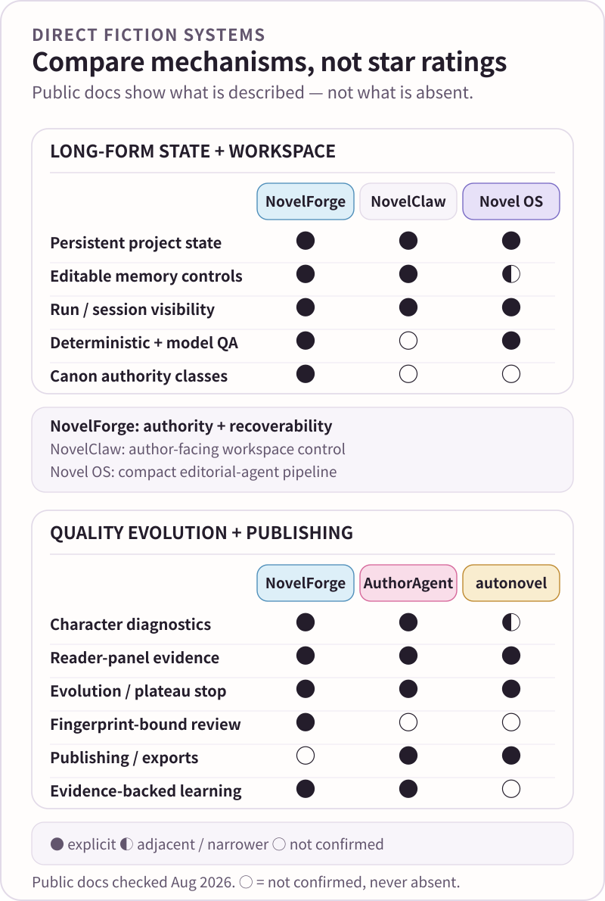
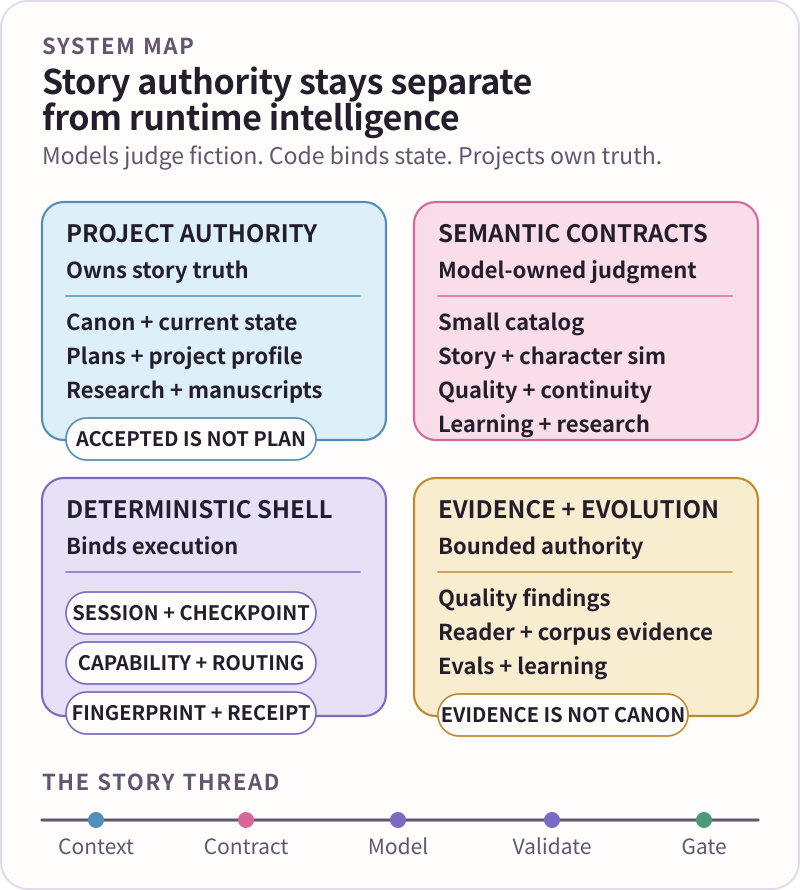
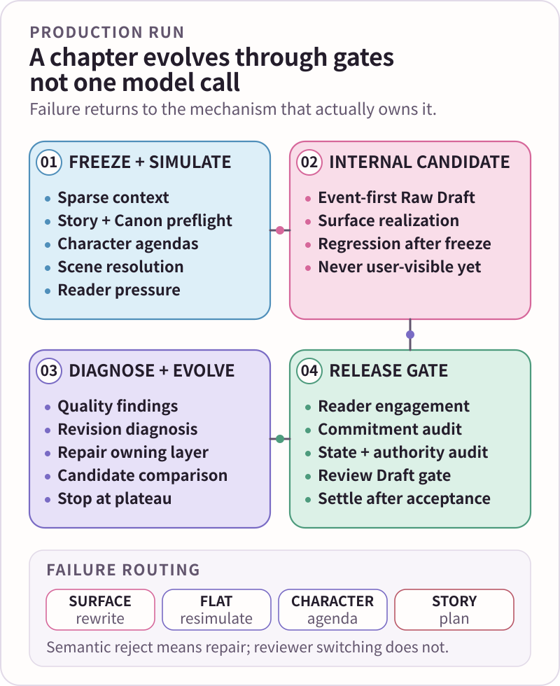
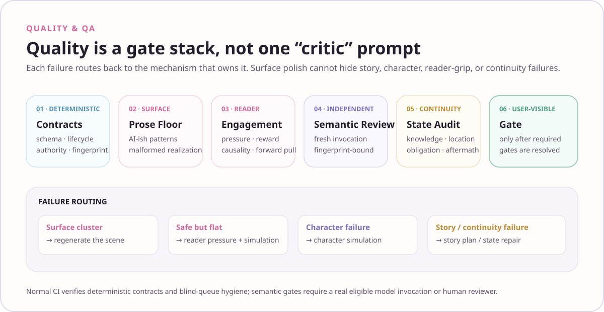
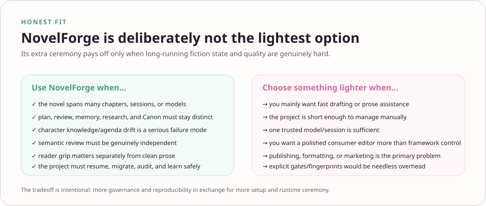

<div align="center">
  
  <p><strong>AI-native fiction production with explicit story authority, recoverable runtime state, and model-readable semantic contracts.</strong></p>
  <p><kbd>CANON BOUNDARIES</kbd>&nbsp;&nbsp;<kbd>CONTRACT PACKS</kbd>&nbsp;&nbsp;<kbd>RECOVERABLE RUNS</kbd>&nbsp;&nbsp;<kbd>QUALITY EVOLUTION</kbd>&nbsp;&nbsp;<kbd>EVIDENCE LEARNING</kbd></p>
  <p><strong>English</strong> · <a href="README.zh-CN.md">简体中文</a> · <a href="docs/README.en.md">Documentation</a></p>
</div>


# NovelForge · Adaptive Fiction Agent Framework

NovelForge is a project-agnostic framework for long-form and serialized fiction. It does not try to turn literary judgment into a pile of Python heuristics, and it does not treat one model completion as a finished chapter.

> **Core boundary ✦** Models own semantic fiction judgment. Deterministic code owns authority, permissions, fingerprints, persistence, routing, hard budgets, stage isolation, typed validation, transactions, and reproducibility.

A consuming Project owns the facts of its story. NovelForge owns the generic production machinery around those facts.

**Development architecture snapshot:** `novelforge.py` currently reports **7.3.0** for the AI-native, contract-first implementation with progressively disclosed semantic packs. **Release authority remains `HARNESS_MANIFEST.yaml` (currently 7.2.0); this is not an 8.0 release declaration.** See the [Changelog](CHANGELOG.en.md) for current release truth.

<p align="center"><a href="docs/why-novelforge.en.md"><strong>Why NovelForge?</strong></a> · <a href="docs/production-pipeline.en.md"><strong>Production Pipeline</strong></a> · <a href="docs/quality-assurance.en.md"><strong>Quality & QA</strong></a> · <a href="docs/architecture-atlas.en.md"><strong>Architecture Atlas</strong></a></p>

---

## 01 · The problem NovelForge is built for ✦

Long-running fiction accumulates state, authority, and revision pressure. The hard failures are rarely “the model cannot write a sentence.” They are things such as:

- a plan being mistaken for an event that already happened;
- a character knowing information outside their knowledge boundary;
- session memory outranking Accepted Canon;
- prose polishing continuing after the real failure has moved upstream into story or character logic;
- reviewers judging different candidate versions;
- “memory” turning into uncontrolled prompt accumulation;
- research, Corpus evidence, eval output, or a learning hypothesis quietly acquiring authority;
- an interrupted external run being resumed without reliable before-state.

NovelForge treats these as production-system problems rather than prompt-writing conventions.

Its core mechanisms are **authority separation, sparse context, independent character state, explicit semantic contracts, resumable runtime state, failure routing, transactional settlement, and evidence-backed learning**.



For source-backed positioning against direct novel agents/frameworks, mature author products, and general agent runtimes, read [Why NovelForge](docs/why-novelforge.en.md) and [Agent Framework Adoption](knowledge/AGENT_FRAMEWORK_ADOPTION.en.md).

---

## 02 · The development mental model 🪄



### Story authority

Project truth follows explicit authority classes such as `locked`, `accepted`, `active_plan`, `review`, and `proposal`. A plan, memory, semantic judgment, scenario branch, Corpus result, or runtime receipt cannot become Canon merely because it exists.

### Semantic intelligence

NovelForge exposes literary understanding through exact model-readable contracts. The runtime resolves a contract from `harness/semantic_workers/model_contract_catalog.json`, loads only the required pack from `harness/semantic_workers/contracts/`, packages bounded input and rubric, computes the semantic fingerprint, and validates the typed result.

The catalog is the only registry index. There is no monolithic compatibility registry and no deterministic “literary score engine” pretending to understand fiction.

### Deterministic shell

Python and workflow code own what should actually be deterministic: permissions, lifecycle, persistence, fingerprints, session/run identity, checkpointing, consume-once semantics, hard budgets, authority boundaries, rights/provenance gates, release invariants, and reproducible builds.

### Project engineering

A novel is a versioned project with its own manifest, exact Framework lock, profiles, bible, Accepted Canon, state, plans, manuscripts, research, regressions, tests, and build artifacts. Chat history is never the project database.

Read [Architecture](docs/architecture.en.md) and [Architecture Atlas](docs/architecture-atlas.en.md).

---

## 03 · A chapter is a production run, not one model call 📖



A DRAFT/REVISE run is organized around four responsibilities.

### Prepare the run

Freeze only the context the current work needs. Reconfirm Project authority and Canon cutoff. Simulate scene causality, character agendas/knowledge, and reader pressure before prose generation.

### Create an internal candidate

Generate event-first Raw Draft material, then realize the prose surface. Raw Draft remains internal. The first model completion is not automatically a user-visible chapter.

### Diagnose the real failure

Post-generation work may use Surface/Reader mechanisms, regression evidence, character-integrity judgment, reader reaction or pairwise comparison, revision diagnosis, continuity/state evidence, and other exact semantic contracts. Semantic work is bounded and fingerprinted; deterministic checks validate everything that does not require literary interpretation.

### Repair the owning mechanism, then release

A sentence-level defect can be rewritten locally. A clustered realization failure may require scene regeneration. SAFE-BUT-FLAT returns to Reader Pressure and Scene Simulation. Character failure returns to Character Simulation. Story failure returns to Story/Plan. Context failure returns to Context/Memory.

Only candidates that resolve the applicable quality, continuity, and user-visible gates can be presented as review-ready output.

Read [Production Pipeline](docs/production-pipeline.en.md).

---

## 04 · Quality means diagnosis, not one score ✅



NovelForge deliberately separates machine-provable correctness from model-required interpretation.

**Deterministic QA** catches invalid schemas, broken authority boundaries, hidden-gold leaks, stale fingerprints, duplicate result consumption, lifecycle violations, missing capabilities, project leakage, rights/provenance failures, and release invariant failures.

**Semantic QA** asks questions that actually require understanding: whether a character action follows from beliefs and agenda, what a reader is likely to feel or expect, why a scene is flat, which mechanism owns a revision problem, or which candidate better serves a supplied rubric.

When independence is mandatory, review comes from a genuinely separate invocation/session and returns a fingerprint-bound typed result. A valid `semantic_reject` routes repair; it is not infrastructure failure and must not trigger reviewer-shopping.

Quality evolution records findings and candidate lineage so revision can stop at a plateau instead of turning into endless rewrite churn.

Read [Quality & QA](docs/quality-assurance.en.md), [Quality Evolution](docs/quality-evolution.en.md), and [Eval Reference](evals/README.en.md).

---

## 05 · Context and memory stay under author control 🧠

Persistent memory is a governed derived view, not automatic prompt injection.

Context inspection can explain why information entered the working set. Memory tiers and the editable memory bank support explicit control over derived/context views, while protected `accepted` / `locked` references remain protected. Editing protected truth produces a proposal or another explicitly non-authoritative artifact rather than rewriting Canon.

Semantic relevance belongs to the model when genuine interpretation is required. Deterministic context/memory code enforces hard budgets, authority classes, provenance, lifecycle, and explicit controls instead of inventing pseudo-literary scalar relevance.

Read [Context & Memory](docs/context-and-memory.en.md).

---

## 06 · Runtime without provider lock-in 🔌

The Harness can operate through a current chat, separate peer chat, local Codex/Claude invocation, provider API, MCP/service worker, GitHub job, local model, or human reviewer when the current host exposes the required capability.

**Runtime name ≠ capability proof. Capability ≠ authority.**

The runtime keeps `project/resource`, `session/thread`, `run/invocation`, and `checkpoint` separate so external or interrupted work can resume without pretending provider history is Canon.

Read [Runtime & Integrations](docs/integrations.en.md), [Session Runtime](harness/session_runtime/SESSION_RUNTIME.en.md), and [Semantic Execution](harness/semantic_workers/SEMANTIC_EXECUTION_RUNTIME.en.md).

---

## 07 · Evidence-driven learning and Corpus intelligence 🔎

NovelForge can learn from edits, accepts/rejects, repeated correction patterns, project conventions, Corpus evidence, and evals—but learning never receives authority for free.

Preference/craft hypotheses remain scoped, contradictable, versioned, and rollbackable. Corpus discovery, rights classification, storage, semantic analysis, learning, and promotion are separate gates. Search success is not permission to mirror copyrighted text, and Corpus evidence is not Canon or automatic character knowledge.

Read [Adaptive Learning](docs/adaptive-learning.en.md) and [Corpus Intelligence](corpus/README.en.md).

---

## 08 · Project engineering ⚙️

```bash
python project_sdk.py init <path> --id PROJECT-X --title "Novel"
python project_sdk.py validate <path>
python project_sdk.py build <path>
python project_sdk.py self-test
```

Projects pin an exact NovelForge revision and may map legacy storage through a Project Adapter. Structural changes can use `spec → plan → tasks → implementation → verification → acceptance`; ordinary prose micro-edits do not need fake ceremony.

Read [Project SDK](docs/project-sdk.en.md), [Project Adapters](docs/project-adapters.en.md), and [Framework Bundle](release/FRAMEWORK_BUNDLE.en.md).

---

## 09 · Honest fit and tradeoffs ⚖️



NovelForge is strongest when a fiction project is long-lived enough that authority, continuity, context control, resumability, runtime choice, QA provenance, and learning discipline genuinely matter.

It is deliberately heavier than a one-shot writing assistant. If the main goal is fast ideation, light rewriting, or a polished consumer editor, a simpler product may be the better choice.

The framework also does not pretend semantic judgment is free or deterministic. Model or human review adds latency and cost; NovelForge's goal is to make that judgment explicit, bounded, inspectable, and unable to mutate story truth by accident.

---


## 10 · Documentation 🌸

<p align="center"><a href="docs/README.en.md"><strong>Docs Home</strong></a> · <a href="docs/why-novelforge.en.md"><strong>Positioning</strong></a> · <a href="docs/architecture-atlas.en.md"><strong>Architecture Atlas</strong></a> · <a href="docs/production-pipeline.en.md"><strong>Production Pipeline</strong></a> · <a href="docs/quality-assurance.en.md"><strong>Quality & QA</strong></a> · <a href="assets/DESIGN_SYSTEM.en.md"><strong>Story Loom Design</strong></a></p>

<div align="center">
  
  <br />
  <sub><strong>Strict backstage. Vivid fiction.</strong> 🌸</sub>
</div>