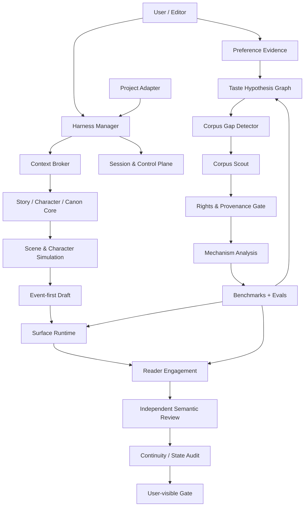

# NovelForge · Adaptive Fiction Agent Framework

<p align="center">
  <strong>A production-grade, project-agnostic agent framework for long-form and serialized fiction.</strong>
</p>

<p align="center">
  English · <a href="README.zh-CN.md">简体中文</a>
</p>

## Why NovelForge

Most AI fiction tools stop at `outline → prompt → chapter`. NovelForge treats fiction production as a stateful software-and-editorial system:

- explicit story architecture and Canon state;
- session-native orchestration and resumable checkpoints;
- bounded specialist workers rather than noisy agent round-tables;
- independent semantic review with fingerprint binding;
- surface-quality and reader-engagement gates;
- user-taste learning from evidence;
- autonomous corpus discovery and benchmark building;
- rights-aware source handling;
- capability + regression evals;
- provider-neutral execution through chat sessions, local agents, MCP, APIs, CI jobs, local models, or human review.

The repository intentionally contains **no built-in novel, character, plot, or Canon**. A consuming project supplies only its adapter, profile, and state.

## Architecture



## Core subsystems

### 1. Story / Canon Core

Models hierarchical story structure, character autonomy, information boundaries, relationships, resources, obligations, foreshadowing, evidence, dependencies, and Accepted Canon. Plans never become Canon merely because they exist.

### 2. Harness & Sessions

The Harness uses a deterministic outer workflow and one manager by default. Sessions, runs, checkpoints, events, handoffs, worker leases, and exactly-once logical result consumption are explicit runtime state.

### 3. Surface + Reader Engagement

Surface Safety catches malformed, AI-ish, or mechanically realized prose. Reader Engagement separately measures narrative pressure, reward, tonal contrast, curiosity evolution, scene causality, and forward pull. Clean prose can still fail if it is flat.

### 4. Independent Semantic Workers

Mandatory independent review must come from a genuinely separate session/invocation. Supported transports include local Codex/Claude processes, provider adapters, MCP workers, GitHub jobs, separate peer chats, local models, and human reviewers. Same-session role-play never counts as independence.

### 5. Adaptive Preference Learning

NovelForge does not reduce user taste to a static style prompt. It maintains evidence-backed hypotheses:

```text
feedback
→ evidence
→ preference hypothesis
→ confidence / contradiction
→ style dimensions
→ corpus gap
→ discovery request
→ corpus evidence
→ personalized eval
→ active profile / rollback
```

The framework can discover *new* preference dimensions instead of only updating predefined sliders.

### 6. Corpus Intelligence

Corpus is a first-class subsystem. It can autonomously identify missing evidence, generate discovery plans, inspect lawful sources through the host runtime, classify rights, derive mechanism-level observations, search counterexamples, build cross-work benchmarks, and strengthen personalized or general craft models.

It does **not** mirror modern copyrighted fiction wholesale or create named-author imitation fingerprints.

### 7. Evals & Self-improvement

Every durable behavior promotion requires mechanism evidence, counterexamples/profile boundaries, evaluation coverage, version/rollback, and post-change regression checks. User-rejected model output can become negative regression evidence; it cannot become a positive style exemplar.

## Runtime model

```text
resource/project
→ session/thread
→ run/invocation
→ checkpoint
→ event / handoff
→ worker lease / external wait
→ result
→ validation
→ consume-once receipt
→ resume
```

Chat sessions are first-class runtimes. The framework does not require an API key if the selected host can provide another independent worker path.

## Provider-neutral execution

| Runtime | Manager | Specialist | Independent review | Typical transport |
|---|---:|---:|---:|---|
| Current chat session | ✓ | bounded | self-review ✗ | host chat |
| Separate peer chat | — | — | ✓ | user/connector relay |
| Codex CLI | ✓ | ✓ | ✓ separate invocation | local process / MCP |
| Claude Code | ✓ | ✓ | ✓ separate invocation | local process / MCP |
| Provider API | — | ✓ | ✓ | adapter |
| GitHub Actions | — | ✓ | ✓ with worker backend | workflow/event |
| Remote MCP worker | ✓ | ✓ | ✓ isolated session | Streamable HTTP |
| Local model | optional | ✓ | ✓ isolated invocation | adapter |
| Human reviewer | — | — | ✓ | relay |

## Project adapter boundary

A project supplies only project-owned information:

```text
project/
├── project.yaml            # identity + framework compatibility
├── profile/                # genre, platform, prose/reader targets
├── bible/                  # characters, world, relationships, research
├── state/                  # Accepted Canon + ledgers
├── plans/                  # active plans / scene cards
├── regressions/            # project-only negative cases
└── manuscripts/            # draft/review/accepted artifacts
```

Dependency direction is one-way:

```text
Project → NovelForge
NovelForge -X→ Project-specific imports
```

CI rejects project-specific leakage in the framework repository.

## Bilingual documentation

Every human-facing document is published in paired editions:

```text
name.en.md
name.zh-CN.md
```

Root routing files such as `README.md`, `AGENTS.md`, `CLAUDE.md`, and `SKILL.md` remain compact bilingual/bootstrap entry points and link to the paired authoritative editions. CI checks documentation pairing and internal links.

Machine schemas remain single-source JSON/YAML to avoid semantic drift; user-facing schema explanations are bilingual.

## Visual documentation

Mermaid diagrams are treated as executable architecture charts. Static assets under `assets/` use a consistent original manga/anime-inspired visual language for documentation and branding only.

## Repository map

```text
.
├── core/                   # story, character, Canon, context primitives
├── surface/                # prose realization + reader engagement
├── harness/                # orchestration, sessions, control plane, workers
├── learning/               # user taste + promotion/rollback logic
├── corpus/                 # discovery, rights, analysis, benchmarks
├── knowledge/              # general craft + framework research
├── evals/                  # capability/regression suites
├── integrations/           # host/runtime adapters
├── schemas/                # stable machine contracts
├── docs/                   # architecture and guides
├── assets/                 # diagrams / visual identity
└── examples/               # project-agnostic fixtures only
```

## Principles

- Start simple; multi-agent is an implementation choice, not a quality feature.
- Persist operational state, not accidental authority.
- Retrieve sparsely; do not dump the entire story bible into every model call.
- Keep writer context separate from regression gold and reviewer expectations.
- Prefer mechanism-level learning over word bans or style imitation.
- A semantic rejection is a valid judgment, not a reason to shop reviewers.
- Corpus is evidence, not Canon.
- User taste is revisable evidence, not permanent mythology.

## Status

The framework is under active consolidation from an earlier monorepo prototype. Current work is focused on a fully self-contained generic Story/Surface/Corpus/Learning/Eval stack, bilingual docs, project-leakage CI, and session-native integrations.
