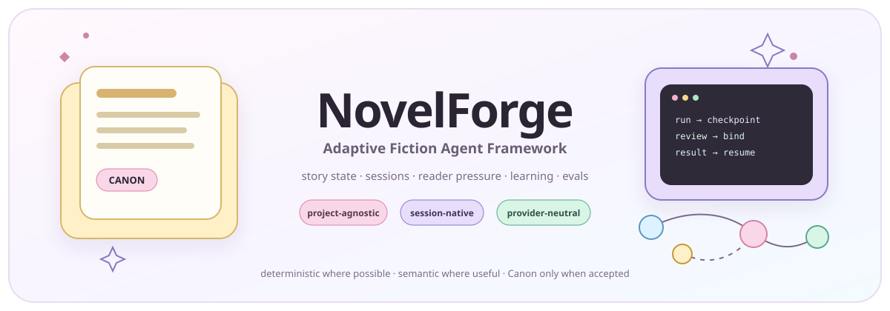
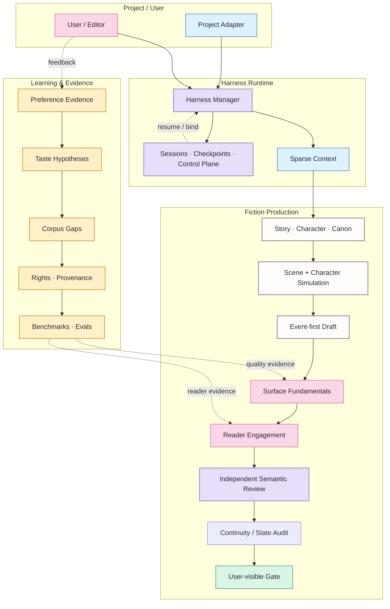

<div align="center">
  

  <h1>NovelForge · Adaptive Fiction Agent Framework</h1>
  <p><strong>A production-grade, project-agnostic framework for long-form and serialized fiction.</strong></p>
  <p><code>Story State</code> · <code>Session Runtime</code> · <code>Reader Quality</code> · <code>Adaptive Learning</code> · <code>Provider Neutral</code></p>
  <p><strong>English</strong> · <a href="README.zh-CN.md">简体中文</a></p>
</div>

> 🌸 **NovelForge does not reduce fiction production to “outline → prompt → chapter.” It treats Story, Canon, editorial quality, long-term learning, and agent runtime as one stateful system.**

## ✨ Why NovelForge

Most AI fiction tools center the model call. NovelForge centers a **recoverable production workflow with explicit authority**. Models handle work that genuinely requires semantic judgment; deterministic mechanisms own identity, state transitions, permissions, fingerprints, checkpoints, settlement, and idempotency.

At a glance:

| Domain | What it does | Invariant |
|---|---|---|
| **Story & Canon** | story hierarchy, characters, relationships, information boundaries, resources, continuity | Plan / Review / Memory ≠ Canon |
| **Harness & Sessions** | task routing, sparse context, checkpoints, handoffs, workers | Session state ≠ Project authority |
| **Quality Runtime** | Surface Fundamentals, Reader Engagement, independent semantic review | “No obvious defect” ≠ “good to read” |
| **Learning & Corpus** | evidence, taste hypotheses, corpus gaps, benchmarks, evals | Model inference ≠ durable preference |
| **Project Engineering** | manifests, lockfiles, adapters, validation, build/release | Framework ≠ consumer project |

> **Boundary ✦** This repository intentionally contains **no built-in novel, character, plot, or Canon**. A consuming novel supplies project-owned profile/state/plans through a Project Adapter; the Framework never absorbs those story facts back into Generic source.

## 🪄 Architecture



**How to read it:** solid lines are primary execution/dependency paths; dashed lines are feedback, evidence, or resume loops. Color is a grouping aid only—node labels retain the actual semantics.

## 📖 Core subsystems

### 1. Story / Canon Core

Models `BOOK → VOLUME → ARC → UNIT → CHAPTER → SCENE` plus character autonomy, relationships, information boundaries, resources, obligations, foreshadowing, evidence, dependencies, Accepted Canon, and settlement. **A plan never becomes Canon merely because the system remembers it.**

### 2. Harness & Sessions

The Harness uses a deterministic outer workflow and one manager by default. `session / run / checkpoint / event / handoff / worker lease / result receipt` are explicit runtime states. A persistent session records where work is—not what the story has accepted as truth.

### 3. Surface + Reader Engagement

Surface Fundamentals reject malformed, AI-ish, or mechanically realized prose. Reader Engagement separately evaluates narrative pressure, reward, tonal contrast, curiosity evolution, scene causality, and forward pull.

> ✨ **Key idea:** clean prose is the floor. A chapter may contain no obvious surface defect and still fail because it is SAFE-BUT-FLAT.

### 4. Independent Semantic Workers

Mandatory independent review must come from a genuinely separate session/invocation and bind to the artifact fingerprint. Eligible transports include local Codex/Claude, provider adapters, MCP workers, GitHub jobs, separate peer chats, local models, and human reviewers.

Same-session “critic role-play” is not independent review. A valid semantic rejection must be repaired, not reviewer-shopped until something says PASS.

### 5. Adaptive Preference Learning

NovelForge does not compress user taste into a permanent style prompt. It maintains evidence-backed hypotheses that can contradict, narrow, deprecate, and roll back:

```text
feedback
→ evidence
→ preference hypothesis
→ confidence / contradiction
→ style dimensions
→ corpus gap
→ discovery request
→ corpus evidence
→ personalized eval
→ active profile / rollback
```

The framework can discover **new preference dimensions** rather than only adjusting predefined sliders. Model inference alone cannot promote durable user taste.

### 6. Corpus Intelligence

Corpus is evidence infrastructure, not Canon. NovelForge can detect evidence gaps, create discovery plans, inspect lawful sources through the host's Web/GitHub/MCP connectors, classify rights/provenance, derive mechanism-level observations, seek counterexamples, and build cross-work benchmarks.

It does **not** mirror modern copyrighted fiction wholesale merely because it is readable online, and it does not build named-author imitation fingerprints.

### 7. Evals & Self-improvement

Every durable Framework behavior promotion requires mechanism evidence, counterexample/profile-boundary analysis, eval coverage, version/rollback, and post-change regression. User-rejected model output may become negative regression evidence; it cannot become a positive style exemplar.

## ⚙️ Runtime model

```text
resource / project
→ session / thread
→ run / invocation
→ checkpoint
→ event / handoff
→ worker lease / external wait
→ result
→ validation
→ consume-once receipt
→ resume
```

Chat sessions are first-class runtimes. The Framework does not require an API key when the selected host can provide another eligible independent worker path.

### Provider-neutral execution

| Runtime | Manager | Specialist | Independent review | Typical transport |
|---|---:|---:|---:|---|
| Current chat session | ✓ | bounded | self-review ✗ | host chat |
| Separate peer chat | — | — | ✓ | user / connector relay |
| Codex CLI | ✓ | ✓ | ✓ separate invocation | local process / MCP |
| Claude Code | ✓ | ✓ | ✓ separate invocation | local process / MCP |
| Provider API | — | ✓ | ✓ | adapter |
| GitHub Actions | — | ✓ | ✓ with worker backend | workflow / event |
| Remote MCP worker | ✓ | ✓ | ✓ isolated session | Streamable HTTP |
| Local model | optional | ✓ | ✓ isolated invocation | adapter |
| Human reviewer | — | — | ✓ | relay |

## 🧩 Project Adapter boundary

A consuming novel supplies only project-owned information:

```text
project/
├── project.yaml            # identity + framework compatibility
├── profile/                # genre / platform / prose / reader targets
├── bible/                  # characters / world / relationships / research
├── state/                  # Accepted Canon + ledgers
├── plans/                  # active plans / scene cards
├── regressions/            # project-only negative cases
└── manuscripts/            # draft / review / accepted artifacts
```

Dependency direction is always one-way:

```text
Project → NovelForge
NovelForge -X→ Project-specific imports
```

CI rejects consumer-project leakage inside the Framework repository.

## 🗺️ Repository map

```text
.
├── core/                   # Story / Character / Canon primitives
├── surface/                # prose realization + reader engagement
├── harness/                # orchestration / sessions / control plane / workers
├── learning/               # preference evidence + promotion / rollback
├── corpus/                 # discovery / rights / analysis / benchmarks
├── knowledge/              # generic craft + framework research
├── evals/                  # capability / regression suites
├── docs/                   # architecture / SDK / integration guides
├── assets/                 # visual identity + documentation design system
├── project_sdk.py          # project engineering contract
└── project_adapter.py      # standard / mapped project resolution
```

## 🌐 Bilingual documentation

Every human-facing document ships as an English / Simplified Chinese pair:

```text
name.en.md
name.zh-CN.md
```

Stable routing entries such as `README.md`, `AGENTS.md`, `CLAUDE.md`, and `SKILL.md` stay compact. CI checks pairing and internal links. Machine schemas remain single-source JSON/YAML to avoid semantic drift.

## 🎨 Visual documentation

Mermaid is the authoritative diagram format because it is version-controlled, diffable, and reviewable. `assets/` defines a shared **professional technical + anime-editorial** visual system. Hero art, sakura/lavender/mint accents, sparse `🌸 ✨ 📖 ✦`, and any future original editor/mascot motif remain strictly decorative.

- [Documentation design system](assets/DESIGN_SYSTEM.en.md)
- [Visual system](assets/README.en.md)

> A tiny `(˶ᵔ ᵕ ᵔ˶)` may live in README microcopy. It will never appear in a schema, authority contract, or machine state.

## ✦ Principles

- Start simple: multi-agent is an implementation choice, not a quality feature.
- Persist operational state, not accidental authority.
- Retrieve sparsely: existence in storage does not imply prompt inclusion.
- Isolate writer context from regression gold and expected verdicts.
- Learn mechanisms, not word-ban lists or author-imitation templates.
- Semantic rejection is a valid judgment, not a reason to shop reviewers.
- Corpus is evidence, not Canon.
- User taste is revisable evidence, not permanent mythology.

## 🚧 Status

NovelForge v7 is consolidating Generic Story / Surface / Corpus / Learning / Eval, a session-native Harness, provider-neutral runtime, and Project SDK into one self-contained Framework. Normal CI remains deterministic; live semantic model execution must be explicitly triggered and must never silently spend model usage.

<p align="center"><sub>strict backstage · vivid fiction · professional docs with just a few sakura petals 🌸</sub></p>
