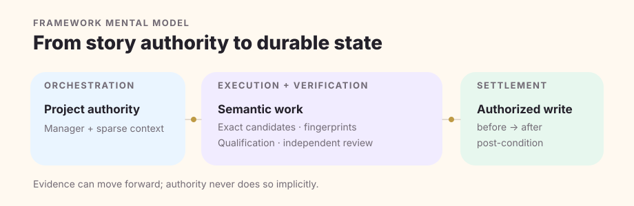
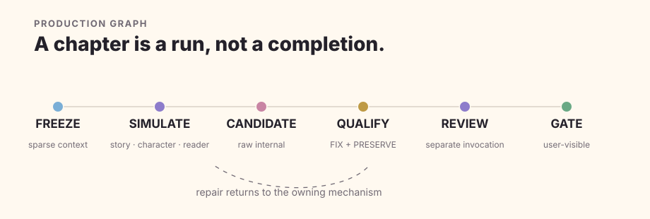

<p align="center">
  
</p>

<h1 align="center">Quillframe</h1>

<p align="center"><strong>AI-native long-form fiction framework and authoring environment.</strong></p>

<p align="center">
  Stories can grow long. Canon, context, character state, and execution truth should still know exactly where they stand.
</p>

<p align="center">
  <a href="https://quillframe.wei-dev.com/">Website</a> ·
  <a href="https://studio.quillframe.wei-dev.com/">Studio</a> ·
  <a href="https://quillframe.wei-dev.com/docs/">Documentation</a> ·
  <a href="#quick-start">Quick Start</a>
</p>

<p align="center">
  <a href="https://github.com/xiaooye/cn_webnovel_agent/actions/workflows/quillframe-ci.yml"></a>
  
  <a href="LICENSE"></a>
</p>

<p align="center"><sub>0.9.x · pre-1.0 · active development</sub></p>

<p align="center"><a href="README.zh-CN.md">简体中文</a> · <strong>English</strong></p>

---

> **✦ Quillframe is not an LLM chat wrapper.** Models provide semantic judgment and generation. Quillframe owns the long-running system around them: story structure, character and relationship state, Canon, bounded Context, runtime identity, quality gates, learning evidence, persistence, and authorized Settlement.

## Why Quillframe exists

A one-shot writing loop is simple:

```text
prompt → model → text
```

A novel that survives hundreds of scenes needs more than a larger prompt. It needs to know which facts are authoritative, which plans are only future intent, which evidence actually entered a model call, whether a review belongs to this exact candidate, and whether an accepted change has been durably applied.

Quillframe turns those questions into explicit system boundaries rather than reconstructing them from chat history.

```text
bounded Context
      ↓
Story / Canon preflight
      ↓
scene + character simulation
      ↓
generation / revision
      ↓
independent semantic review when required
      ↓
reader + continuity validation
      ↓
user-visible Review candidate
      ↓  explicit acceptance
Settlement → durable project state
```

The result is deliberately heavier than a one-shot assistant—and useful for exactly the projects where continuity, provenance, recovery, and long-horizon quality matter.

## The principles that matter

| | Principle | What it means in practice |
|---|---|---|
| ✦ | **Canon-aware** | Plan, Draft, Review, Accepted text, Canon, and Settled state are distinct lifecycle/authority states. |
| ✧ | **Context-bounded** | Stored information is larger than any invocation. A sparse Context Manifest selects task-relevant evidence; stored ≠ injected. |
| ♡ | **Character integrity** | Character agenda, knowledge boundaries, relationships, location, and emotional consequences are production state—not decorative prompt flavor. |
| ⋆ | **Independent semantic judgment** | A manager relabeling itself as a critic is not an independent review. Required review is bound to an exact artifact fingerprint and a genuinely separate eligible execution. |
| ✦ | **Writer-first** | Studio is an authoring environment first. Runtime and diagnostics remain available without becoming the default creative information architecture. |
| ✧ | **SQLite-native** | Durable product state lives in SQLite. Markdown, DOCX, EPUB, and other files are import/export artifacts, not a second live authority. |
| ♡ | **Inference is capability, not authority** | Models interpret and generate; Quillframe owns orchestration, state, permissions, provenance, and project authority boundaries. |
| ⋆ | **Learning without silent promotion** | Feedback can be captured automatically as evidence; it does not silently become Project preference, Canon, user taste, or Framework policy. |

## How Quillframe is put together

### 1 · Product mental model

```text
Writer
  ↓
Quillframe
  ├─ authoring workflow
  ├─ Story / Character / Relationship / Canon / Context
  ├─ Runtime / Quality / Learning / Settlement
  └─ durable project state
  ↕
Model inference
```

The model is not above Quillframe in the authority chain. It supplies inference to a Quillframe-owned operation.

The 0.9 development direction is an even simpler model connection surface—**API Endpoint + Access Token** (the token may be empty for unauthenticated local endpoints)—while Quillframe continues to own sessions, context, tools, execution contracts, authority, and the agent loop. That Quillframe-owned Model Runtime is being developed separately and is **not yet merged into this frozen 0.9.0 baseline**.

### 2 · Framework, Studio, and durable state

The current architecture keeps presentation away from direct persistence access:

```text
SolidJS Studio / host surface
          ↓
   typed Bridge / API
          ↓
   Python Quillframe Core
          ↓
        SQLite
```

A thin Tauri 2 desktop host is the current desktop architecture direction; the frozen `0.9.0` baseline checked into `main` still ships the SolidJS Local Web/cloud UI and typed Python Host Bridge rather than a finished Tauri wrapper.



The generic Framework owns mechanisms. A consuming Project owns its concrete story facts, characters, relationships, research, plans, manuscripts, Accepted Canon, and current state. Dependency direction is **Project → Quillframe**; private story facts do not become generic Framework truth.

### 3 · Production is a lifecycle, not a single generation call



Current DRAFT / REVISE execution includes bounded context and authority bootstrap, Story/Canon preflight, character/scene simulation, reader pressure, event-first drafting, surface realization, qualification, independent review when required, repair/challenger generation, reader engagement, continuity, and a user-visible gate.

**Raw Draft is internal.** A user-visible Review Draft is still not Accepted. Accepted is still not Settled.

## Canon, Context, and Settlement

Quillframe's state model is intentionally explicit:

```text
stored      ≠ injected
Plan        ≠ Canon
Review      ≠ Accepted
Accepted    ≠ Settled
autosave    ≠ Accepted
revision    ≠ Canon
Research    ≠ Character Knowledge
Corpus      ≠ Canon
session     ≠ Canon
persistence ≠ authority
```

Current Canon precedence is expressed as:

```text
locked > accepted > active_plan > review > proposal
```

That is an authority/lifecycle distinction—not an automatic promotion ladder.

**Settlement** is the authorized transaction that turns explicit acceptance into durable state mutation. It requires exact before → after intent, current before-state validation, write authorization, dependency/projection handling, and post-condition checks. A mismatch yields `settlement_incomplete`; Quillframe does not guess that a partial write probably succeeded.

<details>
<summary><strong>Why sparse Context matters</strong></summary>

A persistent project can contain far more information than a model call should see. Quillframe first decides what evidence is relevant to the current semantic question, then deterministic assembly validates exact references, authority class, visibility/stage constraints, provenance, fingerprints, and hard budget.

This keeps three things separate:

1. what the project stores;
2. what semantic selection considers useful;
3. what actually entered the model context after budget and visibility rules.

See [Context & Memory](docs/context-and-memory.en.md) for the full model.

</details>

## Learning: automatic intake, governed promotion

Meaningful user feedback can enter a learning intake without requiring the user to say “learn this.” The intended flow is:

```text
capture → interpret → scope → evidence → candidate → validation
```

Automatic capture does **not** imply automatic promotion. `one_off`, `project`, `user_taste`, and `general_craft` remain separate scopes, and none gains durable authority merely because a model inferred a preference.

## Studio · authoring environment first

Quillframe Studio is the product-experience layer around the Core. On the frozen `0.9.0` baseline it is a real SolidJS + TypeScript + Vite application shell behind a typed read-only Host Bridge, with local and cloud-hosted web surfaces.

The long-term Writer Mode information architecture centers the writing task—Desk, Manuscript, Plan, Story, Review, Research & Corpus, Learning, and Publish—with runtime details progressively disclosed through an Inspector. The parallel UI/UX session is actively evolving that authoring surface; **do not treat its unmerged branch work or future screenshots as released product behavior.**

Current baseline Studio operations include bridge description, Framework doctor, project inspection, capability inspection, Context inspection, and semantic catalog inspection. Mutation, acceptance, Settlement, and direct private SQLite access are not fabricated in the UI when Core contracts do not expose them.

## SQLite is the canonical durable state

Quillframe 0.9's persistence implementation uses:

```text
~/.quillframe/
├─ quillframe.sqlite
├─ projects/
│  └─ <project-id>/
│     ├─ project.sqlite
│     ├─ blobs/
│     └─ exports/
├─ backups/
└─ cache/
```

Connections enable foreign keys, a busy timeout, WAL journal mode, and `synchronous=FULL`. Migrations are ordered and checksum-verified. The persistence CLI also exposes `doctor`, backup/verify/restore, project creation, and search.

Persistence does not grant Canon, acceptance, Settlement, or Learning-promotion authority by itself.

## Quick Start

### Prerequisites

The current CI baseline is:

- **Python 3.13** for Core/SQLite/Host Bridge validation;
- **Node.js 24** for the product site/docs and Studio builds;
- **pnpm 10.33.0** for `studio/app`.

Quillframe is pre-1.0; use the exact repository revision/lock required by your consuming Project rather than assuming latest `main` is compatible with every project.

### Clone and verify the Core

```bash
git clone https://github.com/xiaooye/cn_webnovel_agent.git
cd cn_webnovel_agent
python project_sdk.py self-test
python studio/host_bridge.py self-test
python persistence/cli.py doctor
```

Successful self-tests print structured JSON. `doctor` initializes/checks the default Quillframe data root; it does not make manuscript content Canon.

### Run the current local Studio

```bash
cd studio/app
corepack enable
pnpm install --frozen-lockfile
pnpm build
cd ../..
python studio/local_server.py
```

The local server binds loopback and prints the URL to open. On this baseline the Studio consumes the typed read-only Host Bridge. **An AI provider is not required for basic inspection/authoring shell startup.**

### Create a Quillframe fiction project skeleton

```bash
python project_sdk.py init ./my-novel \
  --id PROJECT-MY-NOVEL \
  --title "My Novel" \
  --language en

python project_sdk.py validate ./my-novel
python project_sdk.py build ./my-novel
```

The Project SDK scaffolds separate plans, state, manuscripts, research, Corpus references, tests, and project locks. It does not automatically promote content into Canon.

<details>
<summary><strong>Run the product site and Starlight docs</strong></summary>

```bash
cd site
npm install --no-audit --no-fund
npm run dev
```

For the Starlight documentation surface:

```bash
npm run dev:docs
```

Production verification uses `npm run quality`, `npm run build`, and `npm run docs:build`.

</details>

## Repository map

```text
cn_webnovel_agent/
├─ core/                 # Story / Character / Canon contracts
├─ harness/              # runtime, sessions, semantic execution, control plane
├─ quality/              # production readiness and quality evolution
├─ learning/             # evidence intake, hypotheses, governed promotion
├─ corpus/               # governed craft/research evidence
├─ persistence/          # canonical SQLite durable state
├─ publication/          # Accepted-text publication IR/compiler
├─ studio/               # Host Bridge, local server, SolidJS Studio app
├─ site/                 # product site + Astro/Starlight docs build
├─ docs/                 # public concepts, guides, architecture, documentation map
├─ tests/                # deterministic contract/regression tests
├─ specs/                # current and historical engineering specifications
└─ .github/              # CI, deployment, issue/PR contribution surfaces
```

Historical specs deliberately preserve historical terminology. Current product guidance should not require a visitor to read those records first.

## Documentation map

| Start with… | When you need… |
|---|---|
| [Documentation home](docs/README.en.md) | a curated path through the full documentation set |
| [Why Quillframe](docs/why-quillframe.en.md) | product fit, tradeoffs, and the system boundary |
| [Architecture](docs/architecture.en.md) | Framework/Project authority, semantic vs deterministic ownership, Settlement |
| [Production Pipeline](docs/production-pipeline.en.md) | DRAFT/REVISE lifecycle and user-visible readiness |
| [Context & Memory](docs/context-and-memory.en.md) | sparse Context, visibility, persistence, memory boundaries |
| [Quality Assurance](docs/quality-assurance.en.md) | fingerprint-bound gates, diagnostics, independent review |
| [Adaptive Learning](docs/adaptive-learning.en.md) | feedback intake, evidence, scopes, promotion rules |
| [Project SDK](docs/project-sdk.en.md) | integrating a novel as a reproducible Project |
| [Studio](studio/README.en.md) | current product shell and Host Bridge behavior |
| [Architecture Atlas](docs/architecture-atlas.en.md) | implementation owners and deep contract links |

Public docs are built with **Astro + Starlight** and deployed under the Quillframe product site.

## Current status · 0.9.x

Quillframe is **pre-1.0 and in active development**. Breaking changes may occur before 1.0.

| Area | Frozen `main` status |
|---|---|
| Python Core / authority contracts | Implemented and CI-tested |
| SQLite-native persistence | Implemented and CI-tested |
| Typed read-only Host Bridge | Implemented and self-tested |
| SolidJS Studio | Implemented application shell; authoring UX still evolving |
| Product site + Starlight docs | Implemented and deployment-managed |
| Tauri 2 thin desktop host | Architecture direction; finished wrapper not present on frozen baseline |
| Quillframe-owned Model API runtime | **In active development in separate Draft PR #108; not merged** |
| Writer Mode UX reconstruction | **In active parallel UI/UX work; unmerged work is not released** |

This README describes `main` as frozen for its reconstruction. Branch work ≠ merged capability; merged code ≠ deployed surface.

## Contributing

Start with [CONTRIBUTING.md](CONTRIBUTING.md). Small fixes are welcome, but changes to Canon/Settlement semantics, semantic independence, Learning promotion, persistence authority, or runtime contracts require explicit architecture reasoning and matching tests.

Useful entry points:

- [Bug report](https://github.com/xiaooye/cn_webnovel_agent/issues/new/choose)
- [Security policy](SECURITY.md)
- [Code of Conduct](CODE_OF_CONDUCT.md)
- [Changelog](CHANGELOG.en.md)

## Security

Never paste API access tokens, provider credentials, private manuscript text, or sensitive project databases into public issues. Hosted secrets belong server-side and must never be bundled into Vite client code. See [SECURITY.md](SECURITY.md) for private vulnerability reporting and data-handling guidance.

## License

**This public repository is currently source-available, not OSI open source.** The repository's [LICENSE](LICENSE) permits limited private non-commercial evaluation/research and restricts redistribution, deployment, and commercial use unless separate written permission is granted.

The license still carries historical `NovelForge` legal naming. That text is intentionally not rewritten as a presentation cleanup: changing legal scope/identity requires a separate explicit relicensing/legal decision.

---

<p align="center">
  <sub>✦ · Quillframe keeps creative judgment flexible and execution truth explicit. · ♡</sub>
</p>
