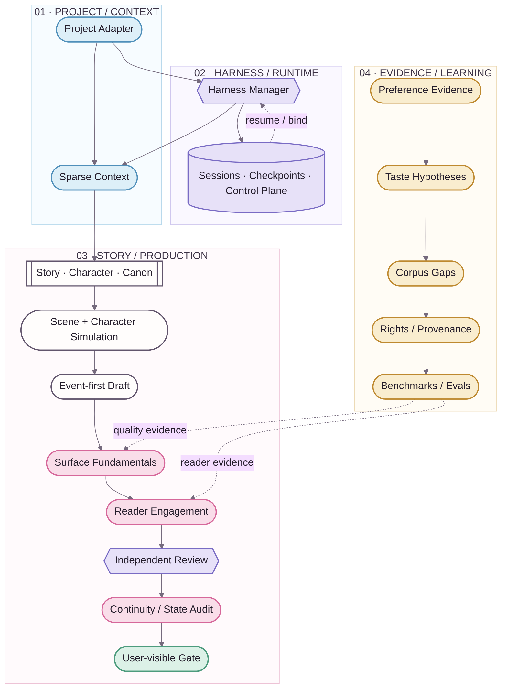

<div align="center">
  
  <p><strong>Engineer the production system without turning fiction into system logs.</strong></p>
  <p><kbd>STORY + CANON</kbd>&nbsp;&nbsp;<kbd>SESSIONS</kbd>&nbsp;&nbsp;<kbd>READER QUALITY</kbd>&nbsp;&nbsp;<kbd>LEARNING</kbd>&nbsp;&nbsp;<kbd>EVALS</kbd></p>
  <p><strong>English</strong> · <a href="README.zh-CN.md">简体中文</a></p>
</div>


# NovelForge · Adaptive Fiction Agent Framework

> 🌸 **NovelForge does not reduce fiction production to “outline → prompt → chapter.” It treats Story, Canon, editorial quality, long-term learning, and agent runtime as one stateful production system.**

**Project-agnostic · Session-native · Reader-aware · Evidence-driven · Provider-neutral**

> **Boundary ✦** This repository intentionally contains **no built-in novel, character, plot, or Canon**. A consuming novel supplies project-owned profile/state/plans through a Project Adapter; the Framework never absorbs those story facts back into Generic source.

---

## 01 · Why NovelForge ✨

Most AI fiction tools center the model call. NovelForge centers **explicit authority + a recoverable production workflow**. Models handle work that genuinely requires semantic judgment; identity, state transition, permission, fingerprint, checkpoint, settlement, and idempotency remain deterministic mechanisms.

| Lane | Capability | Invariant |
|---|---|---|
| **Story / Canon** | story hierarchy, characters, relationships, information boundaries, resources, continuity | Plan / Review / Memory ≠ Canon |
| **Harness / Runtime** | task routing, sparse context, checkpoints, handoffs, workers | Session state ≠ Project authority |
| **Editorial Quality** | Surface Fundamentals, Reader Engagement, independent semantic review | “No obvious defect” ≠ “engaging” |
| **Evidence / Learning** | evidence, taste hypotheses, corpus gaps, benchmarks, evals | Model inference ≠ durable preference |
| **Project Engineering** | manifests, lockfiles, adapters, validation, build/release | Framework ≠ consumer project |

---

## 02 · Story Loom System Map 🪄



**Solid edges** are execution / dependency. **Dashed edges** are feedback, evidence, or resume. Visual tokens come from [`assets/brand/tokens.json`](assets/brand/tokens.json).

---

## 03 · Core Subsystems 📖

### Story / Canon Core

Models `BOOK → VOLUME → ARC → UNIT → CHAPTER → SCENE` plus character autonomy, relationships, information boundaries, resources, obligations, foreshadowing, evidence, dependencies, Accepted Canon, and settlement. **A plan never becomes Canon merely because the system remembers it.**

### Harness & Sessions

The Harness uses a deterministic outer workflow and one manager by default. `session / run / checkpoint / event / handoff / worker lease / result receipt` are explicit runtime states. A persistent session records where work is—not what the story has accepted as truth.

### Surface + Reader Engagement

Surface Fundamentals reject malformed, AI-ish, or mechanically realized prose. Reader Engagement separately evaluates narrative pressure, reward, tonal contrast, curiosity evolution, scene causality, and forward pull.

> ✨ **Key idea:** clean prose is the floor. A chapter may contain no obvious surface defect and still fail because it is SAFE-BUT-FLAT.

### Independent Semantic Workers

Mandatory independent review must come from a genuinely separate session/invocation and bind to the artifact fingerprint. Eligible transports include local Codex/Claude, provider adapters, MCP workers, GitHub jobs, separate peer chats, local models, and human reviewers.

Same-session “critic role-play” is not independent review. A valid semantic rejection must be repaired, not reviewer-shopped until something says PASS.

### Adaptive Preference Learning

```text
feedback
→ evidence
→ preference hypothesis
→ confidence / contradiction
→ style dimensions
→ corpus gap
→ discovery request
→ corpus evidence
→ personalized eval
→ active profile / rollback
```

The Framework can discover **new preference dimensions** rather than only adjusting predefined sliders. Model inference alone cannot promote durable user taste.

### Corpus Intelligence

Corpus is evidence infrastructure, not Canon. NovelForge can detect evidence gaps, create discovery plans, inspect lawful sources through host Web/GitHub/MCP connectors, classify rights/provenance, derive mechanism-level observations, seek counterexamples, and build cross-work benchmarks.

### Evals & Self-improvement

Durable Framework behavior promotion requires mechanism evidence, counterexample/profile-boundary analysis, eval coverage, version/rollback, and post-change regression. User-rejected output may become negative regression evidence; it cannot become a positive exemplar.


## 04 · Runtime Model ⚙️

```text
resource / project
→ session / thread
→ run / invocation
→ checkpoint
→ event / handoff
→ worker lease / external wait
→ result
→ validation
→ consume-once receipt
→ resume
```

Chat sessions are first-class runtimes. The Framework does not require an API key when the selected host can provide another eligible independent worker path.

### Provider-neutral execution

| Runtime | Manager | Specialist | Independent review | Typical transport |
|---|---:|---:|---:|---|
| Current chat session | ✓ | bounded | self-review ✗ | host chat |
| Separate peer chat | — | — | ✓ | user / connector relay |
| Codex CLI | ✓ | ✓ | ✓ separate invocation | local process / MCP |
| Claude Code | ✓ | ✓ | ✓ separate invocation | local process / MCP |
| Provider API | — | ✓ | ✓ | adapter |
| GitHub Actions | — | ✓ | ✓ with worker backend | workflow / event |
| Remote MCP worker | ✓ | ✓ | ✓ isolated session | Streamable HTTP |
| Local model | optional | ✓ | ✓ isolated invocation | adapter |
| Human reviewer | — | — | ✓ | relay |

---

## 05 · Project Adapter Boundary 🧩

```text
project/
├── project.yaml            # identity + framework compatibility
├── profile/                # genre / platform / prose / reader targets
├── bible/                  # characters / world / relationships / research
├── state/                  # Accepted Canon + ledgers
├── plans/                  # active plans / scene cards
├── regressions/            # project-only negative cases
└── manuscripts/            # draft / review / accepted artifacts
```

Dependency direction is one-way:

```text
Project → NovelForge
NovelForge -X→ Project-specific imports
```

---

## 06 · Repository Map 🗺️

```text
.
├── core/                   # Story / Character / Canon primitives
├── surface/                # prose realization + reader engagement
├── harness/                # orchestration / sessions / control plane / workers
├── learning/               # preference evidence + promotion / rollback
├── corpus/                 # discovery / rights / analysis / benchmarks
├── knowledge/              # generic craft + framework research
├── evals/                  # capability / regression suites
├── docs/                   # architecture / SDK / integration guides
├── assets/                 # Story Loom brand + documentation system
├── project_sdk.py          # project engineering contract
└── project_adapter.py      # standard / mapped project resolution
```

---

## 07 · Visual & Documentation System 🎨

NovelForge's GitHub pages use **Story Loom**: an original logo, semantic tokens, story-thread dividers, numbered section rhythm, and branded Mermaid. Future AI/designer-rendered architecture visuals may sit above the source diagrams, while Mermaid remains the inspectable reference layer.

- [Documentation design system](assets/DESIGN_SYSTEM.en.md)
- [Brand tokens](assets/brand/tokens.json)
- [Architecture](docs/architecture.en.md)
- [Visual provenance](assets/provenance.json)

A tiny `(˶ᵔ ᵕ ᵔ˶)` may live in README microcopy. It will never appear in a schema, authority contract, or machine state.

---

## 08 · Principles ✦

- Multi-agent is an implementation choice, not a quality feature.
- Persist operational state, not accidental authority.
- Retrieve sparsely: existence in storage does not imply prompt inclusion.
- Isolate writer context from regression gold and expected verdicts.
- Learn mechanisms, not author-imitation templates.
- Semantic rejection is a valid judgment, not a reason to shop reviewers.
- Corpus is evidence, not Canon.
- User taste is revisable evidence, not permanent mythology.

<div align="center">
  
  <br />
  <sub>strict backstage · vivid fiction · professional docs with a few sakura petals 🌸</sub>
</div>
