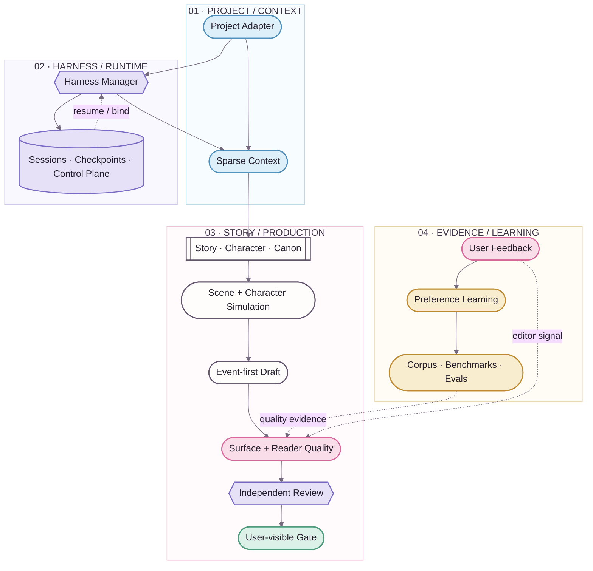

  

  
<strong>Fiction production, engineered without flattening fiction.</strong>

  

    <kbd>STORY + CANON</kbd>&nbsp;&nbsp;
    <kbd>SESSIONS</kbd>&nbsp;&nbsp;
    <kbd>READER QUALITY</kbd>&nbsp;&nbsp;
    <kbd>LEARNING</kbd>&nbsp;&nbsp;
    <kbd>EVALS</kbd>
  

  

    <a href="README.en.md"><strong>English</strong></a> · <a href="README.zh-CN.md"><strong>简体中文</strong></a>
  

> 🌸 **NovelForge is a project-agnostic production framework for long-form and serialized fiction.**
>
> It combines explicit story authority, resumable agent execution, sparse context, reader-engagement gates, independent semantic review, lawful corpus intelligence, evidence-driven preference learning, and reproducible project engineering.

### ✦ The hard boundary

**No built-in novel. No hidden Canon promotion. No reviewer shopping.** Consumer projects depend on NovelForge; NovelForge never imports their story facts back into the framework.

---

## 01 · System map ✨

The diagram follows the **Story Loom** brand grammar: blue is project/context, violet is runtime/orchestration, pink is editorial quality, amber is evidence/learning, and mint is validated output. Color is never the only semantic channel.

**Solid edges** are execution/dependency. **Dashed edges** are resume, feedback, or evidence. Mermaid is the inspectable source diagram; branded rendered diagrams may later sit above it as a presentation layer.

---

## 02 · What NovelForge owns 📖

| Lane | NovelForge owns | It explicitly does **not** mean |
|---|---|---|
| **Story / Canon** | hierarchy, characters, relationships, state, continuity | plan / memory / review = Canon |
| **Harness / Runtime** | task routing, context, sessions, checkpoints, handoffs | runtime state = project authority |
| **Editorial Quality** | Surface Fundamentals, Reader Engagement, semantic review | grammatically clean = engaging |
| **Evidence / Learning** | feedback evidence, hypotheses, corpus gaps, benchmarks | model inference = durable taste |
| **Project Engineering** | manifests, exact locks, adapters, validation, release contracts | framework = consumer project |

> **Boundary ✦** Canon mutation remains transactional. Corpus, session state, reviewer results, schedules, webhooks, and learning hypotheses do not gain story authority merely because they exist.

## 03 · Explore the framework 🪄

| Path | English | 简体中文 |
|---|---|---|
| **Overview** | [README.en.md](README.en.md) | [README.zh-CN.md](README.zh-CN.md) |
| **Architecture** | [docs/architecture.en.md](docs/architecture.en.md) | [docs/architecture.zh-CN.md](docs/architecture.zh-CN.md) |
| **Adaptive learning** | [docs/adaptive-learning.en.md](docs/adaptive-learning.en.md) | [docs/adaptive-learning.zh-CN.md](docs/adaptive-learning.zh-CN.md) |
| **Corpus intelligence** | [corpus/README.en.md](corpus/README.en.md) | [corpus/README.zh-CN.md](corpus/README.zh-CN.md) |
| **Project adapters** | [docs/project-adapters.en.md](docs/project-adapters.en.md) | [docs/project-adapters.zh-CN.md](docs/project-adapters.zh-CN.md) |
| **Runtime & integrations** | [docs/integrations.en.md](docs/integrations.en.md) | [docs/integrations.zh-CN.md](docs/integrations.zh-CN.md) |
| **Brand / design system** | [assets/DESIGN_SYSTEM.en.md](assets/DESIGN_SYSTEM.en.md) | [assets/DESIGN_SYSTEM.zh-CN.md](assets/DESIGN_SYSTEM.zh-CN.md) |

## 04 · Design axioms 🌸

- **One framework, many novels.** Generic mechanisms live here; project facts never do.
- **Deterministic where possible, semantic where useful.** Identity, transitions, permissions, fingerprints, and idempotency stay explicit.
- **Chat is a real runtime.** Local agents, APIs, MCP, GitHub jobs, peer chats, local models, and humans are transports—not authorities.
- **Canon is transactional.** Plans, corpus evidence, model memory, session state, and reviewer output cannot silently become story truth.
- **Quality is more than correctness.** Surface safety is a floor; Reader Engagement and continuity still have to pass.
- **Learning is evidence-driven.** Preference hypotheses can evolve, contradict, narrow, and roll back.
- **No reviewer shopping.** Infrastructure failures may fall back; a valid semantic rejection must be repaired.

  
   
  <strong>Story Loom visual system</strong> · professional technical core · anime-editorial warmth ✦

