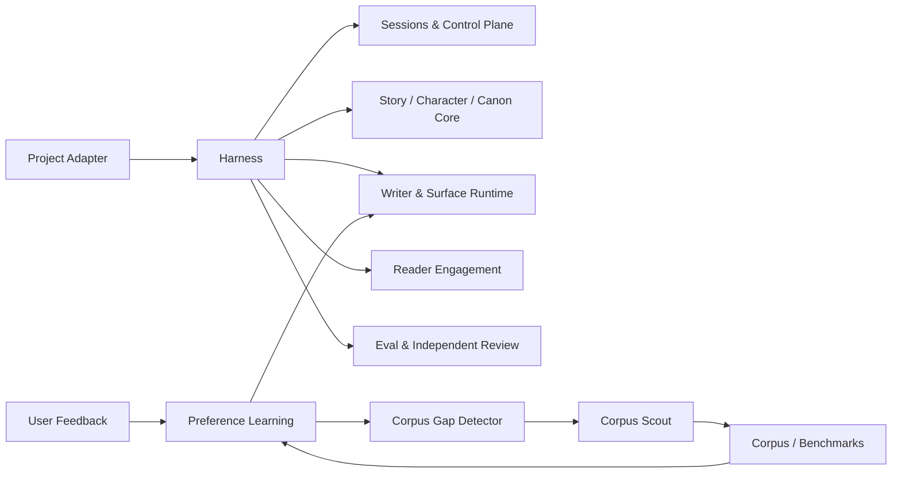

# NovelForge · Adaptive Fiction Agent Framework

  <strong>Project-agnostic · Session-native · Corpus-driven · Self-improving · Provider-neutral</strong>

  <a href="README.en.md">English</a> · <a href="README.zh-CN.md">简体中文</a>

> This landing page intentionally stays short. Full documentation is maintained as paired English / Simplified Chinese editions and checked by CI.

## What this repository is

NovelForge is a reusable production framework for long-form and serialized fiction. It combines deterministic workflow control with bounded semantic workers, persistent sessions, explicit Canon/state authority, adaptive user-preference learning, lawful corpus analysis, regression/capability evals, and provider-neutral agent integrations.

It contains **no built-in novel, character, plot, Canon, or project-specific default**. Projects consume the framework through a Project Adapter; the framework never imports a consumer project back into itself.

## Start here

- [English overview](README.en.md)
- [中文总览](README.zh-CN.md)
- [Architecture / 架构](docs/architecture.en.md)
- [Adaptive learning / 自适应学习](docs/adaptive-learning.en.md)
- [Corpus system / 语料系统](corpus/README.en.md)
- [Project adapters / 项目适配器](docs/project-adapters.en.md)
- [Runtime & integrations / Runtime 与集成](docs/integrations.en.md)

## Design axioms

1. **One framework, many novels.** Generic mechanisms live here; project facts never do.
2. **Deterministic shell, semantic workers.** Known state transitions stay explicit; models judge only where judgment is useful.
3. **Chat sessions are first-class runtimes.** Local agents, APIs, MCP services, GitHub jobs, peer chats, local models, and humans are transports—not authorities.
4. **Canon is transactional.** Plan, memory, corpus, session state, and reviewer output are not Canon.
5. **Learning is evidence-driven.** User taste can evolve; model guesses cannot silently become durable preference.
6. **Corpus is lawful and mechanism-level.** Read broadly, store narrowly, infer cautiously, test aggressively.
7. **No reviewer shopping.** Infrastructure failures may fall back; a valid rejection must be repaired.
8. **Every human-facing document is bilingual.** English and Simplified Chinese editions are release-checked.

## Visual identity

The repository uses Mermaid for executable diagrams and a small original anime-inspired visual system under `assets/`. Visuals are decorative/documentary only and never affect runtime authority.

## License / rights note

Framework code and documentation follow repository licensing. Third-party fiction corpus has its own explicit rights/provenance classification; modern copyrighted text is not mirrored merely because it is publicly readable.
