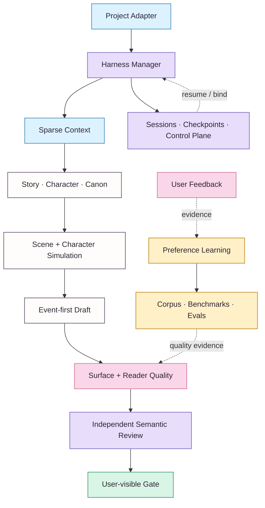

  

  <h1>NovelForge</h1>
  
<strong>Adaptive Fiction Agent Framework</strong>

  

    <code>project-agnostic</code> · <code>session-native</code> · <code>reader-aware</code> · <code>evidence-driven</code> · <code>provider-neutral</code>
  

  

    <a href="README.en.md"><strong>English</strong></a> · <a href="README.zh-CN.md"><strong>简体中文</strong></a>
  

> 🌸 **A production framework for fiction that treats story state, quality, learning, and agent execution as one coherent system.**
>
> NovelForge is built for long-form and serialized fiction. It combines deterministic workflow control with bounded semantic workers, explicit Canon/state authority, resumable sessions, reader-engagement gates, lawful corpus analysis, adaptive preference learning, and provider-neutral execution.

## ✨ At a glance

| Domain | What NovelForge owns | Hard boundary |
|---|---|---|
| **Story & Canon** | story hierarchy, characters, relationships, state, continuity | Plan / memory / review ≠ Canon |
| **Harness & Sessions** | task routing, sparse context, checkpoints, handoffs, workers | Session state ≠ project authority |
| **Quality Runtime** | Surface Fundamentals, Reader Engagement, semantic review | Clean prose ≠ engaging prose |
| **Learning & Corpus** | evidence, preference hypotheses, corpus gaps, benchmarks, evals | Model inference ≠ durable truth |
| **Project Engineering** | manifests, lockfiles, adapters, validation, release contracts | Framework ≠ consumer project |

> **Boundary ✦** This repository contains **no built-in novel, character, plot, Canon, or project-specific default**. Consumer projects depend on NovelForge; NovelForge never imports their story facts back into itself.

## 🪄 System map

Solid lines are primary execution/dependency paths; dashed lines are resume, feedback, or evidence loops. Mermaid remains the authoritative architecture representation. The anime-editorial visual layer is decorative only. ✨

## 📖 Explore the framework

| Start here | English | 简体中文 |
|---|---|---|
| **Full overview** | [README.en.md](README.en.md) | [README.zh-CN.md](README.zh-CN.md) |
| **Architecture** | [docs/architecture.en.md](docs/architecture.en.md) | [docs/architecture.zh-CN.md](docs/architecture.zh-CN.md) |
| **Adaptive learning** | [docs/adaptive-learning.en.md](docs/adaptive-learning.en.md) | [docs/adaptive-learning.zh-CN.md](docs/adaptive-learning.zh-CN.md) |
| **Corpus intelligence** | [corpus/README.en.md](corpus/README.en.md) | [corpus/README.zh-CN.md](corpus/README.zh-CN.md) |
| **Project adapters** | [docs/project-adapters.en.md](docs/project-adapters.en.md) | [docs/project-adapters.zh-CN.md](docs/project-adapters.zh-CN.md) |
| **Runtime & integrations** | [docs/integrations.en.md](docs/integrations.en.md) | [docs/integrations.zh-CN.md](docs/integrations.zh-CN.md) |
| **Visual system** | [assets/DESIGN_SYSTEM.en.md](assets/DESIGN_SYSTEM.en.md) | [assets/DESIGN_SYSTEM.zh-CN.md](assets/DESIGN_SYSTEM.zh-CN.md) |

## 🌸 Design axioms

- **One framework, many novels.** Generic mechanisms live here; project facts never do.
- **Deterministic where possible, semantic where useful.** Identity, state transitions, permissions, fingerprints, and idempotency stay explicit.
- **Chat is a real runtime.** Local agents, APIs, MCP, GitHub jobs, peer chats, local models, and humans are transports—not authorities.
- **Canon is transactional.** Plans, corpus evidence, model memory, session state, and reviewer output cannot silently become story truth.
- **Quality is more than correctness.** Surface safety is a floor; Reader Engagement and continuity still have to pass.
- **Learning is evidence-driven.** Preference hypotheses can evolve, contradict, narrow, and roll back.
- **No reviewer shopping.** Infrastructure failure may fall back; a valid semantic rejection must be repaired.

professional technical docs · anime-editorial warmth · no authority hidden in decoration ✦

