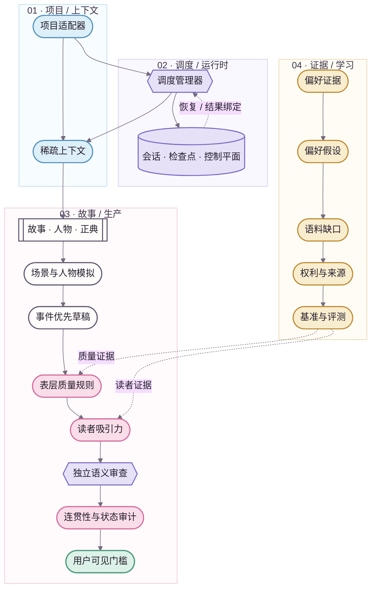

<div align="center">
  
  <p><strong>把小说生产做成可恢复、可审计、可学习的系统，但不把小说写成系统日志。</strong></p>
  <p><kbd>故事与正典</kbd>&nbsp;&nbsp;<kbd>会话运行时</kbd>&nbsp;&nbsp;<kbd>读者质量</kbd>&nbsp;&nbsp;<kbd>偏好学习</kbd>&nbsp;&nbsp;<kbd>评测体系</kbd></p>
  <p><a href="README.en.md">English</a> · <strong>简体中文</strong></p>
</div>


# NovelForge · 自适应小说智能体框架

> 🌸 **NovelForge 不把小说生产简化成“大纲 → 提示词 → 章节”，而是把故事、正典、编辑质量、长期学习与智能体运行时统一为一个有状态的生产系统。**

**项目无关 · 会话原生 · 面向读者体验 · 证据驱动 · 提供商无关**

> **边界 ✦** 本仓库刻意**不内置任何具体小说、人物、剧情或正典（Canon）**。具体小说只通过项目适配器提供自己的配置、状态和计划；框架不会反向吸收下游项目的故事事实。

---

## 01 · 为什么需要 NovelForge ✨

多数 AI 小说工具把“调用模型”当作系统中心。NovelForge 把**明确的权威边界和可恢复的生产流程**放在中心：真正需要语义判断的工作交给模型；身份、状态迁移、权限、内容指纹、检查点、正典结算与幂等性则交给确定性机制。

| 领域 | 负责什么 | 不可越过的边界 |
|---|---|---|
| **故事 / 正典** | 故事层级、人物、关系、信息边界、资源、伏笔、连贯性 | 计划 / 审阅 / 记忆 ≠ 正典 |
| **调度 / 运行时** | 任务路由、稀疏上下文、检查点、交接、执行器 | 会话状态 ≠ 项目权威 |
| **编辑质量** | 表层质量规则、读者吸引力、独立语义审查 | “没有明显错误” ≠ “好看、想继续读” |
| **证据 / 学习** | 用户反馈、偏好假设、语料缺口、基准、评测 | 模型推断 ≠ 持久偏好 |
| **项目工程化** | 清单、精确锁定、适配器、验证、构建与发布 | 框架 ≠ 下游小说项目 |

---

## 02 · Story Loom 系统总览 🪄



**实线**表示主执行路径或依赖关系；**虚线**表示恢复、反馈、证据或引用。视觉令牌统一来自 [`assets/brand/tokens.json`](assets/brand/tokens.json)。

---

## 03 · 核心子系统 📖

### 故事与正典核心

管理 `BOOK → VOLUME → ARC → UNIT → CHAPTER → SCENE` 的故事层级，以及人物自主性、关系、信息边界、资源、义务、伏笔、证据、依赖、已接受正典与正典结算。**一份计划不会因为“系统记得它”就自动变成正典。**

### 调度与会话

调度框架（Harness）采用确定性的外层流程，并默认由一个管理器协调。`session / run / checkpoint / event / handoff / worker lease / result receipt` 分别对应会话、运行、检查点、事件、交接、执行租约和结果回执；它们描述的是“工作进行到了哪里”，不是“故事已经接受了什么”。

### 表层质量与读者吸引力

表层质量规则（`Surface Fundamentals`）负责拦截结构破损、明显 AI 腔和机械化实现；读者吸引力（`Reader Engagement`）则单独评估叙事压力、阶段性回报、语气反差、好奇心演化、场景因果与继续阅读的动力。

> ✨ **关键点：** 文字干净只是地板。一个章节完全可能“没有明显错误”，却因为安全但平淡、缺少推进力而无法通过质量门槛。

### 独立语义审查

强制独立审查必须来自真正不同的会话或调用，并绑定候选稿的内容指纹。可用路径包括本地 Codex / Claude、提供商适配器、MCP 执行器、GitHub 任务、独立聊天、局部模型和人工审阅者。

同一会话里让管理器“换个批评者角色”不算独立审查；一个有效的语义拒绝也不能通过不断更换审阅者来“审到通过”。

### 自适应偏好学习

NovelForge 不把用户口味压缩成一张永久不变的风格提示词，而是维护有证据支持、允许矛盾、可以收窄、废弃和回滚的偏好假设：

```text
用户反馈
→ 证据
→ 偏好假设
→ 置信度 / 矛盾
→ 风格维度
→ 语料缺口
→ 检索请求
→ 语料证据
→ 个性化评测
→ 当前配置 / 回滚
```

框架可以发现**新的偏好维度**，而不只是调整预设滑块。模型自己猜测“用户喜欢什么”不能单独升级为持久偏好。

### 语料智能

语料体系是证据基础设施，不是小说正典。系统可以识别证据缺口、生成检索计划、通过当前宿主允许的 Web / GitHub / MCP 连接器查找合法来源、分类权利与来源、提炼机制层观察、主动寻找反例，并构建跨作品基准。

现代版权小说不会因为“网上可以读”就被整章镜像，也不会被用来制作针对特定在世作者的模仿指纹。

### 评测与自我改进

任何持久的框架行为升级，都必须具备机制证据、反例或适用边界、评测覆盖、版本与回滚方案，以及变更后的回归验证。用户明确拒绝的模型输出可以成为负面回归证据，但不能成为正向风格范例。


## 04 · 运行时模型 ⚙️

```text
项目资源
→ 会话
→ 一次运行 / 调用
→ 检查点
→ 事件 / 交接
→ 执行租约 / 外部等待
→ 结果
→ 验证
→ 单次消费回执
→ 恢复执行
```

普通聊天会话是一等运行时。只要当前宿主还能提供其他合格的独立执行路径，框架本身并不要求必须持有 API 密钥。

### 提供商无关的执行方式

| 运行方式 | 可作管理器 | 可作专门执行器 | 可作独立审查 | 常见承载方式 |
|---|---:|---:|---:|---|
| 当前聊天会话 | ✓ | 有限 | 自审 ✗ | 宿主聊天 |
| 独立聊天会话 | — | — | ✓ | 用户或连接器转交 |
| Codex CLI | ✓ | ✓ | ✓，独立调用 | 本地进程 / MCP |
| Claude Code | ✓ | ✓ | ✓，独立调用 | 本地进程 / MCP |
| 提供商 API | — | ✓ | ✓ | 适配器 |
| GitHub Actions | — | ✓ | 有后端执行器时 ✓ | 工作流 / 事件 |
| 远程 MCP 执行器 | ✓ | ✓ | ✓，隔离会话 | Streamable HTTP |
| 本地模型 | 可选 | ✓ | ✓，隔离调用 | 适配器 |
| 人工审阅者 | — | — | ✓ | 人工转交 |

---

## 05 · 项目适配器边界 🧩

具体小说只提供项目自己拥有的信息：

```text
project/
├── project.yaml            # 项目标识 + 框架兼容性
├── profile/                # 类型 / 平台 / 文风 / 读者目标
├── bible/                  # 人物 / 世界 / 关系 / 研究资料
├── state/                  # 已接受正典 + 各类台账
├── plans/                  # 当前计划 / 场景卡
├── regressions/            # 项目专属负面回归案例
└── manuscripts/            # 草稿 / 审阅稿 / 已接受稿件
```

依赖方向永远只有一条：

```text
项目 → NovelForge
NovelForge -X→ 项目专属事实
```

---

## 06 · 仓库结构 🗺️

```text
.
├── core/                   # 故事 / 人物 / 正典基础机制
├── surface/                # 文本实现 + 读者吸引力
├── harness/                # 调度 / 会话 / 控制平面 / 执行器
├── learning/               # 偏好证据 + 升级 / 回滚
├── corpus/                 # 检索 / 权利 / 分析 / 基准
├── knowledge/              # 通用写作机制 + 框架研究
├── evals/                  # 能力评测 / 回归评测
├── docs/                   # 架构 / SDK / 集成指南
├── assets/                 # Story Loom 品牌与文档设计系统
├── project_sdk.py          # 项目工程契约
└── project_adapter.py      # 标准 / 映射式项目解析
```

---

## 07 · 文档与视觉系统 🎨

NovelForge 的 GitHub 文档使用 **Story Loom / 故事织机** 视觉体系：原创标志、语义令牌、故事线分隔符、编号式章节节奏和品牌化 Mermaid。未来可以在源图上方加入 AI / 设计师生成的品牌化架构图，但 Mermaid 仍保留为可检查、可维护的语义参照。

- [文档设计系统](assets/DESIGN_SYSTEM.zh-CN.md)
- [品牌令牌](assets/brand/tokens.json)
- [架构总览](docs/architecture.zh-CN.md)
- [视觉资产来源记录](assets/provenance.json)

`(˶ᵔ ᵕ ᵔ˶)` 可以偶尔出现在 README 的非权威微文案里；它永远不会进入 Schema、权限契约或机器状态。

---

## 08 · 核心原则 ✦

- 多智能体只是实现选择，不是质量特性。
- 持久化运行状态，不持久化意外产生的权威。
- 稀疏检索：存储中“存在”不等于自动进入模型上下文。
- 写作者上下文与负面回归样本、预期审阅结论保持隔离。
- 学习机制，不建立作者模仿模板。
- 语义拒绝是有效判断，不是更换审阅者的理由。
- 语料是证据，不是正典。
- 用户口味是可修订的证据模型，不是不可动摇的神话。

<div align="center">
  
  <br />
  <sub>后台严谨，正文鲜活；文档专业，再撒一点樱花。🌸</sub>
</div>
