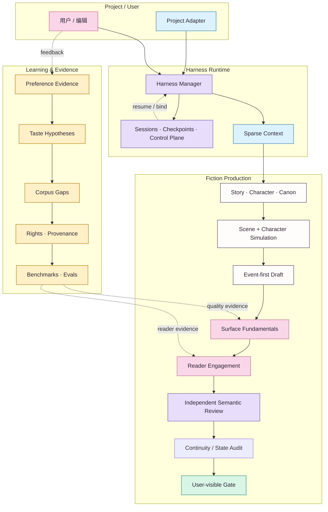

<div align="center">
  

  <h1>NovelForge · 自适应小说 Agent 框架</h1>
  <p><strong>面向长篇与连载小说的、project-agnostic 的生产级 Agent Framework。</strong></p>
  <p><code>Story State</code> · <code>Session Runtime</code> · <code>Reader Quality</code> · <code>Adaptive Learning</code> · <code>Provider Neutral</code></p>
  <p><a href="README.en.md">English</a> · <strong>简体中文</strong></p>
</div>

> 🌸 **NovelForge 不把小说生产理解成“大纲 → Prompt → 章节”，而是一个同时包含 Story、Canon、编辑质量、长期学习与 Agent Runtime 的有状态系统。**

## ✨ 为什么是 NovelForge

多数 AI 小说工具把模型调用当中心；NovelForge 把**可恢复的生产流程与明确 authority** 放在中心。模型负责真正需要语义判断的部分，确定性的状态迁移、权限、fingerprint、checkpoint、settlement 与 idempotency 则交给显式机制。

这意味着它可以同时处理：

| Domain | 能力 | 不变量 |
|---|---|---|
| **Story & Canon** | Story hierarchy、人物、关系、信息边界、资源、伏笔、continuity | Plan / Review / Memory ≠ Canon |
| **Harness & Sessions** | task routing、sparse context、checkpoint、handoff、worker | Session state ≠ Project authority |
| **Quality Runtime** | Surface Fundamentals、Reader Engagement、independent semantic review | “没犯错” ≠ “好看” |
| **Learning & Corpus** | evidence、taste hypothesis、corpus gap、benchmark、eval | Model inference ≠ durable preference |
| **Project Engineering** | manifest、lockfile、adapter、validation、build/release | Framework ≠ consumer project |

> **Boundary ✦** 本仓库刻意**不包含任何内置小说、人物、剧情或 Canon**。具体小说只通过 Project Adapter 提供自己的 profile / state / plans；Framework 不会反向吸收 consumer project 的故事事实。

## 🪄 总体架构



**读图方式：** 实线表示主执行 / dependency path；虚线表示 feedback、evidence 或 resume loop。颜色只是辅助分组，节点文字本身始终保留完整语义。

## 📖 核心子系统

### 1. Story / Canon Core

管理 `BOOK → VOLUME → ARC → UNIT → CHAPTER → SCENE` 层级，以及人物自主性、关系、信息边界、资源、义务、伏笔、证据、依赖、Accepted Canon 与 settlement。**Plan 不会因为“系统记得它”就自动成为 Canon。**

### 2. Harness & Sessions

Harness 采用 deterministic outer workflow，并默认一个 manager。`session / run / checkpoint / event / handoff / worker lease / result receipt` 都是明确的 runtime state；persistent session 只表示“工作做到哪里”，不自动授予故事 authority。

### 3. Surface + Reader Engagement

Surface Fundamentals 拦截 malformed、AI-ish、机械化实现；Reader Engagement 单独衡量 narrative pressure、reward、tonal contrast、curiosity evolution、scene causality 与 forward pull。

> ✨ **关键点：** clean prose 只是地板。一个章节可以完全“没有明显错误”，但依然因为 SAFE-BUT-FLAT 而 Gate Fail。

### 4. Independent Semantic Workers

Mandatory independent review 必须来自真正不同的 session/invocation，并绑定 artifact fingerprint。可用 transport 包括本地 Codex/Claude、provider adapter、MCP worker、GitHub job、独立 peer chat、local model 与 human reviewer。

同一个 session 里让 manager 换一个“critic 角色”不算 independent review；有效 semantic reject 也不能靠 reviewer-shopping 审到 PASS。

### 5. Adaptive Preference Learning

NovelForge 不把用户口味压成一张永久 style prompt，而是维护有证据、有 contradiction、可 narrow / deprecate / rollback 的 hypothesis：

```text
feedback
→ evidence
→ preference hypothesis
→ confidence / contradiction
→ style dimensions
→ corpus gap
→ discovery request
→ corpus evidence
→ personalized eval
→ active profile / rollback
```

系统可以发现**新的偏好维度**，而不只是修改预设 slider。模型自己“觉得用户喜欢什么”永远不能单独 promote durable taste。

### 6. Corpus Intelligence

Corpus 是 evidence infrastructure，而不是小说 Canon。系统可以识别证据缺口、生成 discovery plan、通过当前 host 的 Web/GitHub/MCP connector 检索合法来源、分类 rights/provenance、提炼 mechanism-level observation、寻找 counterexample，并构建 cross-work benchmark。

现代版权小说不会因为“网上能读”就被整章镜像，也不会生成 named-author imitation fingerprint。

### 7. Eval & Self-improvement

任何 durable Framework behavior promotion 都要求 mechanism evidence、counterexample/profile boundary、eval coverage、version/rollback 与 post-change regression。用户明确拒绝的模型输出可以成为 negative regression evidence，但不能成为正向风格 exemplar。

## ⚙️ Runtime 模型

```text
resource / project
→ session / thread
→ run / invocation
→ checkpoint
→ event / handoff
→ worker lease / external wait
→ result
→ validation
→ consume-once receipt
→ resume
```

Chat session 是一等 runtime。只要 host 仍有其他合格的 independent worker path，Framework 本身不要求必须持有 API key。

### Provider-neutral execution

| Runtime | Manager | Specialist | Independent review | 常见 transport |
|---|---:|---:|---:|---|
| 当前 Chat session | ✓ | bounded | self-review ✗ | host chat |
| 独立 Peer Chat | — | — | ✓ | user / connector relay |
| Codex CLI | ✓ | ✓ | ✓ 独立 invocation | local process / MCP |
| Claude Code | ✓ | ✓ | ✓ 独立 invocation | local process / MCP |
| Provider API | — | ✓ | ✓ | adapter |
| GitHub Actions | — | ✓ | 有 worker backend 时 ✓ | workflow / event |
| Remote MCP worker | ✓ | ✓ | isolated session ✓ | Streamable HTTP |
| Local model | optional | ✓ | isolated invocation ✓ | adapter |
| Human reviewer | — | — | ✓ | relay |

## 🧩 Project Adapter 边界

具体小说只提供 project-owned information：

```text
project/
├── project.yaml            # identity + framework compatibility
├── profile/                # genre / platform / prose / reader targets
├── bible/                  # characters / world / relationships / research
├── state/                  # Accepted Canon + ledgers
├── plans/                  # active plans / scene cards
├── regressions/            # project-only negative cases
└── manuscripts/            # draft / review / accepted artifacts
```

依赖方向永远只有一条：

```text
Project → NovelForge
NovelForge -X→ Project-specific imports
```

CI 会直接拒绝 Framework repo 中出现 consumer-project leakage。

## 🗺️ Repository Map

```text
.
├── core/                   # Story / Character / Canon primitives
├── surface/                # prose realization + reader engagement
├── harness/                # orchestration / sessions / control plane / workers
├── learning/               # preference evidence + promotion / rollback
├── corpus/                 # discovery / rights / analysis / benchmarks
├── knowledge/              # generic craft + framework research
├── evals/                  # capability / regression suites
├── docs/                   # architecture / SDK / integration guides
├── assets/                 # visual identity + documentation design system
├── project_sdk.py          # project engineering contract
└── project_adapter.py      # standard / mapped project resolution
```

## 🌐 双语文档

所有面向人的文档都发布为中英双语成对版本：

```text
name.en.md
name.zh-CN.md
```

`README.md`、`AGENTS.md`、`CLAUDE.md`、`SKILL.md` 等 stable entry 保持 compact bootstrap；CI 检查文档配对和内部链接。Machine schema 继续使用单份 JSON/YAML，避免双份 schema 漂移。

## 🎨 Visual Documentation

Mermaid 是 authoritative diagram format，因为它可 version-control、可 diff、可 review。`assets/` 提供统一的 **professional technical + anime-editorial** 视觉系统；Hero、sakura/lavender/mint accent、少量 `🌸 ✨ 📖 ✦` 与未来原创 editor/mascot motif 都只属于 decorative layer。

- [文档设计系统](assets/DESIGN_SYSTEM.zh-CN.md)
- [Visual System](assets/README.zh-CN.md)

> `(˶ᵔ ᵕ ᵔ˶)` 可以存在于 README 的微文案里；它永远不会出现在 schema、authority contract 或机器状态里。

## ✦ 原则

- 从简单开始：multi-agent 是实现选择，不是质量特性。
- Persist operational state，不持久化 accidental authority。
- Sparse retrieval：Storage 里“存在”不等于自动注入 prompt。
- Writer context 与 regression gold / expected verdict 隔离。
- 学习 mechanism，不学禁词表，也不学作者模仿模板。
- Semantic rejection 是有效判断，不是换 reviewer 的理由。
- Corpus 是 evidence，不是 Canon。
- User taste 是可修订的证据模型，不是永久神话。

## 🚧 当前状态

NovelForge v7 正在把 Generic Story / Surface / Corpus / Learning / Eval、session-native Harness、provider-neutral runtime 与 Project SDK 收敛为一个自包含 Framework。Normal CI 保持 deterministic；live semantic model execution 必须显式触发，不能静默消耗 usage。

<p align="center"><sub>严谨的后台，鲜活的正文；专业的文档，再偷偷撒一点樱花。🌸</sub></p>
