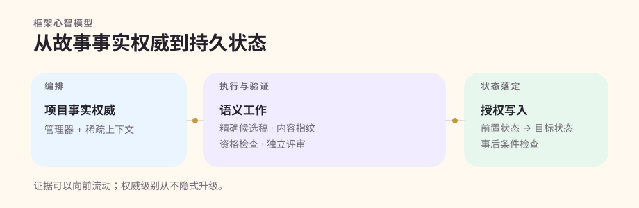

<p align="center">
  
</p>

<h1 align="center">Quillframe</h1>

<p align="center"><strong>面向长篇小说的 AI-native 创作框架与写作环境。</strong></p>

<p align="center">故事可以越写越长；正典、上下文、人物状态和执行事实，仍然应该清楚知道自己处在什么位置。</p>

<p align="center">
  <a href="https://quillframe.wei-dev.com/">产品网站</a> ·
  <a href="https://studio.quillframe.wei-dev.com/">Studio</a> ·
  <a href="https://quillframe.wei-dev.com/docs/">文档</a> ·
  <a href="#快速开始">快速开始</a>
</p>

<p align="center">
  <a href="https://github.com/xiaooye/cn_webnovel_agent/actions/workflows/quillframe-ci.yml"></a>
  
  <a href="LICENSE"></a>
</p>

<p align="center"><sub>0.9.x · pre-1.0 · 持续开发中</sub></p>
<p align="center"><strong>简体中文</strong> · <a href="README.en.md">English</a></p>

---

> **✦ Quillframe 不是给 LLM 套一层聊天界面的 wrapper。** 模型负责需要理解力的判断与生成；Quillframe 负责长时间运行的那套系统：故事结构、人物与关系状态、正典、受边界约束的上下文、运行身份、质量门槛、学习证据、持久化，以及经过授权的状态落定。

## 为什么需要 Quillframe

一次性的 AI 写作流程很简单：**提示词 → 模型 → 文本**。但一本活过几百个场景的小说，需要回答更难的问题：哪些事实才有权威？哪些只是未来计划？某条证据到底有没有真正进入这次模型调用？一次评审是不是针对当前这份候选稿？用户接受修改以后，项目状态是否真的、完整地落定了？

Quillframe 不靠聊天记录去猜这些答案，而是把它们变成明确的系统边界。

概念上的长篇生产链是：受限 Context → Story/Canon 预检 → 场景与人物模拟 → 生成/修订 → 需要时进行真正独立的语义评审 → 读者投入度/连续性验证 → 用户可见 Review 候选稿 → 明确接受 → Settlement 写入持久项目状态。

它有意比一次性写作助手更重；也正因为如此，它适合那些真正会被连续性、来源证明、恢复能力和长周期质量拖垮的大型项目。

## 真正重要的原则

| | 原则 | 在系统里的实际含义 |
|---|---|---|
| ✦ | **正典有边界** | Plan、Draft、Review、Accepted 正文、Canon 与 Settled 状态是不同生命周期/权威状态。 |
| ✧ | **上下文有边界** | 项目里保存的内容远多于一次调用该看到的内容。稀疏 Context Manifest 只选当前任务真正需要的证据；stored ≠ injected。 |
| ♡ | **人物完整性** | 人物目标、知识边界、关系、空间位置和情绪后果属于生产状态，不是装饰提示词。 |
| ⋆ | **独立语义判断是真的独立** | 需要独立性时，评审必须绑定精确 artifact fingerprint，并由真正不同的合格执行完成。 |
| ✦ | **作者优先** | Studio 首先是写作环境；runtime inspection 渐进展开，而不是反过来主导日常创作信息架构。 |
| ✧ | **SQLite-native** | 持久产品状态以 SQLite 为 canonical authority；Markdown、DOCX、EPUB 等是导入/导出产物，不是第二套 live database。 |
| ♡ | **推理能力不是系统权威** | 模型负责理解与生成；Quillframe 负责编排、工具、状态、权限、来源证明和项目权威边界。 |
| ⋆ | **自动学习不等于偷偷晋升规则** | 用户反馈可以进入证据 intake，但不会悄悄变成 Canon、Project preference、user taste 或 Framework policy。 |

## Quillframe 怎样组成

### 产品心智模型

```text
作者
 ↓
Quillframe
 ├─ 创作工作流
 ├─ Story / Character / Relationship / Canon / Context
 ├─ Agent Runtime / Quality / Learning / Settlement
 └─ 持久项目状态
 ↕
Model API
```

Model API 不在 Quillframe 的 authority chain 上方。它只是为某个 Quillframe-owned operation 提供 inference。

### 模型连接：用户只需要两个输入

当前 Model Runtime 的普通设置面只有：

```text
API Endpoint
Access Token
```

无认证本地 endpoint 时，`Access Token` 可以为空。Protocol discovery、model discovery、capability evidence、model selection、tool execution、Session/Run/Checkpoint 身份，以及 model → tool → model loop 都由 Quillframe 自己负责。Provider/vendor identity 最多只是诊断 provenance，不是 runtime authority，也不是 onboarding input。

解析后的 token 不会被持久化到 SQLite、prompt、Context、AgentJob/Result、checkpoint、receipt 或 fingerprint；durable Model Service 只保存 credential reference，真正 secret 在需要 inference 时由 host 即时解析。

<details>
<summary><strong>Wire protocol 细节</strong></summary>

当前 codec 覆盖 OpenAI Chat Completions、OpenAI Responses 与 Anthropic Messages。这里描述的是 wire protocol family，不是 provider identity。能够列出模型，只能证明 model discovery；tools、vision、structured output、context limit 等能力仍需要独立 evidence。

Normal CI 不会调用配置的在线/付费 Model API。Live compatibility probe 必须显式 opt-in，而且结果只是带时间戳、绑定具体 endpoint/model 的 evidence，不会被当成永久能力事实。

详见 [Model Runtime](docs/model-runtime.zh-CN.md) 与 [Agent Runtime](docs/agent-runtime.zh-CN.md)。

</details>

### Framework、Studio 与持久状态

```text
SolidJS Studio / host surface
          ↓
   typed Bridge / API
          ↓
   Python Quillframe Core
          ↓
        SQLite
```

Tauri 2 thin host 是当前桌面 architecture direction；但 `0.9.0` 当前真正已经存在的是 SolidJS Local Web / cloud UI 与 Python typed Host Bridge，而不是一个已经完成的 Tauri wrapper。



通用 Framework 拥有机制；具体 Project 拥有自己的剧情事实、人物、关系、研究、计划、稿件、Accepted Canon 与当前状态。依赖方向只有 **Project → Quillframe**，一本小说里的私有事实不会反向变成通用 Framework 真理。

### 正文生产是一条生命周期，不是一次生成调用


当前 DRAFT / REVISE 路径会经过受限 Context 与 authority bootstrap、Story/Canon 预检、人物/场景模拟、Reader Pressure、事件优先 Raw Draft、表层实现、资格检查、需要时的独立语义评审、修复/挑战稿、读者投入度、连续性检查与用户可见门槛。

**Raw Draft 永远是内部产物。Review 不等于 Accepted；Accepted 不等于 Settled。**

## Canon、Context 与 Settlement

Quillframe 刻意把这些概念拆开：

```text
stored      ≠ injected
Plan        ≠ Canon
Review      ≠ Accepted
Accepted    ≠ Settled
autosave    ≠ Accepted
revision    ≠ Canon
Research    ≠ Character Knowledge
Corpus      ≠ Canon
session     ≠ Canon
persistence ≠ authority
```

当前 Canon precedence 是 `locked > accepted > active_plan > review > proposal`。这描述的是权威与生命周期，不是一条可以自动往上“升级”的流水线。

**Settlement** 才是把明确接受变成持久状态修改的授权事务。它要求精确 before → after 意图、当前 before-state 校验、写入授权、依赖/派生处理和 post-condition。任何关键前状态不匹配都会得到 `settlement_incomplete`，而不是“估计已经写成功”。

<details>
<summary><strong>为什么 Sparse Context 很重要</strong></summary>

一个长期项目可以存下远超一次模型调用容量的内容。Quillframe 先判断当前语义问题需要哪些证据，再由确定性 assembly 校验精确引用、权威类别、可见性/阶段约束、来源证明、fingerprint 与 hard budget。

因此，项目存了什么、语义选择认为哪些内容有用、以及最终什么真正进入模型上下文，始终是三件不同的事。详见[上下文与记忆](docs/context-and-memory.zh-CN.md)。

</details>

## Learning：自动接收，受治理晋升

有意义的用户反馈可以自动进入 learning intake，不需要每次显式触发学习任务：

`capture → interpret → scope → evidence → candidate → validation`

自动 capture **不等于** 自动 promotion。`one_off`、`project`、`user_taste`、`general_craft` 各自独立；模型推断出一个偏好，不会因此自动获得永久写权限。

## Studio · 首先是写作环境

Quillframe Studio 是 Core 周围的 product-experience layer。`0.9.0` 已经有真实的 SolidJS + TypeScript + Vite application shell，并通过 typed read-only Host Bridge 工作，同时支持 local 和 cloud-hosted web surface。

Writer Mode 的方向围绕书桌、正文、计划、故事、审阅、研究与语料、学习、发布展开；更底层的 runtime detail 通过 Inspector 渐进展开。并行 UI/UX branch 正在继续完善这套 authoring surface；**未合并 branch 的功能和未来截图都不能冒充 released behavior。**

当前 Studio Bridge 已有 bridge description、Framework doctor、project inspection、capability inspection、Context inspection、semantic catalog inspection。Core 没有暴露 mutation / acceptance / Settlement / private SQLite contract 的地方，UI 不会自行伪造。

## SQLite 是 canonical durable state

```text
~/.quillframe/
├─ quillframe.sqlite
├─ projects/
│  └─ <project-id>/
│     ├─ project.sqlite
│     ├─ blobs/
│     └─ exports/
├─ backups/
└─ cache/
```

连接会开启 foreign keys、busy timeout、WAL journal mode 与 `synchronous=FULL`。Migration 按顺序执行并校验 checksum；persistence CLI 还提供 `doctor`、backup/verify/restore、project creation 与 search。

持久化本身不会授予 Canon、Accepted、Settlement 或 Learning promotion 权威。

## 快速开始

### 环境要求

- **Python >= 3.11**；当前 CI 使用 Python 3.13 验证。
- **Node.js 24**：产品网站、文档与 Studio build。
- **pnpm 10.33.0**：`studio/app`。

Quillframe 仍在 pre-1.0。消费项目应遵循自己锁定的 exact Framework revision / bundle，不要默认 latest `main` 一定兼容。

### Clone、安装并验证 Library/Core

```bash
git clone https://github.com/xiaooye/cn_webnovel_agent.git
cd cn_webnovel_agent
python -m pip install -e .
python -c "from quillframe import Quillframe, AgentJob; print(Quillframe.__name__, AgentJob.__name__)"
python project_sdk.py self-test
python studio/host_bridge.py self-test
python persistence/cli.py doctor
```

Self-test 成功时会输出结构化结果；`doctor` 会初始化/检查默认 data root，但 persistence 本身永远不会把正文变成 Canon。

### 运行当前本地 Studio

```bash
cd studio/app
corepack enable
pnpm install --frozen-lockfile
pnpm build
cd ../..
python studio/local_server.py
```

Local server 只绑定 loopback，并打印可打开的 URL。当前 Studio 消费 typed read-only Host Bridge。**基本 inspection / authoring shell 启动不要求先配置 AI endpoint。**

### 创建小说 Project 骨架

```bash
python project_sdk.py init ./my-novel \
  --id PROJECT-MY-NOVEL \
  --title "我的小说" \
  --language zh-CN

python project_sdk.py validate ./my-novel
python project_sdk.py build ./my-novel
```

Project SDK 会把计划、状态、正文、研究、Corpus refs、tests 与 project lock 分开建立；它不会自动把内容晋升为 Canon。

<details>
<summary><strong>运行产品网站与 Starlight 文档</strong></summary>

```bash
cd site
npm install --no-audit --no-fund
npm run dev
npm run dev:docs
```

Production verification 使用 `npm run quality`、`npm run build`、`npm run docs:build`。

</details>

## 仓库结构

```text
cn_webnovel_agent/
├─ quillframe/            # embeddable public Python façade
├─ agent_runtime/         # Quillframe-owned AgentJob / Tool / Agent loop
├─ model_runtime/         # endpoint、discovery、capability evidence、inference transport
├─ core/                  # Story / Character / Canon 契约
├─ harness/               # sessions、semantic execution、control plane
├─ quality/               # production readiness 与 quality evolution
├─ learning/              # evidence intake、hypothesis、受治理 promotion
├─ corpus/                # 受治理 craft/research evidence
├─ persistence/           # canonical SQLite durable state
├─ publication/           # Accepted-text publication IR/compiler
├─ studio/                # Host Bridge、local server、SolidJS Studio app
├─ site/                  # 产品网站 + Astro/Starlight 文档 build
├─ docs/                  # 公共概念、指南与架构
├─ tests/                 # deterministic contract/regression tests
├─ specs/                 # 当前与历史工程规格
└─ .github/               # CI、部署、Issue/PR contribution surfaces
```

历史记录在 provenance 需要时保留当时的原始术语；当前产品指导统一使用 Quillframe / `quillframe`。

## 文档地图

| 从这里开始 | 当你需要了解 |
|---|---|
| [文档中心](docs/README.zh-CN.md) | 整套文档的推荐阅读路径 |
| [为什么是 Quillframe](docs/why-quillframe.zh-CN.md) | 产品适用场景、取舍与系统边界 |
| [总体架构](docs/architecture.zh-CN.md) | Framework/Project authority、语义与确定性 ownership、Settlement |
| [Model Runtime](docs/model-runtime.zh-CN.md) | Endpoint + Token、discovery、capability evidence、secret/network policy |
| [Agent Runtime](docs/agent-runtime.zh-CN.md) | AgentJob、tool loop、checkpoint、receipt、embeddable library |
| [生产流水线](docs/production-pipeline.zh-CN.md) | DRAFT/REVISE 生命周期与用户可见 readiness |
| [上下文与记忆](docs/context-and-memory.zh-CN.md) | Sparse Context、visibility、persistence、memory boundaries |
| [质量保障](docs/quality-assurance.zh-CN.md) | fingerprint-bound gate、diagnostics、独立评审 |
| [自适应学习](docs/adaptive-learning.zh-CN.md) | feedback intake、evidence、scope、promotion rules |
| [Project SDK](docs/project-sdk.zh-CN.md) | 把一本小说接成可复现 Project |
| [Studio](studio/README.zh-CN.md) | 当前产品 shell 与 Host Bridge 行为 |
| [架构图谱](docs/architecture-atlas.zh-CN.md) | implementation owner 与深入 contract link |

公共文档使用 **Astro + Starlight** 构建，并挂在 Quillframe 产品站下。

## 当前状态 · 0.9.x

Quillframe 仍是 **pre-1.0 / active development**；1.0 前可能出现 breaking changes。

| Area | 当前 `main` 状态 |
|---|---|
| 可嵌入 `quillframe` Python library | 已实现；wheel/import 由 CI 验证 |
| Quillframe-owned Model Runtime | 已实现；Endpoint + Token、discovery、capability evidence、inference transport |
| Quillframe-owned Agent Runtime | 已实现；typed job/result、tool runtime、checkpoint/receipt boundary |
| Python fiction Core / authority contracts | 已实现，CI 覆盖 |
| SQLite-native persistence | 已实现，CI 覆盖 |
| typed read-only Host Bridge | 已实现，有 self-test |
| SolidJS Studio | 已有真实 application shell；authoring UX 仍在演进 |
| 产品网站 + Starlight docs | 已实现并由 deployment workflow 管理 |
| Tauri 2 thin desktop host | architecture direction；当前 `main` 还没有完成 wrapper |
| Writer Mode UX reconstruction | **并行 UI/UX 工作中；未合并内容不是 released** |

Normal CI 刻意使用 deterministic/mock Model Runtime；live endpoint compatibility 是 opt-in evidence，不是默认 release claim。

## 贡献

从 [CONTRIBUTING.md](CONTRIBUTING.md) 开始。小型修复欢迎提交；涉及 Canon/Settlement semantics、semantic independence、Learning promotion、persistence authority、Model/Agent Runtime contract 或其他 authority surface 的改动，需要明确 architecture reasoning 与对应 tests。

常用入口：[Issues](https://github.com/xiaooye/cn_webnovel_agent/issues/new/choose) · [安全政策](SECURITY.md) · [行为准则](CODE_OF_CONDUCT.md) · [Roadmap](ROADMAP.md) · [变更日志](CHANGELOG.zh-CN.md)

## 安全

不要在公开 Issue 中粘贴 API Access Token、provider credential、私有小说正文或敏感 project database。解析后的 Model API token 是 host secret，不得进入 prompt、receipt、SQLite 或 Vite client bundle；Hosted secret 只能留在 server side。详见 [SECURITY.md](SECURITY.md)。

## License

**这个 public repository 当前是 source-available，而不是 OSI open source。** 当前 [LICENSE](LICENSE) 只授予有限的私人、非商业评估/研究权限，并限制 redistribution、deployment 与 commercial use；除非另有单独书面授权。

法律文件保留了项目历史阶段的产品命名。本次 repository presentation 工作不会改写法律文本；任何法律身份或 relicensing 变化都必须是单独、明确的决策。

---

<p align="center"><sub>✦ · Quillframe 让创作判断保持灵活，也让系统事实始终明确。 · ♡</sub></p>
