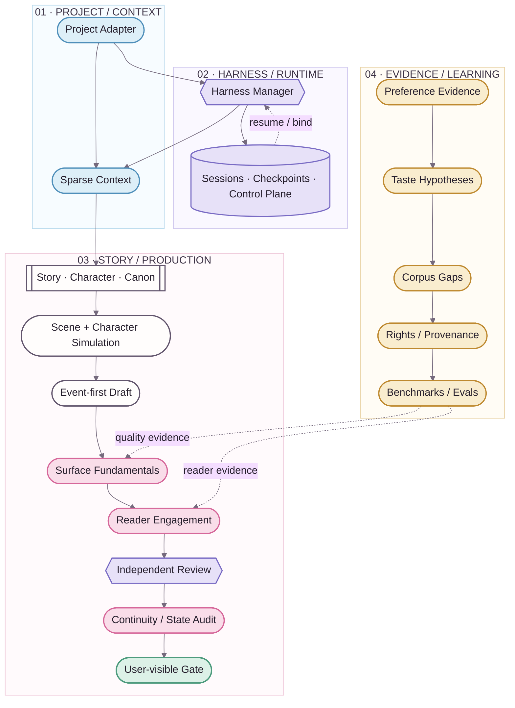

<div align="center">
  
  <p><strong>把小说生产做成可恢复、可审计、可学习的系统，但别把小说写成系统日志。</strong></p>
  <p><kbd>STORY + CANON</kbd>&nbsp;&nbsp;<kbd>SESSIONS</kbd>&nbsp;&nbsp;<kbd>READER QUALITY</kbd>&nbsp;&nbsp;<kbd>LEARNING</kbd>&nbsp;&nbsp;<kbd>EVALS</kbd></p>
  <p><a href="README.en.md">English</a> · <strong>简体中文</strong></p>
</div>


# NovelForge · 自适应小说 Agent 框架

> 🌸 **NovelForge 不把小说生产理解成“大纲 → Prompt → 章节”，而是一个同时包含 Story、Canon、编辑质量、长期学习与 Agent Runtime 的有状态生产系统。**

**Project-agnostic · Session-native · Reader-aware · Evidence-driven · Provider-neutral**

> **Boundary ✦** 本仓库刻意**不包含任何内置小说、人物、剧情或 Canon**。具体小说通过 Project Adapter 提供自己的 profile / state / plans；Framework 不会反向吸收 consumer project 的故事事实。

---

## 01 · 为什么是 NovelForge ✨

多数 AI 小说工具把模型调用放在中心；NovelForge 把**明确 authority + 可恢复 production workflow** 放在中心。模型只负责真正需要 semantic judgment 的部分；identity、state transition、permission、fingerprint、checkpoint、settlement、idempotency 则交给 deterministic mechanism。

| Lane | 能力 | 不变量 |
|---|---|---|
| **Story / Canon** | Story hierarchy、人物、关系、信息边界、资源、伏笔、continuity | Plan / Review / Memory ≠ Canon |
| **Harness / Runtime** | task routing、sparse context、checkpoint、handoff、worker | Session state ≠ Project authority |
| **Editorial Quality** | Surface Fundamentals、Reader Engagement、independent semantic review | “没犯错” ≠ “有抓力” |
| **Evidence / Learning** | evidence、taste hypothesis、corpus gap、benchmark、eval | Model inference ≠ durable preference |
| **Project Engineering** | manifest、lockfile、adapter、validation、build/release | Framework ≠ consumer project |

---

## 02 · Story Loom System Map 🪄



**实线**表示主 execution / dependency；**虚线**表示 feedback、evidence 或 resume。视觉 token 来自 [`assets/brand/tokens.json`](assets/brand/tokens.json)。

---

## 03 · 核心子系统 📖

### Story / Canon Core

管理 `BOOK → VOLUME → ARC → UNIT → CHAPTER → SCENE` 层级，以及人物自主性、关系、信息边界、资源、义务、伏笔、证据、依赖、Accepted Canon 与 settlement。**Plan 不会因为系统记得它就自动成为 Canon。**

### Harness & Sessions

Harness 使用 deterministic outer workflow，并默认一个 manager。`session / run / checkpoint / event / handoff / worker lease / result receipt` 都是明确 runtime state；persistent session 只表示“工作做到哪里”，不授予故事 authority。

### Surface + Reader Engagement

Surface Fundamentals 拦截 malformed、AI-ish、机械化实现；Reader Engagement 单独衡量 narrative pressure、reward、tonal contrast、curiosity evolution、scene causality 与 forward pull。

> ✨ **Key idea：** clean prose 只是地板。一个章节可以“没有明显错误”，但仍然因为 SAFE-BUT-FLAT 而 Gate Fail。

### Independent Semantic Workers

Mandatory independent review 必须来自真正不同的 session/invocation，并绑定 artifact fingerprint。可用 transport 包括本地 Codex/Claude、provider adapter、MCP worker、GitHub job、独立 peer chat、local model 与 human reviewer。

同 session 换一个“critic 角色”不算独立；有效 semantic reject 也不能靠 reviewer-shopping 审到 PASS。

### Adaptive Preference Learning

```text
feedback
→ evidence
→ preference hypothesis
→ confidence / contradiction
→ style dimensions
→ corpus gap
→ discovery request
→ corpus evidence
→ personalized eval
→ active profile / rollback
```

系统可以发现**新的偏好维度**；模型自己“觉得用户喜欢什么”不能单独 promote durable taste。

### Corpus Intelligence

Corpus 是 evidence infrastructure，不是小说 Canon。系统可以识别证据缺口、生成 discovery plan、通过 host Web/GitHub/MCP connector 检索合法来源、分类 rights/provenance、提炼 mechanism-level observation、寻找 counterexample，并构建 cross-work benchmark。

### Eval & Self-improvement

Durable Framework behavior promotion 要求 mechanism evidence、counterexample/profile boundary、eval coverage、version/rollback 与 post-change regression。用户拒绝稿可以成为 negative regression evidence，不能成为正向 exemplar。


## 04 · Runtime Model ⚙️

```text
resource / project
→ session / thread
→ run / invocation
→ checkpoint
→ event / handoff
→ worker lease / external wait
→ result
→ validation
→ consume-once receipt
→ resume
```

Chat session 是一等 runtime。只要 host 仍有其他合格的 independent worker path，Framework 不要求必须持有 API key。

### Provider-neutral execution

| Runtime | Manager | Specialist | Independent review | 常见 transport |
|---|---:|---:|---:|---|
| 当前 Chat session | ✓ | bounded | self-review ✗ | host chat |
| 独立 Peer Chat | — | — | ✓ | user / connector relay |
| Codex CLI | ✓ | ✓ | ✓ 独立 invocation | local process / MCP |
| Claude Code | ✓ | ✓ | ✓ 独立 invocation | local process / MCP |
| Provider API | — | ✓ | ✓ | adapter |
| GitHub Actions | — | ✓ | 有 worker backend 时 ✓ | workflow / event |
| Remote MCP worker | ✓ | ✓ | isolated session ✓ | Streamable HTTP |
| Local model | optional | ✓ | isolated invocation ✓ | adapter |
| Human reviewer | — | — | ✓ | relay |

---

## 05 · Project Adapter Boundary 🧩

```text
project/
├── project.yaml            # identity + framework compatibility
├── profile/                # genre / platform / prose / reader targets
├── bible/                  # characters / world / relationships / research
├── state/                  # Accepted Canon + ledgers
├── plans/                  # active plans / scene cards
├── regressions/            # project-only negative cases
└── manuscripts/            # draft / review / accepted artifacts
```

依赖方向只有：

```text
Project → NovelForge
NovelForge -X→ Project-specific imports
```

---

## 06 · Repository Map 🗺️

```text
.
├── core/                   # Story / Character / Canon primitives
├── surface/                # prose realization + reader engagement
├── harness/                # orchestration / sessions / control plane / workers
├── learning/               # preference evidence + promotion / rollback
├── corpus/                 # discovery / rights / analysis / benchmarks
├── knowledge/              # generic craft + framework research
├── evals/                  # capability / regression suites
├── docs/                   # architecture / SDK / integration guides
├── assets/                 # Story Loom brand + documentation system
├── project_sdk.py          # project engineering contract
└── project_adapter.py      # standard / mapped project resolution
```

---

## 07 · Visual & Documentation System 🎨

NovelForge 的 GitHub 页面使用 **Story Loom**：自有 logo、semantic tokens、story-thread divider、编号 section rhythm 与 branded Mermaid。未来可以增加 AI/designer-rendered architecture visual，但 Mermaid 仍保留为 source/reference chart。

- [Documentation Design System](assets/DESIGN_SYSTEM.zh-CN.md)
- [Brand tokens](assets/brand/tokens.json)
- [Architecture](docs/architecture.zh-CN.md)
- [Visual provenance](assets/provenance.json)

`(˶ᵔ ᵕ ᵔ˶)` 可以存在于 README 微文案里；它永远不会出现在 schema、authority contract 或 machine state 中。

---

## 08 · Principles ✦

- Multi-agent 是实现选择，不是质量特性。
- Persist operational state，不持久化 accidental authority。
- Sparse retrieval：Storage 里“存在”不等于自动注入 prompt。
- Writer context 与 regression gold / expected verdict 隔离。
- 学 mechanism，不学作者模仿模板。
- Semantic rejection 是有效判断，不是换 reviewer 的理由。
- Corpus 是 evidence，不是 Canon。
- User taste 是可修订证据模型，不是永久神话。

<div align="center">
  
  <br />
  <sub>严谨的后台，鲜活的正文；专业的文档，再撒一点樱花。🌸</sub>
</div>
