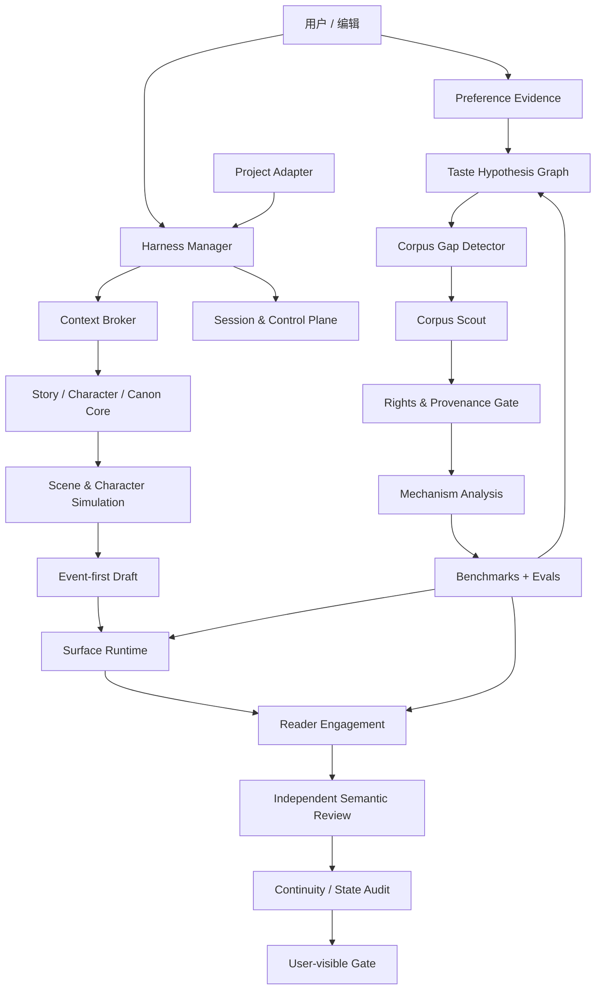

# NovelForge · 自适应小说 Agent 框架

<p align="center">
  <strong>面向长篇与连载小说的、项目无关的生产级 Agent Framework。</strong>
</p>

<p align="center">
  <a href="README.en.md">English</a> · 简体中文
</p>

## 为什么是 NovelForge

多数 AI 小说工具停在 `大纲 → Prompt → 章节`。NovelForge 把小说创作视为一个同时包含软件工程、编辑流程和长期记忆的有状态生产系统：

- 显式 Story Architecture 与 Canon 状态；
- session-native orchestration 与可恢复 checkpoint；
- bounded specialist workers，而不是热闹但低效的 agent round-table；
- fingerprint-bound 的独立语义审计；
- Surface Quality 与 Reader Engagement 双重质量门；
- 基于证据的用户偏好学习；
- 自主 Corpus discovery 与 benchmark 建设；
- 权利/来源感知的语料处理；
- capability eval + regression eval；
- provider-neutral runtime：普通 chat、本地 agent、MCP、API、CI job、local model 或 human reviewer 都可以接入。

本仓库刻意**不包含任何内置小说、人物、剧情或 Canon**。具体项目只通过 Project Adapter 提供自己的 profile 与 state。

## 总体架构



## 核心子系统

### 1. Story / Canon Core

管理 BOOK/VOLUME/ARC/UNIT/CHAPTER/SCENE 层级、人物自主性、信息边界、关系、资源、义务、伏笔、证据、依赖与 Accepted Canon。Plan 不会因为存在于系统里就自动成为 Canon。

### 2. Harness & Sessions

Harness 使用 deterministic outer workflow，并默认一个 manager。Session、run、checkpoint、event、handoff、worker lease 与 exactly-once logical consumption 都是明确的 runtime state。

### 3. Surface + Reader Engagement

Surface Safety 负责拦截 malformed、AI-ish、机械实现的正文；Reader Engagement 单独衡量 narrative pressure、reward、tonal contrast、curiosity evolution、scene causality 与 forward pull。文字“没犯错”仍然可能因为无聊而失败。

### 4. Independent Semantic Workers

Mandatory independent review 必须来自真正不同的 session/invocation。可用 transport 包括本地 Codex/Claude child process、provider adapter、MCP worker、GitHub job、独立 peer chat、local model 和 human reviewer。同 session 换一个“critic 角色”永远不算独立审计。

### 5. Adaptive Preference Learning

NovelForge 不把用户口味压成一张静态 style prompt，而是维护有证据支撑、可被推翻的 hypothesis：

```text
feedback
→ evidence
→ preference hypothesis
→ confidence / contradiction
→ style dimensions
→ corpus gap
→ discovery request
→ corpus evidence
→ personalized eval
→ active profile / rollback
```

系统可以自主发现**新的偏好维度**，而不只是修改预设 slider。

### 6. Corpus Intelligence

Corpus 是一等公民。系统可以自主识别证据缺口、生成 discovery plan、通过当前 host 的 Web/GitHub/MCP connector 检索合法来源、分类 rights、提炼 mechanism-level observation、主动寻找 counterexample、构建 cross-work benchmark，并用结果强化 personalized profile 或 General Craft。

它不会因为现代小说“网上能看”就整章镜像，也不会生成“模仿某位在世作者”的句式指纹。

### 7. Eval & Self-improvement

任何持久行为升级都必须有 mechanism evidence、counterexample/profile boundary、eval coverage、version/rollback 与 post-change regression。用户明确拒绝的模型输出可以成为 negative regression evidence，但不能成为正向风格范例。

## Runtime 模型

```text
resource/project
→ session/thread
→ run/invocation
→ checkpoint
→ event / handoff
→ worker lease / external wait
→ result
→ validation
→ consume-once receipt
→ resume
```

Chat session 是一等 runtime。只要 host 还有其他合格的 independent worker path，framework 本身不要求必须持有 API key。

## Provider-neutral execution

| Runtime | Manager | Specialist | Independent review | 常见 transport |
|---|---:|---:|---:|---|
| 当前 Chat session | ✓ | bounded | self-review ✗ | host chat |
| 独立 Peer Chat | — | — | ✓ | user/connector relay |
| Codex CLI | ✓ | ✓ | ✓ 独立 invocation | local process / MCP |
| Claude Code | ✓ | ✓ | ✓ 独立 invocation | local process / MCP |
| Provider API | — | ✓ | ✓ | adapter |
| GitHub Actions | — | ✓ | 有 worker backend 时 ✓ | workflow/event |
| Remote MCP worker | ✓ | ✓ | isolated session ✓ | Streamable HTTP |
| Local model | optional | ✓ | isolated invocation ✓ | adapter |
| Human reviewer | — | — | ✓ | relay |

## Project Adapter 边界

具体小说只提供项目自己的信息：

```text
project/
├── project.yaml            # identity + framework compatibility
├── profile/                # genre / platform / prose / reader targets
├── bible/                  # characters / world / relationships / research
├── state/                  # Accepted Canon + ledgers
├── plans/                  # active plans / scene cards
├── regressions/            # project-only negative cases
└── manuscripts/            # draft / review / accepted artifacts
```

依赖方向永远只有一条：

```text
Project → NovelForge
NovelForge -X→ Project-specific imports
```

CI 会直接拒绝 framework repo 中出现 project-specific leakage。

## 双语文档

所有面向人的文档都发布为中英双语成对版本：

```text
name.en.md
name.zh-CN.md
```

`README.md`、`AGENTS.md`、`CLAUDE.md`、`SKILL.md` 等工具约定入口保持精简 bootstrap，并链接到对应的中英权威版本。CI 检查文档配对和内部链接。

机器 schema 仍使用单份 JSON/YAML，避免两套 schema 漂移；其人类说明文档必须双语。

## Visual Documentation

架构图使用 Mermaid，使图本身可以 version-control 和 diff。`assets/` 下使用统一、原创的 manga/anime-inspired visual system 作为品牌和文档装饰，不参与任何 runtime authority。

## Repository Map

```text
.
├── core/                   # story / character / Canon / context primitives
├── surface/                # prose realization + reader engagement
├── harness/                # orchestration / sessions / control plane / workers
├── learning/               # user taste + promotion / rollback
├── corpus/                 # discovery / rights / analysis / benchmarks
├── knowledge/              # general craft + framework research
├── evals/                  # capability / regression suites
├── integrations/           # host/runtime adapters
├── schemas/                # stable machine contracts
├── docs/                   # architecture and guides
├── assets/                 # diagrams / visual identity
└── examples/               # 只允许 project-agnostic fixtures
```

## 原则

- 从简单开始：multi-agent 是实现选择，不是质量特性。
- 持久化 operational state，不持久化 accidental authority。
- Sparse retrieval；不把整本 Story Bible 塞给每一次模型调用。
- Writer context 与 regression gold / reviewer expectation 隔离。
- 学习 mechanism，不学禁词表，也不学作者模仿模板。
- Semantic rejection 是有效判断，不是换 reviewer 审到 PASS 的理由。
- Corpus 是 evidence，不是 Canon。
- User taste 是可修订的证据模型，不是永久神话。

## 当前状态

Framework 正在从早期 monorepo prototype 整理成完全自包含的 Generic Story/Surface/Corpus/Learning/Eval stack，同时补齐双语文档、project-leakage CI 与 session-native integrations。
