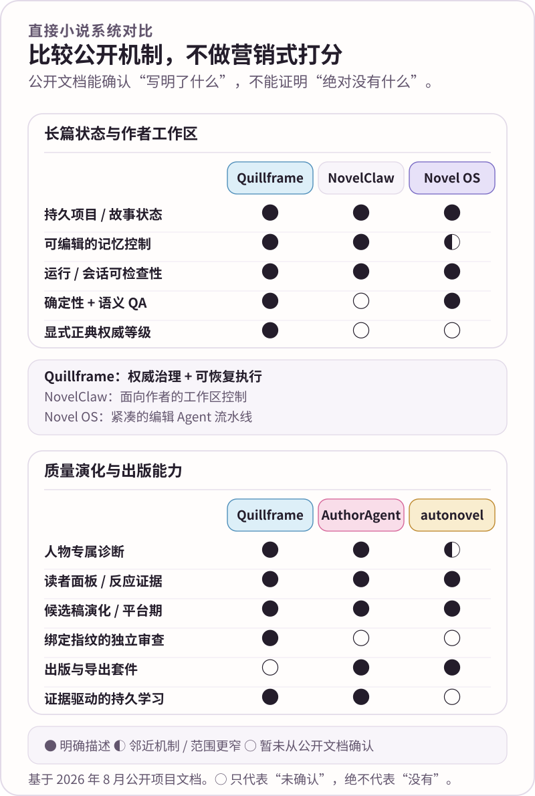
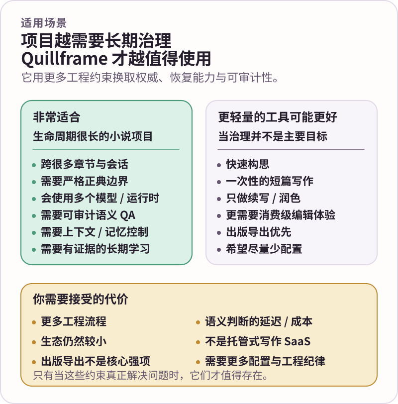

<div align="center">
  
  <p><strong>把小说生产做成可恢复、可审计、可学习的系统，但不把小说写成系统日志。</strong></p>
  <p><kbd>正典</kbd>&nbsp;&nbsp;<kbd>可恢复会话</kbd>&nbsp;&nbsp;<kbd>读者 QA</kbd>&nbsp;&nbsp;<kbd>独立审查</kbd>&nbsp;&nbsp;<kbd>长期学习</kbd></p>
  <p><a href="README.en.md">English</a> · <strong>简体中文</strong> · <a href="docs/README.zh-CN.md">文档中心</a></p>
</div>


# NovelForge · 自适应小说智能体框架

> 🌸 **NovelForge 是面向长篇与连载小说的项目无关智能体框架。** 它把故事事实、人物状态、读者质量、运行恢复、独立审查和偏好学习都当作一等生产问题，而不是靠提示词约定临时维持。

**项目无关 · 会话原生 · 面向读者体验 · 证据驱动 · 提供商无关**

> **边界 ✦** 不内置具体小说；不允许隐藏式正典升级；不允许靠反复更换审查者“刷”出通过结果。下游项目拥有自己的故事事实，NovelForge 只拥有通用机制。

<p align="center"><a href="docs/why-novelforge.zh-CN.md"><strong>为什么是 NovelForge？</strong></a> · <a href="docs/production-pipeline.zh-CN.md"><strong>生产流水线</strong></a> · <a href="docs/quality-assurance.zh-CN.md"><strong>质量保障与 QA</strong></a> · <a href="docs/architecture-atlas.zh-CN.md"><strong>架构图谱</strong></a></p>

---

## 01 · 直接小说智能体对比 ✨



这里刻意只做**小说智能体 / 小说框架之间的同类比较**。Sudowrite、NovelCrafter 这类成熟作者产品会在 [为什么是 NovelForge](docs/why-novelforge.zh-CN.md) 中单独讨论；LangGraph、OpenAI Agents SDK、AutoGen、CrewAI 等通用框架属于 [实现思想来源](knowledge/AGENT_FRAMEWORK_ADOPTION.en.md)，不是首页的主要产品竞品。

NovelForge 的核心判断是：长篇 AI 小说真正困难的地方并不是“再多几个智能体”，而是**权威分离、人物归属、读者压力、可信 QA、可恢复运行和有证据的长期学习**。

---

## 02 · 系统架构 🪄


三类持久状态明确分离：

```text
运行 / 会话状态 ≠ 学习状态 ≠ 项目 / 正典状态
```

因此，一条会话记忆、一份语料结果、一个审阅结论或一个学习假设，都不会因为“系统里已经有了”就自动变成故事事实。

阅读 [总体架构](docs/architecture.zh-CN.md) 查看系统视图，阅读 [架构图谱](docs/architecture-atlas.zh-CN.md) 查看每个子系统具体负责什么，以及对应的底层协议。

---

## 03 · 一章正文是一条生产流水线 📖

一章正文会经过四个职责明确的生产阶段：

**01 · 准备生产运行** —— 只冻结当前任务真正需要的上下文，完成故事 / 正典预检，模拟场景与人物行为，并在正式写作前建立读者压力。

**02 · 生成内部候选稿** —— 先产出事件优先的原始草稿，再完成表层实现。原始草稿（Raw Draft）始终留在内部；模型第一次生成出来的文字不会自动成为用户看到的章节。

**03 · 主动挑战并回到归属层修复** —— 原始草稿冻结后才引入回归坏例与独立语义审查；发现问题后，回到真正拥有该问题的机制修复，而不是只在下游继续润色表面症状。

**04 · 通过门槛后展示** —— 读者吸引力与连贯性 / 状态审计必须全部解决，候选稿才能跨过用户可见门槛。

失败回路按问题归属处理：孤立的表层缺陷可以局部改写；表层失败成簇时整场景重新生成；`SAFE-BUT-FLAT` 回到读者压力与场景模拟；人物失败回到人物模拟；故事层失败回到故事 / 计划层。

阅读 [生产流水线](docs/production-pipeline.zh-CN.md)。

---

## 04 · 质量保障与 QA ✅


确定性代码负责 Schema、权威边界、生命周期、内容指纹、依赖、幂等性、盲评卫生和发布不变量；语义判断负责文本质量、读者吸引力、人物 / 场景行为，以及无法诚实压缩成正则规则的问题。

强制独立审查必须来自真正不同的调用 / 会话，并返回绑定精确候选稿指纹的类型化结果。一个有效的语义拒绝结论（`semantic_reject`）必须进入修复流程，不能不断更换审查者直到有人给出 PASS。

阅读 [质量保障与 QA](docs/quality-assurance.zh-CN.md) 与 [评测参考](evals/README.zh-CN.md)。

---

## 05 · 适用场景与真实取舍 ⚖️



NovelForge 刻意比轻量写作工具多一些工程流程：精确框架锁、显式权威等级、检查点、内容指纹、独立门槛、事务化结算、可复现验证。

这些成本只有在项目复杂到确实需要长期治理时才值得。如果你主要需求只是快速构思、续写、润色，或者更需要成熟的消费级编辑器，那么别的产品可能更合适。

---

## 06 · 项目工程化 ⚙️

一本下游小说是一个有版本、有锁定、有验证的工程项目，而不是一堆提示词文件。

```bash
python project_sdk.py init <path> --id PROJECT-X --title "Novel"
python project_sdk.py validate <path>
python project_sdk.py build <path>
python project_sdk.py self-test
```

项目锁定精确 NovelForge 版本，并独立拥有自己的配置画像、故事圣经、已接受正典、当前状态、计划、稿件、研究、回归样本、测试和构建产物。

阅读 [项目 SDK](docs/project-sdk.zh-CN.md) 与 [项目适配器](docs/project-adapters.zh-CN.md)。

---

## 07 · 多运行时与长期学习 🔌

只要满足当前任务的能力和独立性契约，调度系统可以运行在普通聊天、本地 Codex / Claude、提供商 API、MCP 执行器、GitHub 任务、本地模型或人工审阅上。

**能力 ≠ 权威。** 一个运行时技术上“能写文件”，不代表它有正典写入权限。

偏好学习必须有证据、有作用域、允许冲突、可版本化、可回滚。语料证据永远与正典、人物知识和持久用户口味分开。

阅读 [运行时与集成](docs/integrations.zh-CN.md)、[自适应学习](docs/adaptive-learning.zh-CN.md) 与 [语料智能](corpus/README.zh-CN.md)。


## 08 · 文档入口 🌸

<p align="center"><a href="docs/README.zh-CN.md"><strong>文档中心</strong></a> · <a href="docs/why-novelforge.zh-CN.md"><strong>完整竞品对比</strong></a> · <a href="docs/architecture-atlas.zh-CN.md"><strong>架构图谱</strong></a> · <a href="docs/production-pipeline.zh-CN.md"><strong>生产流水线</strong></a> · <a href="docs/quality-assurance.zh-CN.md"><strong>质量保障与 QA</strong></a> · <a href="assets/DESIGN_SYSTEM.zh-CN.md"><strong>Story Loom 设计系统</strong></a></p>

<div align="center">
  
  <br />
  <sub>后台严格，正文鲜活；工程专业，再带一点樱花温度。🌸</sub>
</div>
