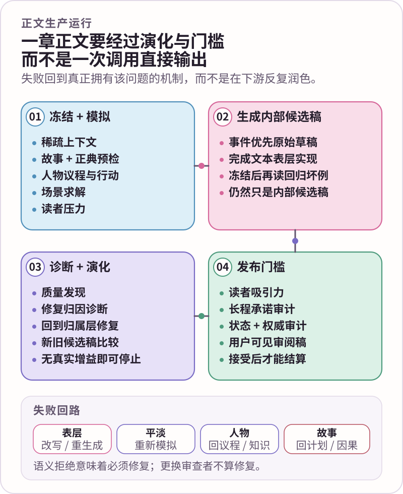

<div align="center">
  
  <p><strong>让模型负责理解小说，让确定性系统负责边界、恢复、验证与持久状态。</strong></p>
  <p><kbd>正典边界</kbd>&nbsp;&nbsp;<kbd>语义契约包</kbd>&nbsp;&nbsp;<kbd>可恢复运行</kbd>&nbsp;&nbsp;<kbd>质量演进</kbd>&nbsp;&nbsp;<kbd>证据学习</kbd></p>
  <p><a href="README.en.md">English</a> · <strong>简体中文</strong> · <a href="docs/README.zh-CN.md">文档中心</a></p>
</div>


# NovelForge · 自适应小说智能体框架

NovelForge 是面向长篇与连载小说的项目无关生产框架。它不试图把文学判断伪装成一堆 Python 规则，也不会把模型第一次生成出来的文字直接当成完成稿。

> **核心边界 ✦** 文本、人物、读者体验与创作机制等语义判断由模型负责；权威、权限、指纹、持久化、路由、硬预算、阶段隔离、类型校验、事务与可复现性由确定性系统负责。

具体小说项目拥有自己的故事事实；NovelForge 只拥有围绕这些事实运行的通用生产机制。

**当前架构：NovelForge 7.3 · AI-native · contract-first · 语义契约按需渐进加载。**

<p align="center"><a href="docs/why-novelforge.zh-CN.md"><strong>为什么是 NovelForge？</strong></a> · <a href="docs/production-pipeline.zh-CN.md"><strong>生产流水线</strong></a> · <a href="docs/quality-assurance.zh-CN.md"><strong>质量保障</strong></a> · <a href="docs/architecture-atlas.zh-CN.md"><strong>架构图谱</strong></a></p>

---

## 01 · NovelForge 真正要解决什么问题？ ✦

长篇小说一旦持续写上几十章、跨越多个会话和多轮修改，最难的问题通常已经不是“模型会不会写一句话”，而是：

- 计划中的事件被误当成已经发生的事实；
- 人物突然知道了自己从未获得的信息；
- 会话记忆反过来压过已接受正典；
- 真正的问题明明出在故事结构或人物逻辑，却一直在句子层继续润色；
- 不同审查者看到的并不是同一个候选稿；
- 所谓“记忆”逐渐变成无控制的提示词堆积；
- 研究材料、语料证据、评测结果或学习假设悄悄获得了不该拥有的权威；
- 外部任务中断后，系统无法可靠判断之前究竟已经执行到哪里。

NovelForge 把这些问题当成**小说生产系统的问题**，而不是靠提示词技巧勉强维持的约定。

它的核心机制包括：**权威分层、稀疏上下文、独立人物状态、显式语义契约、可恢复运行状态、按问题归属修复、事务化结算，以及有证据约束的长期学习。**

直接小说智能体 / 小说框架的定位、取舍与来源说明见 [为什么是 NovelForge](docs/why-novelforge.zh-CN.md)；LangGraph、OpenAI Agents SDK、CrewAI、AutoGen 等通用框架放在更深一层的 [智能体框架采用分析](knowledge/AGENT_FRAMEWORK_ADOPTION.zh-CN.md) 中讨论。

---

## 02 · 7.3 的核心心智模型 🪄


### 故事权威

项目事实必须保留明确的权威等级，例如 `locked`、`accepted`、`active_plan`、`review` 与 `proposal`。计划、记忆、语义判断、情景分支、语料结果或运行回执，不会因为“系统已经看见”就自动成为正典（Canon）。

### 语义智能

NovelForge 通过精确的模型可读契约来承载文学与叙事理解。运行时从 `harness/semantic_workers/model_contract_catalog.json` 解析具体契约，只加载 `harness/semantic_workers/contracts/` 中当前任务真正需要的契约包，然后封装受限上下文与评判标准，计算语义任务指纹，并校验类型化结果。

Catalog 是唯一的契约索引。系统不再维护一个巨大的兼容性总注册表，也不再让确定性代码假装自己拥有“文学评分能力”。

### 确定性外壳

Python 与工作流代码负责真正适合确定性处理的部分：权限、生命周期、持久化、内容指纹、会话 / 运行身份、检查点、结果一次性消费、硬预算、权威边界、版权与来源门槛、发布不变量，以及可复现构建。

### 项目工程

一本小说是一个有版本的独立项目，拥有自己的清单、精确 Framework lock、配置画像、故事圣经、已接受正典、当前状态、计划、稿件、研究、回归样本、测试与构建产物。聊天记录永远不是项目数据库。

阅读 [总体架构](docs/architecture.zh-CN.md) 与 [架构图谱](docs/architecture-atlas.zh-CN.md)。

---

## 03 · 一章正文是一轮生产运行，不是一次模型调用 📖



DRAFT / REVISE 的核心不是一条巨型提示词，而是四类职责明确的工作。

### 准备运行

只冻结当前任务真正需要的上下文，重新确认项目权威与正典截止点，并在生成正文前完成场景因果、人物目标 / 知识边界与读者压力模拟。

### 生成内部候选稿

先生成事件优先的原始草稿，再完成正文表层实现。原始草稿始终留在内部；模型第一次完成的文本不会自动成为用户看到的章节。

### 诊断真正的问题

生成后可以调用 Surface / Reader 机制、回归证据、人物完整性判断、读者反应或成对比较、修改诊断、连续性 / 状态证据以及其他精确语义契约。需要理解文本的工作由模型完成，并绑定明确指纹；不需要文学理解的部分则由确定性检查验证。

### 回到问题归属层修复，再决定是否展示

句子级缺陷可以局部改写；表层问题成簇时可能需要重做整个场景实现；`SAFE-BUT-FLAT` 回到 Reader Pressure 与 Scene Simulation；人物失败回到 Character Simulation；故事失败回到 Story / Plan；上下文失败回到 Context / Memory。

只有真正解决当前质量、连续性与用户可见门槛的候选稿，才能作为可审阅正文展示。

阅读 [生产流水线](docs/production-pipeline.zh-CN.md)。

---

## 04 · 质量不是一个分数，而是一套诊断系统 ✅

NovelForge 刻意把“机器可以证明的正确性”与“必须理解文本才能作出的判断”分开。

**确定性质量检查**负责发现：Schema 错误、权威边界破坏、隐藏答案泄漏、陈旧指纹、重复消费结果、生命周期违规、能力缺失、项目数据泄漏、版权 / 来源问题以及发布不变量失败。

**语义质量判断**负责回答真正需要理解的问题：人物行为是否符合其信念与目标；读者此刻可能感受到什么、期待什么；场景为什么平；某个修改问题真正属于哪个机制；两个候选稿哪一个更符合给定评判标准。

需要独立判断时，结果必须来自真正不同的调用 / 会话，并返回绑定候选稿指纹的类型化结果。有效的 `semantic_reject` 应进入修复流程，而不是通过不断更换审查者去“刷”出通过。

质量演进层记录 findings 与候选稿谱系，让修改在收益趋于平台期时可以停止，而不是无限改写。

阅读 [质量保障](docs/quality-assurance.zh-CN.md)、[质量演进](docs/quality-evolution.zh-CN.md) 与 [评测参考](evals/README.zh-CN.md)。

---

## 05 · 上下文和记忆必须受作者控制 🧠

持久记忆是受治理的派生视图，不是自动注入 prompt 的黑盒。

上下文检查器可以解释某条信息为什么进入当前工作集；记忆分层与可编辑 Memory Bank 允许显式控制派生视图，但受保护的 `accepted` / `locked` 内容不能通过记忆编辑器被静默改写。对受保护事实的修改只能生成 proposal 或其他明确不具权威的产物。

真正需要解释意义时，相关性判断属于模型；确定性 Context / Memory 代码负责硬预算、权威等级、来源、生命周期和显式控制，而不是用任意数值启发式冒充文学相关性。

阅读 [上下文与记忆](docs/context-and-memory.zh-CN.md)。

---

## 06 · 多运行时，但不混淆“能力”和“权威” 🔌

只要当前环境确实具备所需能力，Harness 可以通过当前聊天、独立 peer chat、本地 Codex / Claude 调用、模型提供商 API、MCP / service worker、GitHub job、本地模型或人工审阅执行任务。

**运行时名称 ≠ 能力证明。能力 ≠ 权威。**

运行时层明确区分 `project/resource`、`session/thread`、`run/invocation` 与 `checkpoint`，因此外部任务或中断任务可以在重新验证后恢复，而不会把 provider history 错当成正典。

阅读 [运行时与集成](docs/integrations.zh-CN.md)、[会话运行时](harness/session_runtime/SESSION_RUNTIME.zh-CN.md) 与 [语义执行](harness/semantic_workers/SEMANTIC_EXECUTION_RUNTIME.zh-CN.md)。

---

## 07 · 证据驱动的长期学习与语料智能 🔎

NovelForge 可以从用户修改、接受 / 拒绝、反复出现的纠错模式、项目约定、语料证据和评测中学习，但学习从来不会自动获得写入权威。

偏好与创作机制假设必须有作用域、允许被新证据推翻、可版本化并可回滚。语料发现、版权分类、存储、语义分析、学习与 promotion 是不同的门槛。能够搜索到内容，不等于有权完整镜像版权文本；语料证据也不是正典，更不会自动变成人物知识。

阅读 [自适应学习](docs/adaptive-learning.zh-CN.md) 与 [语料智能](corpus/README.zh-CN.md)。

---

## 08 · 项目工程化 ⚙️

```bash
python project_sdk.py init <path> --id PROJECT-X --title "Novel"
python project_sdk.py validate <path>
python project_sdk.py build <path>
python project_sdk.py self-test
```

下游项目锁定精确 NovelForge revision，也可以通过 Project Adapter 映射旧有目录结构。真正的结构级变更可以采用 `spec → plan → tasks → implementation → verification → acceptance`；普通正文 micro edit 不需要人为制造工程仪式。

阅读 [项目 SDK](docs/project-sdk.zh-CN.md)、[项目适配器](docs/project-adapters.zh-CN.md) 与 [Framework Bundle](release/FRAMEWORK_BUNDLE.zh-CN.md)。

---

## 09 · 适用场景与真实取舍 ⚖️

NovelForge 最适合那些生命周期足够长、确实需要治理权威、连续性、上下文控制、任务恢复、运行时选择、质量证据与长期学习的小说项目。

它刻意比一次性写作助手更重。如果主要需求只是快速构思、轻量续写 / 润色，或者更需要成熟的消费级编辑器，那么更简单的产品往往更合适。

NovelForge 也不会假装语义判断是免费的或确定性的。模型 / 人工审阅会增加延迟与成本；框架要做的是让这些判断**显式、受边界约束、可追踪，并且不能意外改写故事事实**。

---


## 10 · 文档入口 🌸

<p align="center"><a href="docs/README.zh-CN.md"><strong>文档中心</strong></a> · <a href="docs/why-novelforge.zh-CN.md"><strong>产品定位</strong></a> · <a href="docs/architecture-atlas.zh-CN.md"><strong>架构图谱</strong></a> · <a href="docs/production-pipeline.zh-CN.md"><strong>生产流水线</strong></a> · <a href="docs/quality-assurance.zh-CN.md"><strong>质量保障</strong></a> · <a href="assets/DESIGN_SYSTEM.zh-CN.md"><strong>Story Loom 设计系统</strong></a></p>

<div align="center">
  
  <br />
  <sub><strong>后台严格，正文鲜活。</strong> 🌸</sub>
</div>