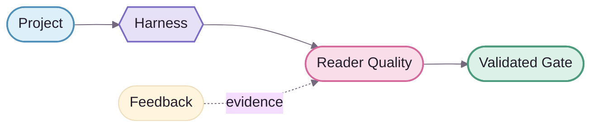

<div align="center">
  
</div>

# NovelForge Documentation Design System

> **Brand concept: Story Loom.**
>
> NovelForge does not become distinctive by painting generic technical docs pink. Its visual system treats **Project → Runtime → Story → Reader → Evidence → Validated Result** as one continuously woven story thread. Professional technical structure is the skeleton; anime-editorial warmth is the recognition layer. 🌸

**Ratio:** `70% professional technical / 30% anime-editorial warmth`.

---

## 1 · Brand DNA ✦

NovelForge should hold four qualities at once:

| Trait | Design meaning |
|---|---|
| **Precise** | hierarchy, spacing, and diagram semantics stay rigorous |
| **Editorial** | feels like a fiction-production studio, not a generic DevOps dashboard |
| **Warm** | sakura / lavender / soft surfaces add human and anime-editorial character |
| **Engineered** | tokens, provenance, chart grammar, and asset boundaries are inspectable |

Landing pages may naturally use `🌸 ✦ ✨ 📖`; dense contracts, schemas, and CLI docs stay quieter.

---

## 2 · Logo System · Story Loom

### Primary mark


The mark has three ideas:

1. **Two book-page forms** — fiction, manuscript, and Canon;
2. **Woven N / story thread** — NovelForge connects project, runtime, story, and evidence as one traceable system;
3. **Forge spark** — validation, revision, and improvement rather than one-shot generation.

### Primary lockup


Usage:
- README / docs landing pages: prefer the lockup;
- small footer, badge, or avatar: use the mark;
- do not rotate, glow, or arbitrarily recolor it;
- do not use the logo as an architecture/status icon;
- the wordmark uses system-font fallbacks only; the mark itself is vector geometry.

---

## 3 · Token Source of Truth

Machine-readable source: [`brand/tokens.json`](brand/tokens.json).

Markdown and Mermaid cannot directly import JSON, so hex values embedded in docs are **mirrors of tokens.json**. Change the token source first, then synchronize human docs and Mermaid classes.

| Semantic token | Fill | Stroke | Role |
|---|---|---|---|
| `project` | `#DDEFF8` | `#4F8FBA` | Project / Context / SDK |
| `runtime` | `#E7E1F8` | `#796BC4` | Harness / Session / Worker |
| `editorial` | `#F9DDE9` | `#D6679A` | Writer / Reader / Quality |
| `evidence` | `#F9EDCF` | `#BE892F` | Feedback / Corpus / Eval |
| `validated` | `#DCF1E7` | `#4D9B7D` | Accepted / validated output |
| `rejected` | `#F7DEE2` | `#B95767` | Reject / invalid / failed gate |
| `neutral` | `#FFFDFC` | `#62556D` | Story core / neutral mechanism |

Base ink: `#241D2B`; soft surface: `#F8F5FA`; cluster border: `#E2DAE8`.

### Token discipline

- Pastels are fill/accent colors, not low-contrast body text.
- State meaning must also use labels, shapes, borders, or edge styles.
- Do not rely on red/green alone for PASS/FAIL.
- Spacing follows a 4/8 rhythm.
- Node stroke defaults to about `1.75px`, primary edges to `2px`, feedback edges to dashed styling.

---

## 4 · Markdown Page Chrome

GitHub Markdown cannot depend on arbitrary CSS, so NovelForge's page style is built from **portable native primitives**:

1. **Brand lockup** — top of major landing pages;
2. **`<kbd>` metadata chips** — stable concepts only;
3. **Story-thread SVG** — branded breathing space between major zones;
4. **Numbered H2 rhythm** — `01 · System map`, `02 · Runtime`;
5. **Semantic callouts** — `Boundary ✦`, `Key idea`, `Why it matters`;
6. **Compact matrices** — capability / comparison / authority tables;
7. **Branded Mermaid** — inspectable source diagrams;
8. **Small mark footer** — a quiet branded close.

Recommended page skeleton:

```text
Logo / lockup
Tagline + metadata chips
Story-thread
One-sentence product thesis
Hard boundary
01 · Primary visual / architecture
02 · Core concepts
Story-thread
03 · Navigation / deep links
04 · Principles / next step
Brand mark footer
```

Do not repeat a hero in every section. Brand identity comes from rhythm and repetition, not visual noise.

---

## 5 · Typography & Information Hierarchy

GitHub controls final fonts, so professional quality comes mainly from hierarchy rather than committed font files.

- one H1 per page;
- numbered H2s establish navigation rhythm;
- H3s hold bounded detail;
- long sections may start with a short bold lead;
- body paragraphs stay short and scannable;
- monospace is for IDs, schemas, paths, commands, and state machines;
- table cells do not hold essay-length prose;
- decorative Unicode / emoji never replace real labels.

---

## 6 · Mermaid · Story Loom Grammar

Mermaid is the **inspectable source chart**. A future AI/designer-rendered static chart may sit above it, but Mermaid remains the diffable and maintainable reference layer.

### Lane grammar

- **Project lane — sky**: inputs, Project SDK, Context;
- **Forge lane — lavender**: Harness, Session, Control Plane, Workers;
- **Story lane — neutral + sakura**: Story core, simulation, draft, reader quality;
- **Evidence lane — amber**: feedback, learning, corpus, eval;
- **Validated gate — mint**: user-visible / accepted / validated outcome;
- **Reject lane — danger**: reserved for actual reject/invalid states.

### Shape grammar

- `([stadium])` — boundary / input / output;
- `{{hexagon}}` — decision / manager / semantic gate;
- `[(database)]` — durable runtime/state store;
- `[[subroutine]]` — reusable core mechanism;
- standard rounded node — processing step.

### Edge grammar

- solid = primary execution / dependency;
- dashed = feedback / evidence / resume / reference;
- one chart answers one core question;
- crossing edges are avoided by default;
- nuance belongs below the chart, not inside long node labels.

### Base theme



---

## 7 · Anime-editorial Budget 🌸

Welcome:
- sakura / lavender / mint accents;
- spark / petal / book / story-thread motifs;
- occasional `🌸 ✦ ✨ 📖` in landing headings;
- rounded SVG geometry;
- sparse `(˶ᵔ ᵕ ᵔ˶)` microcopy;
- a future original Framework mascot/editor motif, strictly decorative.

Avoid:
- emoji as the only architecture/status/navigation icon;
- mascots inside technical contracts;
- candy-colored body text;
- wall-to-wall glow or gradients;
- mixing anime, glassmorphism, brutalism, terminal styling, and skeuomorphism on one page;
- putting authority-bearing information only inside visual assets.

---

## 8 · Static Rendered Charts

Future branded AI/designer charts use a **presentation-over-source** model:

```text
Mermaid source chart
      ↓ reference / semantic contract
Rendered branded SVG/WebP
      ↓ presentation layer
README / architecture landing
```

Rules:
- the rendered chart cannot introduce semantics absent from the source chart;
- architecture changes update the source first, then regenerate the static visual;
- static visuals require alt text + provenance;
- the source chart remains on-page or linked from the architecture doc;
- AI-generated visuals never become runtime authority.

---

## 9 · Accessibility / Resilience

- meaningful images have alt text;
- decorative dividers use empty alt text;
- charts have nearby textual explanation;
- the core content remains understandable if SVG fails to load;
- color and emoji are never the only semantic channels;
- no external font files are required;
- lightweight SVG is preferred;
- logo and charts keep clear boundaries in GitHub light/dark surrounding chrome.

---

## 10 · Definition of Done

A NovelForge page is visually complete when:

- hierarchy is scannable before deep reading;
- removing decoration still leaves rigorous engineering documentation;
- restoring the brand layer makes the page immediately recognizable as NovelForge;
- logo, tokens, divider, and chart grammar clearly belong to one Story Loom system;
- Mermaid no longer feels like a default gray-box flowchart;
- anime-editorial warmth is memorable without reducing professional credibility. ✦
