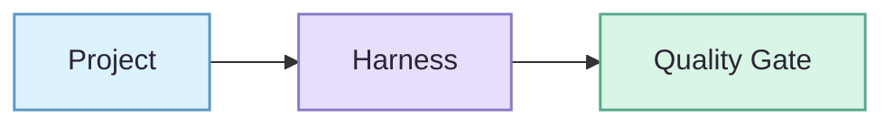

# NovelForge Documentation Design System

> **Design target:** professional technical editorial first, anime warmth second. 🌸
>
> The visual layer helps readers scan and understand NovelForge. It never changes runtime, Canon, quality, or authority semantics.

## 1. Personality

NovelForge should feel like a serious developer framework with a recognizable fiction-editorial soul—not a generic SaaS dashboard and not a pastel toy UI.

**Ratio:** `70% technical / 30% anime-editorial warmth`.

- precise, calm, structured;
- friendly and memorable without becoming childish;
- visually distinctive without competing with the documentation;
- manga/anime influence expressed through editorial composition, accent color, microcopy, and sparse decorative motifs—not fandom imagery.

A little `🌸 ✦ ✨ 📖` is welcome on landing pages. Dense reference pages stay quieter.

## 2. Core visual tokens

| Token | Hex | Role |
|---|---|---|
| `ink-950` | `#2B2433` | primary text / diagram labels |
| `ink-700` | `#5F5368` | secondary text |
| `surface` | `#FFFDFB` | warm neutral surface |
| `surface-soft` | `#F8F6FA` | grouped content / subtle panels |
| `sakura` | `#D982A8` | brand accent / human-editorial lane |
| `lavender` | `#8B7AC6` | runtime / agent orchestration lane |
| `sky` | `#5B98C4` | project / context / engineering lane |
| `mint` | `#58A98C` | accepted / validated / safe progress |
| `amber` | `#C9973B` | evidence / corpus / caution |
| `danger` | `#B65363` | rejection / invalid transition / failure |

### Color discipline

- Pastels are **fills and accents**, never low-contrast body text.
- Every meaningful state needs a label, border, line style, or shape in addition to color.
- Never use red/green alone to distinguish outcomes.
- Keep text and primary diagram labels dark enough for comfortable GitHub light-mode reading.

## 3. Typography

GitHub controls rendered fonts, so the system relies on hierarchy rather than custom font files.

- one H1 per page;
- H2 for major concepts, H3 for bounded details;
- short bold lead sentence before long sections when helpful;
- keep paragraphs compact and scannable;
- prefer concise tables for capability comparisons;
- use monospace only for IDs, schemas, paths, commands, and state machines;
- decorative Unicode must never replace real text labels.

## 4. Layout rhythm

Use a predictable documentation sequence:

1. **Title + one-sentence value proposition**
2. **Language / primary navigation**
3. **Hero or key architecture visual** when useful
4. **At-a-glance overview**
5. **Main explanation**
6. **Deep links / next steps**

Keep decorative material out of dense reference sections.

## 5. Components

### Hero

Use one static SVG/WebP hero only on major landing pages. It should contain no authority-bearing information that is unavailable in text.

### Decorative emoji / kaomoji

Allowed on landing pages and friendly overview docs when the adjacent text remains fully meaningful without them.

Good:
- `🌸 Why NovelForge`
- `✨ At a glance`
- `📖 Story & Canon`
- a sparse `(˶ᵔ ᵕ ᵔ˶)` in non-authoritative microcopy

Avoid:
- emoji replacing status labels, navigation semantics, or architecture node names;
- emoji in schemas, contracts, error codes, CLI output, or machine-facing docs;
- an emoji on every bullet or paragraph.

### Chips / badges

Use badges for stable metadata such as version, documentation language, execution model, or CI status—not as paragraph decoration.

### Callouts

Prefer semantic blockquotes:

- **Key idea** — conceptual invariant
- **Boundary** — authority / safety constraint
- **Why it matters** — reader-oriented explanation
- **Example** — bounded illustration

A decorative emoji may precede the visible label, but the label must carry the meaning.

### Tables

Use tables for comparisons and matrices, not for long prose. Keep headings noun-like and cells short.

## 6. Mermaid chart language

Mermaid is the authoritative architecture representation. Static illustrations are supplementary.

### Visual grammar

- `sky` — Project / Context / SDK
- `lavender` — Harness / Session / Control Plane / Workers
- `sakura` — Writer / Reader / human-facing quality flow
- `amber` — Evidence / Corpus / Learning inputs
- `mint` — validated result / user-visible gate
- `danger` — rejected / forbidden / invalid state

### Diagram rules

1. One chart answers one question.
2. Prefer left-to-right for pipelines; top-to-bottom for layered architecture.
3. Separate the **production path** from **feedback/learning loops**.
4. Use subgraphs only when they reduce cognitive load.
5. Keep node labels short; explain nuance below the chart.
6. Use dashed edges for feedback/reference paths, solid edges for primary execution/dependency.
7. Avoid crossing edges when a simpler diagram can express the same concept.
8. Do not encode meaning by fill color alone.
9. Cute styling belongs in fill/radius/composition—not in vague node labels.

### Base class pattern

## 7. Anime-editorial budget

Welcome:
- gentle sakura/lavender/mint accents;
- rounded diagram nodes;
- sparse sparkles, stars, books, petals, and tiny editorial motifs;
- occasional decorative emoji in landing-page headings;
- one original framework mascot/editor motif in future artwork if it remains clearly decorative;
- subtle playful microcopy where clarity is unaffected.

Avoid:
- emoji as structural icons or status semantics;
- kawaii mascots inside technical contracts;
- excessive gradients/glows;
- candy-color body text;
- decorative dividers every few paragraphs;
- mixing anime, glassmorphism, brutalism, terminal aesthetics, and skeuomorphism on one page.

## 8. Accessibility and resilience

- meaningful images require alt text;
- charts need nearby text explanation;
- important information must remain understandable if SVGs fail to load;
- color and emoji cannot be the sole semantic channels;
- visual additions must not depend on external font files;
- prefer lightweight SVG over large raster assets when possible.

## 9. Definition of done

A documentation change is visually ready when:

- hierarchy is obvious at a glance;
- the page can be scanned before it is read deeply;
- visual accents are consistent with this token system;
- diagrams use the shared visual grammar;
- decorative art is supplementary, accessible, and lightweight;
- the page still feels like engineering documentation after all decoration is removed;
- the warm/anime layer makes it recognizable as NovelForge rather than another anonymous framework. ✦
