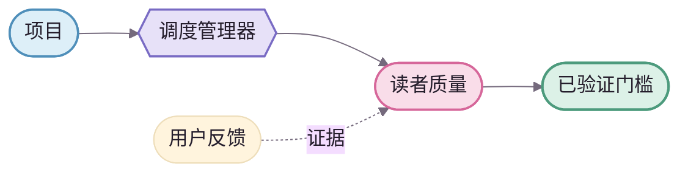

<div align="center">
  
</div>

# NovelForge 文档设计系统

> **品牌概念：Story Loom / 故事织机。**
>
> NovelForge 的视觉目标不是“把普通技术文档染成粉色”，而是让 **项目 → 运行时 → 故事 → 读者体验 → 证据 → 已验证结果** 像一根持续编织、校验、回接的故事线。专业技术感构成骨架，二次元编辑感负责识别度与温度。🌸

**视觉配比：** `70% 专业技术 / 30% 二次元编辑感`。

---

## 1 · 品牌气质 ✦

NovelForge 应同时具备四种气质：

| 气质 | 设计含义 |
|---|---|
| **精确** | 层级、间距、图表语义必须严谨一致 |
| **编辑感** | 像小说编辑与生产工作台，而不是通用运维面板 |
| **温度** | 樱花粉、薰衣草紫、柔和底色带来人味与二次元气质 |
| **工程化** | 设计令牌、资产来源、图表规则和使用边界都可检查、可维护 |

首页和总览页可以自然使用 `🌸 ✦ ✨ 📖`；契约、Schema、命令行和机器接口文档应保持克制。

---

## 2 · 标志系统 · Story Loom

### 主标志


标志由三个概念组成：

1. **两片书页**：小说、稿件与正典；
2. **编织成 N 的故事线**：把项目、运行时、故事和证据连接成一个可追踪的生产系统；
3. **锻造火花**：强调验证、修订与反复打磨，而不是一次性生成。

### 横向组合标志


使用规则：
- README、架构总览等高曝光页面优先使用横向组合标志；
- 页脚、头像、徽记等小尺寸场景使用主标志；
- 不旋转、不增加发光效果、不随意改色；
- 不把品牌标志当作架构节点、状态图标或结果标识；
- 文字标识使用系统字体回退，图形标志本体为纯矢量几何，不依赖外部字体文件。

---

## 3 · 设计令牌唯一来源

机器可读的唯一来源：[`brand/tokens.json`](brand/tokens.json)。

Markdown 和 Mermaid 无法直接导入 JSON，因此文档中的颜色值只是 `tokens.json` 的镜像。修改视觉体系时，应先更新令牌源，再同步人类文档与 Mermaid 样式。

| 语义令牌 | 填充色 | 描边色 | 含义 |
|---|---|---|---|
| `project` | `#DDEFF8` | `#4F8FBA` | 项目、上下文、项目 SDK |
| `runtime` | `#E7E1F8` | `#796BC4` | 调度、会话、控制平面、执行器 |
| `editorial` | `#F9DDE9` | `#D6679A` | 写作、读者体验、质量审查 |
| `evidence` | `#F9EDCF` | `#BE892F` | 用户反馈、语料、证据、评测 |
| `validated` | `#DCF1E7` | `#4D9B7D` | 已验证、已通过门槛、可展示结果 |
| `rejected` | `#F7DEE2` | `#B95767` | 拒绝、无效状态、门槛失败 |
| `neutral` | `#FFFDFC` | `#62556D` | 中性的故事核心与通用机制 |

基础墨色：`#241D2B`；柔和底色：`#F8F5FA`；分区边框：`#E2DAE8`。

### 令牌纪律

- 柔和色只用于填充和强调，不用于低对比度正文；
- 状态不能只靠颜色表达，还必须配合文字、形状、边框或线型；
- “通过 / 失败”不能只靠红绿二元配色区分；
- 间距采用 4 / 8 的统一节奏；
- 节点描边默认约 `1.75px`，主路径约 `2px`，反馈与引用路径使用虚线。

---

## 4 · Markdown 页面样式

GitHub Markdown 不能依赖任意 CSS，因此 NovelForge 的页面风格必须建立在 **GitHub 原生、可移植的组合方式** 上：

1. **品牌组合标志** —— 放在主要入口页顶部；
2. **`<kbd>` 元数据标签** —— 只表达稳定概念，不充当花哨装饰；
3. **故事线分隔符 SVG** —— 在大区块之间提供品牌化留白；
4. **编号式二级标题** —— 例如 `01 · 系统总览`、`02 · 运行时模型`；
5. **语义提示块** —— 例如“边界 ✦”“关键点”“为什么重要”；
6. **紧凑矩阵表** —— 用于能力、边界、权限和运行方式对照；
7. **品牌化 Mermaid** —— 作为可维护的源图；
8. **小尺寸页脚标志** —— 收束页面，不堆视觉噪声。

推荐页面骨架：

```text
品牌标志
一句话定位 + 元数据标签
故事线分隔符
产品核心主张
硬边界
01 · 主视觉 / 架构图
02 · 核心概念
故事线分隔符
03 · 导航 / 深入阅读
04 · 原则 / 下一步
品牌页脚
```

不要在每个章节重复 Hero。品牌感来自稳定的节奏、形状和重复规则，而不是不断增加装饰。

---

## 5 · 字体与信息层级

GitHub 决定最终字体，因此专业感主要来自信息层级，而不是提交自定义字体文件。

- 每页只保留一个 H1；
- H2 使用编号建立清晰的阅读节奏；
- H3 用于局部细节；
- 长章节前可以先放一句粗体导语；
- 正文段落保持短而可扫描；
- 等宽字体只用于 ID、Schema、路径、命令和状态机；
- 表格单元格不塞大段文字；
- 装饰性 Unicode 与 emoji 不能替代正式标签。

---

## 6 · Mermaid · Story Loom 图表语法

Mermaid 是 **可检查、可差异比较、可维护的源图**。未来可以在 README 或架构页上方加入 AI / 设计师生成的品牌化静态图，但 Mermaid 仍然保留为语义参照。

### 分区语法

- **项目区 · 天空蓝**：项目输入、项目 SDK、上下文；
- **调度运行区 · 薰衣草紫**：调度管理器、会话、控制平面、执行器；
- **故事生产区 · 中性墨色 + 樱花粉**：故事核心、模拟、草稿、读者质量；
- **证据学习区 · 琥珀色**：反馈、偏好学习、语料、评测；
- **已验证门槛 · 薄荷绿**：用户可见、已通过、可接受的结果；
- **拒绝状态 · 危险色**：只用于真实的拒绝、无效迁移或门槛失败。

### 形状语法

- `([体育场形])`：边界、输入、输出；
- `{{六边形}}`：调度中心、决策点、语义门槛；
- `[(数据库形)]`：持久状态存储；
- `[[子程序形]]`：可复用核心机制；
- 普通圆角节点：一般处理步骤。

### 连线语法

- 实线：主执行路径或依赖关系；
- 虚线：反馈、证据、恢复、引用关系；
- 一张图只回答一个核心问题；
- 默认避免交叉连线；
- 复杂说明放在图下正文，不塞进节点名称。

### 中文示例



---

## 7 · 二次元编辑感预算 🌸

可以：
- 樱花粉、薰衣草紫、薄荷绿等柔和强调色；
- 火花、花瓣、书本、故事线等小型视觉母题；
- 首页标题偶尔使用 `🌸 ✦ ✨ 📖`；
- 圆润但克制的 SVG 几何；
- 非权威微文案里偶尔出现 `(˶ᵔ ᵕ ᵔ˶)`；
- 未来加入原创框架吉祥物或编辑角色，但必须明确只承担装饰作用。

不要：
- 用 emoji 作为架构、状态或导航的唯一图标；
- 在技术契约里塞吉祥物；
- 使用糖果色正文；
- 满屏发光和渐变；
- 在同一页面混用二次元、玻璃拟态、粗野主义、终端风和拟物风；
- 把正文里没有的权威信息只放进视觉资产。

---

## 8 · 静态品牌图表

未来品牌化的 AI / 设计师静态图采用 **“源图优先，展示覆盖”** 的关系：

```text
Mermaid 源图
    ↓ 语义参照
品牌化 SVG / WebP
    ↓ 展示层
README / 架构总览
```

规则：
- 静态图不能增加源图中不存在的新语义；
- 架构变化时先更新 Mermaid，再重新生成静态图；
- 静态图必须有替代文本和来源记录；
- 源图必须继续保留在页面中，或从架构文档明确链接；
- AI 生成图永远不是运行时权威来源。

---

## 9 · 可访问性与降级能力

- 有意义的图片必须提供替代文本；
- 纯装饰分隔符使用空替代文本；
- 图表附近必须有文字解释；
- 即使 SVG 加载失败，核心信息仍然可理解；
- 颜色和 emoji 都不能成为唯一语义通道；
- 不依赖外部字体文件；
- 优先使用轻量 SVG；
- 标志和图表在 GitHub 明暗界面的周边环境中都应保持清晰边界。

---

## 10 · 完成标准

一页 NovelForge 文档达到视觉完成时，应满足：

- 不细读正文也能迅速扫出信息层级；
- 去掉装饰后，仍然是严谨的工程文档；
- 加回品牌层后，一眼能认出这是 NovelForge；
- 标志、令牌、分隔符和图表语法属于同一个 Story Loom 体系；
- Mermaid 不再像默认的灰色流程框；
- 二次元编辑感有记忆点，但不会削弱专业可信度。✦
