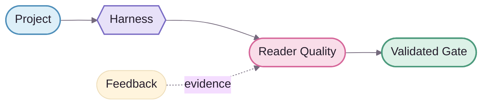

<div align="center">
  
</div>

# NovelForge Documentation Design System · 文档设计系统

> **Brand concept：Story Loom / 故事织机。**
>
> NovelForge 的视觉不是“给技术文档涂成粉色”，而是把 **Project → Runtime → Story → Reader → Evidence → Accepted Result** 看成一根被持续编织、验证、回接的 story thread。专业技术感是骨架，anime/editorial 温度是识别层。🌸

**比例：** `70% professional technical / 30% anime-editorial warmth`。

---

## 1 · Brand DNA ✦

NovelForge 应该具备四个同时存在的气质：

| Trait | 设计含义 |
|---|---|
| **Precise** | hierarchy、spacing、diagram semantics 必须严谨 |
| **Editorial** | 像小说编辑工作台，而不是 generic DevOps dashboard |
| **Warm** | sakura / lavender / soft-surface 带来人味和二次元气质 |
| **Engineered** | token、provenance、chart grammar、asset boundary 全部可检查 |

Landing page 可以自然出现 `🌸 ✦ ✨ 📖`；dense contract / schema / CLI 文档保持克制。

---

## 2 · Logo System · Story Loom

### Primary mark


Logo 由三个语义组成：

1. **两片 book-page forms**：小说 / manuscript / Canon；
2. **woven N / story thread**：NovelForge 把 project、runtime、story 与 evidence 编成一个可追踪系统；
3. **forge spark**：验证、改进、重新锻造，而不是一次性生成。

### Primary lockup


使用规则：
- README / docs landing：优先 lockup；
- 小尺寸 footer / badge / avatar：使用 mark；
- 不旋转、不加 glow、不随意 recolor；
- 不把 logo 当 architecture/status icon；
- system font fallback 只用于 wordmark，mark 本体完全 vector-path based。

---

## 3 · Token Source of Truth

Machine-readable source：[`brand/tokens.json`](brand/tokens.json)。

Markdown / Mermaid 无法直接 import JSON，因此文档中的 hex 值是 **tokens.json 的镜像值**；发生变更时应先改 token source，再同步人类文档与 Mermaid class。

| Semantic token | Fill | Stroke | Role |
|---|---|---|---|
| `project` | `#DDEFF8` | `#4F8FBA` | Project / Context / SDK |
| `runtime` | `#E7E1F8` | `#796BC4` | Harness / Session / Worker |
| `editorial` | `#F9DDE9` | `#D6679A` | Writer / Reader / Quality |
| `evidence` | `#F9EDCF` | `#BE892F` | Feedback / Corpus / Eval |
| `validated` | `#DCF1E7` | `#4D9B7D` | Accepted / validated output |
| `rejected` | `#F7DEE2` | `#B95767` | Reject / invalid / failed gate |
| `neutral` | `#FFFDFC` | `#62556D` | Story core / neutral mechanism |

Base ink：`#241D2B`；soft surface：`#F8F5FA`；cluster border：`#E2DAE8`。

### Token discipline

- Pastel 用作 fill / accent，不拿低对比色写正文；
- 状态不只靠颜色：同时使用 label、shape、border 或 edge style；
- PASS/FAIL 不用 red/green 二元色单独表达；
- spacing 使用 4/8 rhythm；
- node stroke 默认约 `1.75px`，primary edge `2px`，feedback edge 用虚线。

---

## 4 · Markdown Page Chrome

GitHub Markdown 不能依赖任意 CSS，因此 NovelForge 的 page style 来自 **可移植的原生组合**：

1. **Brand lockup** — major landing page 顶部；
2. **`<kbd>` metadata chips** — 只表达稳定概念；
3. **Story-thread SVG** — 大区块之间的 branded breathing space；
4. **Numbered H2 rhythm** — `01 · System map` / `02 · Runtime`；
5. **Semantic callout** — `Boundary ✦` / `Key idea` / `Why it matters`；
6. **Compact matrix** — comparison / capability / authority table；
7. **Branded Mermaid** — source diagram；
8. **Small mark footer** — 收束页面，不堆装饰。

推荐页面骨架：

```text
Logo / lockup
Tagline + metadata chips
Story-thread
One-sentence product thesis
Hard boundary
01 · Primary visual / architecture
02 · Core concepts
Story-thread
03 · Navigation / deep links
04 · Principles / next step
Brand mark footer
```

不要在每个 section 都复制 Hero；品牌感来自 rhythm 与 repetition，不是视觉噪声。

---

## 5 · Typography & Information Hierarchy

GitHub 控制最终字体，因此专业感主要靠 hierarchy，而不是 commit font files。

- 每页一个 H1；
- H2 使用编号建立导航节奏；
- H3 表达 bounded detail；
- 长文段前可用粗体 lead；
- body 段落短、可扫描；
- monospace 只用于 ID、schema、path、command、state machine；
- table cell 不塞长篇 prose；
- decorative Unicode / emoji 不能替代真实文字标签。

---

## 6 · Mermaid · Story Loom Grammar

Mermaid 是 **inspectable source chart**。未来可以在 README 上方增加 AI / designer-rendered static chart，但 Mermaid 继续作为可 diff、可维护、可验证的参照层。

### Lane grammar

- **Project lane — sky**：输入、Project SDK、Context；
- **Forge lane — lavender**：Harness、Session、Control Plane、Worker；
- **Story lane — neutral + sakura**：Story core、simulation、draft、reader quality；
- **Evidence lane — amber**：feedback、learning、corpus、eval；
- **Validated gate — mint**：user-visible / accepted / validated outcome；
- **Reject lane — danger**：只有真实 reject/invalid state 才使用。

### Shape grammar

- `([stadium])`：boundary/input/output；
- `{{hexagon}}`：decision / manager / semantic gate；
- `[(database)]`：durable runtime/state store；
- `[[subroutine]]`：core reusable mechanism；
- 普通 rounded node：processing step。

### Edge grammar

- solid = primary execution / dependency；
- dashed = feedback / evidence / resume / reference；
- 一张图只回答一个核心问题；
- 默认避免 crossing edge；
- complex nuance 放图下，不塞 node label。

### Base theme



---

## 7 · Anime-editorial Budget 🌸

可以：
- sakura / lavender / mint accent；
- spark / petal / book / story-thread motif；
- landing heading 偶尔带 `🌸 ✦ ✨ 📖`；
- rounded SVG geometry；
- 少量 `(˶ᵔ ᵕ ᵔ˶)` microcopy；
- 未来增加原创 Framework mascot/editor motif，但只能 decorative。

不要：
- emoji 当 architecture/status/navigation 的唯一 icon；
- technical contract 里塞 mascot；
- candy-color body text；
- 满屏 glow / gradient；
- 同页混 anime、glassmorphism、brutalism、terminal、skeuomorphism；
- 用视觉资产承载正文里不存在的 authority information。

---

## 8 · Static Rendered Charts

未来 branded AI/designer chart 采用 **presentation-over-source** 模式：

```text
Mermaid source chart
      ↓ reference / semantic contract
Rendered branded SVG/WebP
      ↓ presentation layer
README / architecture landing
```

规则：
- rendered chart 不能新增 Mermaid/source 中不存在的语义；
- 修改 architecture 时先改 source chart，再 regenerate static visual；
- static visual 必须有 alt text + provenance；
- source chart 仍保留在页面下方或 linked architecture doc 中；
- AI-generated visual 不能成为 runtime authority。

---

## 9 · Accessibility / Resilience

- meaningful image 有 alt text；
- decorative divider 用空 alt；
- chart 附近有文字解释；
- SVG 加载失败仍能理解核心内容；
- color / emoji 都不是唯一语义；
- 不依赖外部 font file；
- 优先 lightweight SVG；
- logo / chart 在 GitHub light/dark surrounding chrome 下都保持清晰边界。

---

## 10 · Definition of Done

一页 NovelForge 文档达到视觉完成时：

- 不看正文也能扫出 hierarchy；
- 拿掉装饰后仍然是严谨 engineering docs；
- 加回品牌层后，一眼能认出 NovelForge；
- logo、token、divider、chart grammar 是同一个 Story Loom 系统；
- Mermaid 不再像默认灰盒流程图；
- anime/editorial warmth 有记忆点，但不会降低专业可信度。✦
