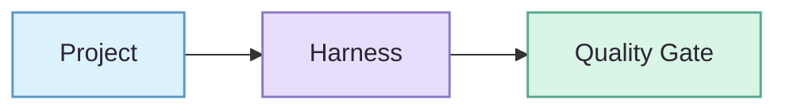

# NovelForge Documentation Design System · 文档设计系统

> **设计目标：专业技术编辑感优先，anime / 二次元温度作为第二层。🌸**
>
> 视觉层负责帮助读者扫描、理解和记忆 NovelForge；它永远不改变 runtime、Canon、quality 或 authority 语义。

## 1. 品牌性格

NovelForge 应该像一个严肃的 developer framework，同时保留小说编辑系统的灵魂；既不是千篇一律的 SaaS Dashboard，也不是 pastel 玩具界面。

**比例：** `70% technical / 30% anime-editorial warmth`。

- 精确、冷静、有结构；
- 友好、有记忆点，但不幼稚；
- 视觉上有辨识度，但不抢正文；
- manga/anime 气质来自 editorial 构图、accent color、microcopy 和少量装饰符号，而不是同人化角色堆叠。

Landing page 可以自然出现 `🌸 ✦ ✨ 📖`；dense reference docs 保持克制。

## 2. 核心视觉 Token

| Token | Hex | 用途 |
|---|---|---|
| `ink-950` | `#2B2433` | 主文本 / Diagram label |
| `ink-700` | `#5F5368` | 次级文本 |
| `surface` | `#FFFDFB` | 暖白背景 |
| `surface-soft` | `#F8F6FA` | 分组区域 / soft panel |
| `sakura` | `#D982A8` | 品牌 accent / human-editorial lane |
| `lavender` | `#8B7AC6` | runtime / agent orchestration lane |
| `sky` | `#5B98C4` | project / context / engineering lane |
| `mint` | `#58A98C` | validated / accepted / safe progress |
| `amber` | `#C9973B` | evidence / corpus / caution |
| `danger` | `#B65363` | reject / invalid transition / failure |

### 颜色纪律

- Pastel 用作 **fill / accent**，不能拿低对比度颜色写正文。
- 所有有意义的状态都必须同时有文字、边框、线型或形状，不能只靠颜色。
- 不用 red/green 二元色单独表达 PASS/FAIL。
- Diagram label 与正文保持深色，优先保证 GitHub light mode 的可读性。

## 3. Typography

GitHub 控制最终字体，所以不要依赖自定义 font file；专业感主要靠 hierarchy 与 spacing。

- 每页一个 H1；
- H2 表达一级概念，H3 表达 bounded detail；
- 长段前可使用一句粗体 lead；
- 段落尽量短而可扫描；
- capability comparison 优先用简洁表格；
- monospace 只用于 ID、schema、path、command、state machine；
- 装饰 Unicode 不能替代真实文字标签。

## 4. 页面节奏

Major documentation 默认采用：

1. **Title + 一句话价值主张**
2. **语言 / 主导航**
3. **Hero 或关键 Architecture Visual**
4. **At-a-glance 总览**
5. **主体解释**
6. **Deep links / Next steps**

Dense reference section 不塞装饰图。

## 5. 组件语言

### Hero

只在 README、Architecture landing 等高曝光页面放一个 SVG/WebP hero。Hero 不承载任何只存在于图片里的 authority 信息。

### Anime emoji / 颜文字

允许用于 landing page、overview 与 friendly microcopy，只要删掉它之后文字仍然完整。

推荐：
- `🌸 Why NovelForge`
- `✨ At a glance`
- `📖 Story & Canon`
- 非权威 microcopy 中偶尔出现 `(˶ᵔ ᵕ ᵔ˶)`

避免：
- 用 emoji 替代 status、navigation、architecture node 的语义；
- 在 schema、contract、error code、CLI、machine docs 中使用颜文字；
- 每个 bullet 都塞一个 emoji。

### Badge / Chip

Badge 只表达稳定 metadata：version、language、execution model、CI status 等；不要把 badge 当段落装饰。

### Callout

优先使用语义清楚的 blockquote：

- **Key idea** — 不变量；
- **Boundary** — authority / safety 边界；
- **Why it matters** — 对读者意味着什么；
- **Example** — bounded 示例。

前面可以加装饰 emoji，但真正语义必须由文字标签承担。

### Table

适合 comparison / matrix，不适合塞长段 prose。Heading 用名词短语，cell 尽量短。

## 6. Mermaid 视觉语言

Mermaid 是 authoritative architecture representation；static illustration 只是补充。

### 视觉语法

- `sky` — Project / Context / SDK
- `lavender` — Harness / Session / Control Plane / Workers
- `sakura` — Writer / Reader / human-facing quality flow
- `amber` — Evidence / Corpus / Learning inputs
- `mint` — validated result / user-visible gate
- `danger` — rejected / forbidden / invalid state

### Diagram 规则

1. 一张图只回答一个核心问题。
2. Pipeline 优先 LR；layered architecture 优先 TB。
3. **Production path** 与 **feedback / learning loop** 分开视觉处理。
4. Subgraph 只有降低认知负担时才使用。
5. Node label 保持短；复杂 nuance 放图下解释。
6. 主执行 / dependency 用实线，feedback/reference 用虚线。
7. 能避免 crossing edge 就避免。
8. 不允许只靠 fill color 表达含义。
9. Cute 体现在 fill、圆角、composition，不体现在模糊含义的 node name。

### Base class pattern

## 7. Anime-editorial Budget

可以多一点：
- sakura / lavender / mint accent；
- 圆角 diagram node；
- 少量 sparkles、星星、书本、花瓣等 editorial motif；
- landing heading 偶尔带装饰 emoji；
- 未来可加入一个原创 Framework mascot/editor motif，但必须明确只是 decorative；
- 清晰度不受影响时，可以有一点 playful microcopy。

不要：
- 用 emoji 当结构性 icon 或状态语义；
- 在技术 contract 里塞 kawaii mascot；
- 满屏 gradient / glow；
- candy-color 正文；
- 每几段就放 decorative divider；
- 同页混 anime、glassmorphism、brutalism、terminal、skeuomorphism 五套风格。

## 8. Accessibility / Resilience

- meaningful image 必须有 alt text；
- chart 旁边必须有文字解释；
- SVG 加载失败时，重要信息仍可通过正文理解；
- color 与 emoji 都不能成为唯一语义通道；
- 不依赖外部 font file；
- 能用 lightweight SVG 就不放大 raster asset。

## 9. Definition of Done

视觉改造完成时应满足：

- 第一眼就能看出 hierarchy；
- 用户可以先扫读再深入阅读；
- 所有 accent 服从统一 token；
- Diagram 服从统一 grammar；
- decorative art 轻量、可访问、可移除；
- 拿掉所有装饰后，页面依然像严谨的 engineering docs；
- 加回 anime/editorial 层后，又能一眼认出这是 NovelForge，而不是另一个匿名 agent framework。✦
