# Canon & State Model

## Purpose

NovelForge separates **what is true in the story** from what is planned, drafted, inferred, researched, remembered by a model, or stored in a runtime session.

This separation is the foundation of reliable long-form continuity.

## Lifecycle

Canonical lifecycle labels:

```text
proposal → active_plan → review → accepted
                 ↘
                  locked   (project constants / explicit invariants)
```

Interpretation:

- `proposal`: candidate; freely replaceable.
- `active_plan`: current intended future; not yet happened.
- `review`: generated/revised artifact awaiting acceptance.
- `accepted`: explicitly accepted story artifact/state eligible for settlement.
- `locked`: explicit invariant or long-lived project constant.

A consuming project may refine precedence, but it must never collapse Plan/Review into Accepted Canon.

## Generic precedence

Default conflict order:

1. current explicit user instruction;
2. project-locked invariants;
3. Accepted Canon artifacts;
4. settled authoritative current-state records;
5. authoritative current character/relationship/world/state records;
6. active plans;
7. verified research claims;
8. review drafts;
9. temporary inference.

Runtime/session/checkpoint data is **not part of Canon precedence**.

## Plan ≠ Canon

If an active chapter plan says a character will receive money, learn a secret, gain permission, meet someone, or change a relationship, none of those facts enters current state until an Accepted artifact provides evidence and settlement applies the delta.

```text
active_plan says future X
≠
current state says X already happened
```

## One authoritative home per fact

Avoid duplicated live truth.

Typical authority mapping:

```text
character identity / biography     → CHAR
relationship current state         → REL / ROM
historical/story event             → EVT
information ownership              → INFO / SEC / RUM
resources / money / debt           → RES
permissions / qualifications       → PERM
objects / evidence                 → ITEM / EVID
open question / obligation         → LOOP / OBL
foreshadow / reveal                → FS / REV
research source / claim            → REF / CLAIM
reader promise / payoff            → PAY
character arc / appeal             → CARC / APL
presence / participation           → PRES
cross-object dependency            → DEP
```

Derived views may summarize authority; they must not become a competing source of truth.

## Stable IDs

Recommended generic object IDs:

### Story
`BOOK`, `VOL`, `ARC`, `UNIT`, `CH`, `SCN`

### Character
`CHAR`, `CARC`, `APL`, `PRES`

### Relationship
`REL`, `ROM`

### World
`ORG`, `LOC`, `INST`, `ITEM`

### Continuity / plot state
`EVT`, `INFO`, `SEC`, `RUM`, `RES`, `PERM`, `LOOP`, `OBL`, `EVID`, `FS`, `REV`

### Research / reader / governance
`REF`, `CLAIM`, `PAY`, `MOM`, `THM`, `DEP`, `DEC`

Once an ID is active/accepted, do not recycle it for a different entity.

## Character knowledge is state

Truth and knowledge are separate:

```text
world truth ≠ narrator knowledge ≠ POV knowledge ≠ character belief ≠ rumor
```

A research claim can be true in reality while still unavailable to a historical/fantasy character.

Use explicit `INFO / SEC / RUM` or equivalent state when information ownership materially affects action.

## Evidence scope

An artifact can prove only what it actually establishes.

Examples:
- possessing an object does not prove understanding its meaning;
- hearing a rumor does not prove truth;
- one character's statement does not automatically prove world fact;
- a review draft does not prove occurrence;
- a semantic review does not prove Canon;
- a Scene Card does not prove occurrence.

## State Delta

Accepted prose should settle through explicit operations:

```yaml
artifact_id:
artifact_fingerprint:
ops:
  - op: update
    object_type: RES
    id: RES-...
    before: {...}
    set: {...}
    evidence_ref: exact accepted passage / fact
```

Each operation requires:

1. exact authority object;
2. unique ID match;
3. exact before-state;
4. evidence from Accepted artifact or explicit Canon instruction;
5. dependency impact analysis;
6. authorized write;
7. derived-view refresh;
8. post-condition check.

`0` matches or `>1` matches is a hard stop.

## Dependency graph

`DEP` records what assumptions rely on what state.

If a settled fact changes, downstream plans, timelines, relationships, resource calculations, research assumptions, or continuity checks may need invalidation/recalculation.

Do not preserve future plans merely because they were expensive to generate.

## Settlement transaction

Generic pattern:

```mermaid
flowchart LR
    A[Explicit Acceptance] --> B[Freeze Artifact]
    B --> C[State Delta]
    C --> D[Validate before-state]
    D --> E[Dependency impact]
    E --> F[Checkpoint / write intent]
    F --> G[Authorized mutation]
    G --> H[Derived views]
    H --> I[Post-condition]
    I --> J[Trace / receipt]
```



Any mismatch returns an incomplete settlement state. Never guess the missing before-state or partially apply unrelated operations.

## Session / event boundary

The following are operational evidence only:
- session history;
- checkpoint;
- handoff;
- connector/webhook event;
- semantic result;
- eval result;
- CI result;
- model memory.

They can trigger validation or propose a state change. They cannot grant Canon authority by themselves.

## Core invariant

> Persist the difference between **intended**, **generated**, **accepted**, and **settled**. Long-form continuity depends on never pretending those are the same thing.
