# Canon & State Model · 设定与状态权威模型

## 目的

NovelForge 必须严格区分：**故事里什么是真的**，以及什么只是计划、草稿、模型推断、现实研究、session memory 或 runtime state。

长篇连续性是否可靠，核心就在这里。

## Lifecycle

统一生命周期：

```text
proposal → active_plan → review → accepted
                 ↘
                  locked   （项目常量 / 明确不变量）
```

含义：

- `proposal`：候选，可自由替换。
- `active_plan`：当前采用的未来意图，但尚未发生。
- `review`：生成/修订后的待接受产物。
- `accepted`：用户明确接受，具备 settlement 资格。
- `locked`：明确锁定的项目不变量或长期常量。

具体项目可以细化 precedence，但永远不能把 Plan/Review 偷偷并入 Accepted Canon。

## Generic Precedence

默认冲突顺序：

1. 用户本轮明确要求；
2. project locked invariants；
3. Accepted Canon artifact；
4. 已 settlement 的 authoritative current state；
5. 当前人物/关系/世界/状态权威对象；
6. active plan；
7. verified research claim；
8. review draft；
9. temporary inference。

Runtime/session/checkpoint **不进入 Canon precedence**。

## Plan ≠ Canon

如果 active plan 写着某个角色将来会拿到钱、知道秘密、获得权限、遇到某人、改变关系，在用户明确接受对应正文并完成 settlement 之前，这些都不能进入 current state。

```text
active_plan 说未来会发生 X
≠
current state 已经发生 X
```

## 每个事实只有一个权威位置

避免 live truth 重复。

典型映射：

```text
人物身份 / 生平                  → CHAR
关系当前状态                     → REL / ROM
历史/故事事件                    → EVT
信息归属                         → INFO / SEC / RUM
钱 / 资产 / 债务                 → RES
权限 / 资格                      → PERM
物件 / 证据                      → ITEM / EVID
开放问题 / 义务                  → LOOP / OBL
伏笔 / 揭示                      → FS / REV
研究来源 / Claim                 → REF / CLAIM
读者承诺 / Payoff                → PAY
人物弧 / 魅力证明                → CARC / APL
出场 / 参与                      → PRES
跨对象依赖                       → DEP
```

Derived view 只能汇总权威，不能变成第二权威。

## Stable IDs

建议通用对象 ID：

### Story
`BOOK`, `VOL`, `ARC`, `UNIT`, `CH`, `SCN`

### Character
`CHAR`, `CARC`, `APL`, `PRES`

### Relationship
`REL`, `ROM`

### World
`ORG`, `LOC`, `INST`, `ITEM`

### Continuity / Plot State
`EVT`, `INFO`, `SEC`, `RUM`, `RES`, `PERM`, `LOOP`, `OBL`, `EVID`, `FS`, `REV`

### Research / Reader / Governance
`REF`, `CLAIM`, `PAY`, `MOM`, `THM`, `DEP`, `DEC`

ID 一旦进入 active/accepted，不得拿来复用成另一个实体。

## Character Knowledge 也是状态

必须区分：

```text
world truth ≠ narrator knowledge ≠ POV knowledge ≠ character belief ≠ rumor
```

现实 Research Claim 即使是真的，也不代表历史/幻想角色当时知道。

当信息归属会影响行动时，应使用明确的 `INFO / SEC / RUM` 或等价状态对象。

## Evidence Scope

Artifact 只能证明它真正建立的内容。

例如：
- 拿到某个物件，不代表理解它的意义；
- 听到一个流言，不代表流言是真的；
- 一个角色说的话，不自动等于世界事实；
- Review Draft 不证明“已经发生”；
- Semantic Review 不证明 Canon；
- Scene Card 不证明“已经发生”。

## State Delta

Accepted prose 应通过显式操作 settlement：

```yaml
artifact_id:
artifact_fingerprint:
ops:
  - op: update
    object_type: RES
    id: RES-...
    before: {...}
    set: {...}
    evidence_ref: 精确 Accepted 正文/事实
```

每个操作要求：

1. 精确 authority object；
2. 唯一 ID 命中；
3. exact before-state；
4. 来自 Accepted artifact 或用户明确 Canon 指令的 evidence；
5. dependency impact；
6. authorized write；
7. derived-view refresh；
8. post-condition。

`0` 命中或 `>1` 命中都必须停止。

## Dependency Graph

`DEP` 记录“哪些东西依赖哪些状态”。

Settled fact 改变后，未来计划、时间线、关系、资源计算、研究假设、连续性检查都可能需要 invalidation / recalculation。

不要因为未来计划生成成本很高，就保留已经失效的计划。

## Settlement Transaction

通用流程：

```mermaid
flowchart LR
    A[Explicit Acceptance] --> B[Freeze Artifact]
    B --> C[State Delta]
    C --> D[Validate before-state]
    D --> E[Dependency impact]
    E --> F[Checkpoint / write intent]
    F --> G[Authorized mutation]
    G --> H[Derived views]
    H --> I[Post-condition]
    I --> J[Trace / receipt]
```



任何 mismatch 都返回 incomplete settlement。禁止猜 missing before-state，也禁止把无关操作先部分执行。

## Session / Event Boundary

以下只属于 operational evidence：
- session history；
- checkpoint；
- handoff；
- connector/webhook event；
- semantic result；
- eval result；
- CI result；
- model memory。

它们可以触发验证或提出状态变化候选，但不能自己授予 Canon authority。

## Core Invariant

> 始终保留 **intended / generated / accepted / settled** 的差异。长篇连续性最怕的，就是系统假装这四者是一回事。
