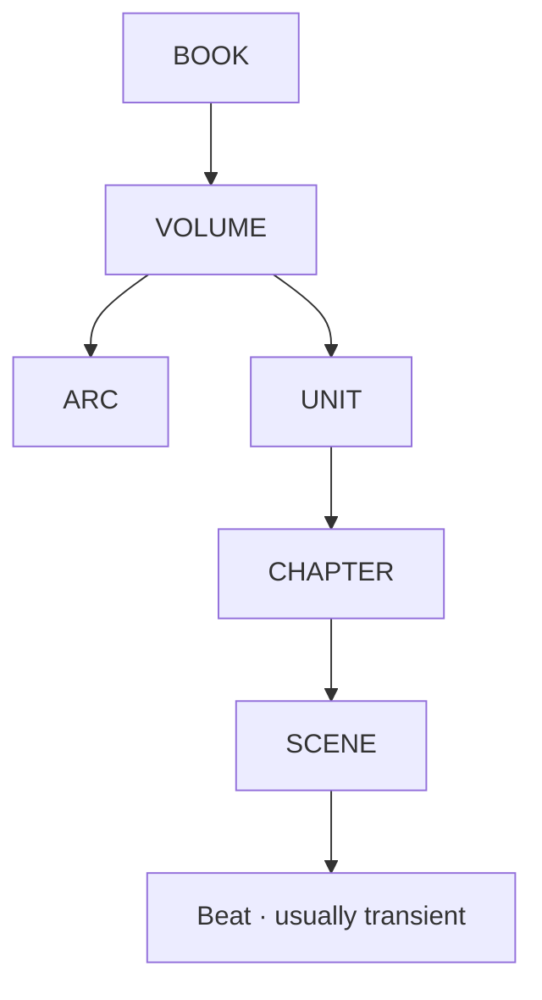

# Story System · Generic Architecture

## Purpose

NovelForge models long-form fiction as a hierarchy of persistent story objects plus transient beats. The hierarchy provides planning scale without forcing every future chapter to be fully specified.



`ARC` and `UNIT` are different:
- **Arc** = a long-running dramatic/relationship/investigative/growth line that may cross units or volumes.
- **Unit** = a contiguous production/consumption block with a concrete objective, pressure sequence, payoff, cost, and exit state.

## BOOK

A book-level design should answer:

- What long-form promise keeps a reader for hundreds of thousands of words?
- What is the core fantasy/appeal?
- How does the story expand without merely repeating the same game at a larger number?
- What long desire drives the protagonist?
- What relationship/world/end-state promises matter?
- What is intentionally out of scope?

Suggested fields:

```yaml
id:
title:
genre:
audience:
premise:
core_fantasy:
reader_promise:
protagonist_long_desire:
central_conflict:
expansion_ladder: []
core_progression: []
major_themes: []
relationship_promise:
end_state:
hard_limits: []
status:
```

## VOLUME

A valid volume is a **state transformation**, not a list of episodes.

```yaml
id:
book_id:
title:
timeframe:
primary_stage:
start_state:
end_state:
volume_desire:
volume_question:
reader_promise:
primary_opposition:
major_arcs: []
major_events: []
resource_delta:
status_delta:
relationship_delta:
character_arc_delta:
world_expansion:
midpoint_shift:
low_point:
climax:
final_payoff:
exit_condition_to_next_volume:
status:
```

The volume should support a meaningful `start_state → end_state` diff.

## ARC

An Arc may belong to the protagonist, antagonist, supporting character, institution, relationship, investigation, family, romance, or social movement.

```yaml
id:
volume_ids: []
name:
type:
central_question:
participants: []
start_state:
desired_end_state:
owner_goal:
opposing_forces: []
stakes:
turning_points: []
planned_payoff:
dependencies: []
crosslinks: []
status:
```

## UNIT

Units prevent the serial from degenerating into unrelated chapters.

```yaml
id:
volume_id:
title:
chapter_window:
primary_arcs: []
concrete_objective:
entry_state:
pressure_sequence: []
major_choices: []
payoff:
cost:
exit_state:
new_open_loops: []
status:
```

## CHAPTER

A chapter is a production unit with a specific dramatic task and a reader-experience contract.

```yaml
id:
unit_id:
title:
time_range:
locations: []
pov:
chapter_task:
entry_state:
main_problem:
reader_question:
scenes: []
must_happen: []
may_change: []
forbidden: []
payoff:
cost_or_counterpressure:
exit_state:
new_open_loops: []
state_delta_expected:
status:
```

A chapter plan is **future intent**, not Canon.

## SCENE

A Scene Card constrains simulation; it is not a sentence-by-sentence script.

```yaml
id:
chapter_id:
time:
location:
pov:
participants: []
entry_state:
scene_problem:
agenda_by_character: {}
knowledge_by_character: {}
misread_by_character: {}
leverage_by_character: {}
constraints: []
trigger:
action_reaction_sequence: []
pivot:
result:
relationship_delta:
resource_delta:
permission_delta:
information_delta:
emotional_aftereffect:
exit_state:
physical_anchors: []
voice_constraints: []
forbidden_forms: []
```

## Rolling elaboration

Do not plan a thousand chapters at identical resolution.

Recommended resolution gradient:

```text
BOOK / end-state          = explicit
next VOLUME / active ARC  = detailed
next UNIT                 = production-ready
next 1–3 CHAPTERS         = scene-ready
far future chapters       = sparse directional placeholders
```

As Accepted Canon changes the state graph, future plans are recalculated.

## Reader-pressure integration

Planning must track not only events but how the reader's near-term question evolves:

```text
question
→ complication changes options
→ partial reward / new information
→ sharper question
→ consequential choice
→ changed state + forward pull
```

Avoid chapter structures that merely enumerate correct procedure.

## Dependency-aware planning

A plan can depend on:
- character state;
- relationship state;
- information ownership;
- resource/permission state;
- prior event;
- foreshadow/reveal;
- research claim;
- open obligation/loop.

If an upstream state changes, dependent future plans must be invalidated or re-evaluated rather than silently preserved.

## Authority rule

Plans can be `proposal` or `active_plan`. They never become `accepted` merely because a writer generated prose from them. Only the consuming project's explicit acceptance/settlement process mutates Canon.
