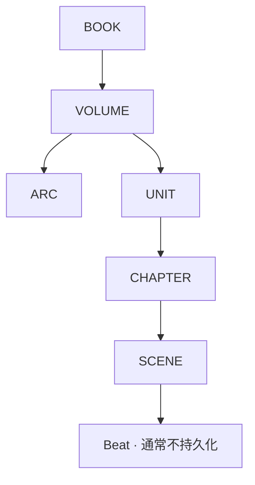

# Story System · 通用故事架构

## 目的

NovelForge 把长篇小说建模为一组可持久化的故事对象层级，以及通常不持久化的 transient beats。这样既能看见长篇结构，又不需要把所有未来章节一次性写死。



`ARC` 与 `UNIT` 不同：
- **Arc**：可跨 Unit / Volume 的长期戏剧、关系、调查、成长或对抗线。
- **Unit**：连续生产/消费的一段故事，具有具体目标、压力序列、兑现、代价和 exit state。

## BOOK

Book-level 设计应回答：

- 什么长期承诺能让读者愿意读几十万甚至几百万字？
- 核心 fantasy / appeal 是什么？
- 故事扩大后如何出现新玩法，而不是同一种玩法把数字放大？
- 主角的长期 desire 是什么？
- 关系、世界和终局有哪些重要承诺？
- 哪些内容明确不属于本书？

建议字段：

```yaml
id:
title:
genre:
audience:
premise:
core_fantasy:
reader_promise:
protagonist_long_desire:
central_conflict:
expansion_ladder: []
core_progression: []
major_themes: []
relationship_promise:
end_state:
hard_limits: []
status:
```

## VOLUME

合格的 Volume 应该是一次**状态变换**，而不是事件列表。

```yaml
id:
book_id:
title:
timeframe:
primary_stage:
start_state:
end_state:
volume_desire:
volume_question:
reader_promise:
primary_opposition:
major_arcs: []
major_events: []
resource_delta:
status_delta:
relationship_delta:
character_arc_delta:
world_expansion:
midpoint_shift:
low_point:
climax:
final_payoff:
exit_condition_to_next_volume:
status:
```

必须能够做有意义的 `start_state → end_state` Diff。

## ARC

Arc 可以属于主角、反派、配角、机构、关系、调查、家庭、感情线或社会运动，不必永远是主角线。

```yaml
id:
volume_ids: []
name:
type:
central_question:
participants: []
start_state:
desired_end_state:
owner_goal:
opposing_forces: []
stakes:
turning_points: []
planned_payoff:
dependencies: []
crosslinks: []
status:
```

## UNIT

Unit 防止长篇退化成“每章各写各的”。

```yaml
id:
volume_id:
title:
chapter_window:
primary_arcs: []
concrete_objective:
entry_state:
pressure_sequence: []
major_choices: []
payoff:
cost:
exit_state:
new_open_loops: []
status:
```

## CHAPTER

Chapter 是一个有明确戏剧任务与读者体验契约的生产单位。

```yaml
id:
unit_id:
title:
time_range:
locations: []
pov:
chapter_task:
entry_state:
main_problem:
reader_question:
scenes: []
must_happen: []
may_change: []
forbidden: []
payoff:
cost_or_counterpressure:
exit_state:
new_open_loops: []
state_delta_expected:
status:
```

Chapter Plan 是**未来意图**，不是 Canon。

## SCENE

Scene Card 用来约束模拟，不是逐句剧本。

```yaml
id:
chapter_id:
time:
location:
pov:
participants: []
entry_state:
scene_problem:
agenda_by_character: {}
knowledge_by_character: {}
misread_by_character: {}
leverage_by_character: {}
constraints: []
trigger:
action_reaction_sequence: []
pivot:
result:
relationship_delta:
resource_delta:
permission_delta:
information_delta:
emotional_aftereffect:
exit_state:
physical_anchors: []
voice_constraints: []
forbidden_forms: []
```

## Rolling Elaboration

不要把一千章都规划到同样精度。

推荐分辨率：

```text
BOOK / end-state          = 明确
next VOLUME / active ARC  = 详细
next UNIT                 = production-ready
next 1–3 CHAPTERS         = scene-ready
far future chapters       = 稀疏方向占位
```

Accepted Canon 改变状态图后，未来计划应重新计算。

## Reader-pressure Integration

计划不能只追踪“发生什么”，还要追踪读者的近程问题如何变化：

```text
question
→ complication 改变可选项
→ partial reward / 新信息
→ 更尖锐的问题
→ consequential choice
→ changed state + forward pull
```

避免把章节规划成正确流程的逐项清单。

## Dependency-aware Planning

Plan 可以依赖：
- character state；
- relationship state；
- information ownership；
- resource / permission state；
- prior event；
- foreshadow / reveal；
- research claim；
- open obligation / loop。

上游状态变化后，下游 future plan 应被 invalidated 或重新评估，而不是静默保留。

## Authority Rule

Plan 可以是 `proposal` 或 `active_plan`。它不会因为 writer 根据它生成了正文就自动变成 `accepted`。只有具体消费项目的明确 acceptance / settlement 流程才能修改 Canon。
