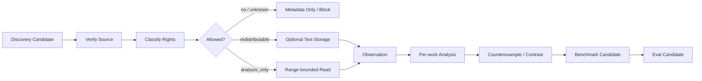

# Corpus Ingest Protocol

## Purpose

Convert a source candidate into a provenance-bound corpus record and derived analysis without confusing access with redistribution rights or analysis with Canon.

## Pipeline



## Step 1 · Discovery candidate

A candidate begins with:
- discovery request ID / corpus gap ID;
- research question;
- proposed source identity;
- expected contrast value;
- requested genre/language/platform tags;
- source channel.

Discovery does not imply ingestion.

## Step 2 · Source verification

Verify as much as the host can reasonably establish:
- canonical work/source identity;
- creator;
- publication/source URL or file identity;
- edition/version when relevant;
- access date;
- source type;
- stable fingerprint for local/user-provided content.

Do not infer quotations or rights from search snippets alone.

## Step 3 · Rights gate

Assign exactly one:

```text
redistributable | analysis_only | unknown
```

`rights_gate.py` validates declared metadata and storage intent. It does not pretend to perform legal analysis automatically.

If `unknown`, full-text storage is blocked.

## Step 4 · Select analysis range

Choose the smallest range that can answer the declared question.

Record:

```yaml
range_type: chapter|scene|passage|work-level-metadata|user-selection
range_ref:
why_this_range:
research_question:
```

## Step 5 · Observation artifact

Keep source-grounded observation separate from interpretation.

```yaml
observation_id:
corpus_id:
range_ref:
question:
observable_features: []
short_evidence_refs: []
metrics: {}
confidence:
```

Avoid private chain-of-thought. Evidence refs should be concise and source-bound.

## Step 6 · Per-work analysis

Analysis may infer mechanism from observations:

```yaml
analysis_id:
corpus_id:
question:
mechanism_candidates: []
what_it_seems_to_do:
tradeoffs: []
profile_context:
uncertainties: []
counterexample_needed:
```

One work cannot establish a universal rule.

## Step 7 · Counterexample / contrast search

Before generalizing, actively seek:
- same outcome with different surface form;
- same surface form with worse outcome;
- genre/profile exception;
- work that contradicts the mechanism.

Record negative evidence rather than discarding it.

## Step 8 · Cross-work benchmark

A benchmark is mechanism-level synthesis across multiple sources.

It should contain:
- mechanism;
- supporting observations;
- counterexamples;
- applicability/profile boundary;
- failure modes;
- writer-safe guidance;
- regression/capability ideas;
- source refs.

Do not store a blended imitation fingerprint.

## Step 9 · Learning/eval handoff

Corpus output may create:
- user-taste evidence;
- project benchmark;
- general-craft candidate;
- capability eval;
- regression eval;
- additional corpus gap.

Promotion remains governed by the Learning protocol.

## Step 10 · Writer exposure

Writer-facing context receives only the minimum benchmark/mechanism/profile evidence required for the current task.

Modern copyrighted raw text and regression gold do not enter first-pass generation by default.

## Removal

Every derived artifact should preserve upstream source refs so rights/provenance correction can invalidate downstream benchmarks/evals/learning candidates deterministically.
