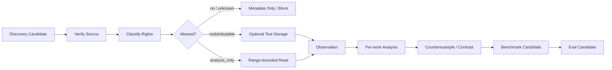

# Corpus Ingest Protocol · 语料摄取协议

## 目的

把 source candidate 转成带 provenance 的 corpus record 与 derived analysis，同时严格区分：能访问 ≠ 能再分发；analysis ≠ Canon。

## Pipeline



## Step 1 · Discovery Candidate

Candidate 至少来自：
- discovery request ID / corpus gap ID；
- research question；
- proposed source identity；
- expected contrast value；
- genre/language/platform tags；
- source channel。

Discovery 不等于 Ingestion。

## Step 2 · Source Verification

当前 host 能验证多少就验证多少：
- canonical work/source identity；
- creator；
- publication/source URL 或 file identity；
- 相关 edition/version；
- access date；
- source type；
- 本地/用户提供材料的 stable fingerprint。

不能只根据 search snippet 推断 quotation 或 rights。

## Step 3 · Rights Gate

只能赋一个：

```text
redistributable | analysis_only | unknown
```

`rights_gate.py` 验证“已声明的 metadata 与 storage intent”，不会假装自动完成法律分析。

`unknown` 时阻止全文 storage。

## Step 4 · Select Analysis Range

只选择回答当前研究问题所需的最小范围。

记录：

```yaml
range_type: chapter|scene|passage|work-level-metadata|user-selection
range_ref:
why_this_range:
research_question:
```

## Step 5 · Observation Artifact

把 source-grounded observation 与 interpretation 分开。

```yaml
observation_id:
corpus_id:
range_ref:
question:
observable_features: []
short_evidence_refs: []
metrics: {}
confidence:
```

不记录 private chain-of-thought。Evidence ref 要简洁、能回到 source。

## Step 6 · Per-work Analysis

Analysis 可以从 observation 推断 mechanism：

```yaml
analysis_id:
corpus_id:
question:
mechanism_candidates: []
what_it_seems_to_do:
tradeoffs: []
profile_context:
uncertainties: []
counterexample_needed:
```

单一作品不能建立 universal rule。

## Step 7 · Counterexample / Contrast Search

Generalize 前主动寻找：
- 不同 surface form 达成同一效果；
- 同 surface form 却效果更差；
- genre/profile exception；
- 直接反驳 mechanism 的作品。

负向 evidence 要记录，不能因为不支持原 hypothesis 就丢掉。

## Step 8 · Cross-work Benchmark

Benchmark 是多个 source 的 mechanism-level synthesis。

至少包含：
- mechanism；
- supporting observations；
- counterexamples；
- applicability/profile boundary；
- failure modes；
- writer-safe guidance；
- regression/capability ideas；
- source refs。

不能生成“混合作者模仿指纹”。

## Step 9 · Learning / Eval Handoff

Corpus output 可以生成：
- user-taste evidence；
- project benchmark；
- general-craft candidate；
- capability eval；
- regression eval；
- 新 corpus gap。

Promotion 仍服从 Learning Protocol。

## Step 10 · Writer Exposure

Writer context 只拿当前任务真正需要的 benchmark/mechanism/profile evidence。

现代版权 raw text 和 regression gold 默认不进入 first-pass generation。

## Removal

所有 derived artifact 必须保留 upstream source refs。这样如果 rights/provenance 后来被纠正，可以 deterministic 地 invalidate downstream benchmark/eval/learning candidate。
