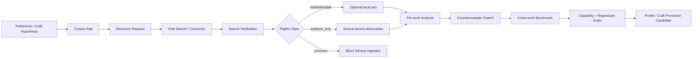

# Corpus Intelligence

Quillframe treats corpus work as a governed evidence pipeline, not a text dump.

For a local novel library, Quillframe keeps three products separate: the complete source files stay under user control; an anonymous public corpus may contain only closed-schema derived evidence; and a private `user_taste` store may retain revocable preference hypotheses. None of the three is Canon.



## Purpose

Corpus supports three evidence scopes:

- **project craft** — evidence useful only for one novel/profile;
- **user taste** — evidence used to test and strengthen a user's revisable preference hypotheses;
- **general craft** — cross-work mechanisms that may become framework-level guidance only after counterexample/profile checks and evals.

Corpus is never Canon.

## The legacy fixed-window publication profile

The original version-1 statistical-publication profile is deliberately narrow:

- exactly 120 distinct logical works, selected and explicitly confirmed as one immutable checklist;
- one bound edition per work;
- three ephemeral passages per work—opening, middle and closing;
- no more than 4,000 Unicode characters in any passage;
- no source prose in the private SQLite ledger or public artifact;
- one explicit study profile, chosen by the user while confirming the checklist: `general` or the separate `adult_explicit` partition.

Before proposing a checklist, the deterministic local ingest layer builds an eligibility partition from private titles, filenames, creator fields, length and edition markers; it does not read prose to make this classification. High-confidence serial, corrected or completed snapshots of one title can fill only one slot. Items with an unidentified work identity, fewer than 100,000 characters, or uncertain classification are quarantined. `general` excludes strong adult metadata signals, while `adult_explicit` admits only clear signals. Classification and quarantine details remain local and only aggregate counts may leave the private boundary.

Metadata with no adult or boundary signal is only a provisional `general` candidate; it does not prove that the prose belongs to an ordinary content zone. The user must still inspect the local title checklist and explicitly choose and confirm the study profile. The mechanical metadata partition is not a semantic conclusion about a work. One study and its aggregates stay inside the selected profile, and `general` and `adult_explicit` evidence cannot be mixed. The three windows are evidence samples, not a claim to represent the whole work. A changed, missing, replaced or newly ineligible source version invalidates its dependent study evidence instead of being silently substituted.

This fixed opening/middle/closing protocol remains available for its original statistical artifact. It is not the prose-style learning protocol and must not be used to claim that 120 works or 360 windows constitute deep style learning.

## Scene-aware prose-style learning

`quillframe_corpus_style_learning_v1` reuses the same governed V5 source identity but changes how evidence is selected and interpreted. It creates no V6 and does not confirm or run V5 as a side effect. The exact 120 works form an addressable available pool. Human confirmation binds declared rights and scope, profile, complete membership and proposal fingerprint; membership checks are not per-work literary review. Depth is measured by coverage, contradiction, counterexamples, held-out replication, semantic saturation, blind causal comparison and leakage resistance—not by exhausting the pool.

In the AI-native contract, AI classifies ten scene functions (`opening`, `dialogue`, `action`, `interiority`, `exposition`, `environment`, `body_appearance`, `relationship`, `transition`, `ending`) and ten independent prose axes, identifies gaps, requests the next minimum-sufficient evidence and judges cross-work convergence. The Python runner only binds source identity/version, minimally materializes bounded passages, applies hygiene and budgets, and records receipts; schema and leakage gates remain deterministic release controls rather than literary judgment. Language mismatch narrows language-specific claims; incomplete/serial material supports local scene/prose claims but not unsupported whole-work claims; restart/concatenation requires boundary-aware windows or narrower claims; a contaminated selected window is rejected and replaced. Full-pool exposure and CPU/memory benchmarks are diagnostics, not quality gates. Registered-contract and synthetic-runner tests now demonstrate dynamic activation of model-requested work/scene-function evidence, truthful unused pool members and early convergence without exhausting the pool. This engineering proof is not a real V5 run, learned style, blind-evaluation result, independent leakage review or publication.

The resulting `StyleContract` is a conditional mechanism record, not an author fingerprint. A source-free craft card contains only an axis, operation, intended effect, applicability and avoidance conditions, failure boundary, content zone and bounded confidence. Private evidence references never enter the Writer projection. Body, clothing, anatomy and appearance description—including an isolated term such as `巨乳`—are ordinary `body_appearance` evidence; they do not establish an explicit-content zone by themselves. Actual explicit sexual content remains separately governed by context.

Production behavior is opt-in. A frozen candidate pack can be selected only for Writer stages, with zero to four relevant cards per scene; the current request and project authority remain higher. Blind Reader, independent reviewers, Canon/state consumers and public evaluation payloads do not receive the selected guidance or treatment identity. The three-arm evaluation compares baseline, current craft v3 and the corpus candidate on the same held-out task, with sealed labels, repeated order swaps, leave-one-work-out separation and a distinct semantic-leakage review.

## Private source, public derivative

Scanning is read-only with respect to the source collection. The private ledger can retain local locations, version fingerprints, random work identities, selection state and derived lineage. When semantic analysis needs a passage, the runtime reopens the exact bound file, verifies its fingerprint, materializes the bounded range only for the call, and persists only its range identity, fingerprints, rubric and source-free result.

The legacy statistical public release is a separate, fail-closed step:

```text
confirmed 120-work checklist
→ 360 bounded range observations
→ per-work source-free synthesis
→ cross-work aggregate and boundaries
→ closed-schema leakage validation
→ exact preview token + manifest fingerprint confirmation
→ repository release
```

The release schemas exclude titles, creators, paths, filenames, prose, quotations, close paraphrases, source-reconstructive summaries, characters, settings and arbitrary extra fields. Random identifiers and numeric/controlled derivatives reduce disclosure risk; they do not replace source-specific rights review.

The semantic study runner executes `corpus.range_observe` for the 360 windows, then `learning.work_synthesize` and `learning.benchmark_synthesize`. Those results are source-free candidates, not publications or active rules. They still pass the derived-output leakage checks; private user-taste candidates go to the standing-policy gates, while General Craft candidates wait for manual promotion. The public release remains limited to its controlled eight-axis and statistical schemas.

Style learning has a separate source-free atlas path. A preview may be inspected from an exact completed StyleStudyRunner receipt, but it grants no authority. A receipt can report whether its own run used dynamic activation or stopped early; no preview proves that real V5 ran, a style was learned, blind evaluation or independent leakage review passed, or publication was authorized. Release requires independently issued, exact-artifact-bound provenance/rights, semantic-leakage, blind-evaluation, promotion and human-approval receipts plus a rollback-capable registry transition. Caller-provided booleans or self-hashed JSON are not trusted evidence. Until those gates exist and pass for the same candidate, [`general/style_registry.json`](general/style_registry.json) remains empty and no style atlas is public.

The production candidate loader is receipt-addressed. The Host supplies only a completion-receipt fingerprint to `TrustedStylePublicationCandidateLoader`; `StyleStudyRunner` resolves the corresponding latest completed candidate and recomputes its immutable receipt, checklist, protocol, sampling, candidate artifacts and current source-file SHA-256 values. The loader canonicalizes the complete private identity policy, accepts provenance only from a constructor-injected Host resolver for an already persisted independent review, and emits the exact closed `quillframe_persisted_style_candidate_v1` record expected by the trusted publisher. An operation caller cannot submit a candidate bundle or provenance hash. The loader holds no signing secret, grants no authority and performs no publication.

## Autonomous loop

Quillframe may autonomously:

1. detect a preference/craft evidence gap;
2. create a typed discovery request;
3. ask the current host to search Web/GitHub/MCP/library/user files;
4. verify source identity and provenance;
5. classify rights;
6. analyze only the range needed for the declared question;
7. search counterexamples and contrast works;
8. synthesize cross-work mechanism benchmarks;
9. generate personalized/general eval cases;
10. strengthen, narrow, contest, supersede, or reject the originating hypothesis.

`corpus_scout.py` plans research; it never pretends to have internet access when the host has no search connector.

## Generation isolation

Raw Writer should not receive bulk corpus text.

Preferred path:

```text
source
→ source-bound observation
→ per-work analysis
→ cross-work benchmark
→ profile/eval calibration
→ minimal relevant injection
→ writer
```

This reduces imitation, context waste, and accidental source leakage.

Private `user_taste` does not bypass this path. After its evidence, semantic, independent-evaluation and contradiction gates pass, a revocable standing policy may activate the preference. Each production run still selects zero or more currently relevant preferences, with the current request taking precedence. The Writer receives only source-free mechanism and applicability guidance. Blind Reader and independent review stages receive no taste or corpus guidance.

## Repository areas

```text
corpus/
├── README.en.md / README.zh-CN.md
├── CORPUS_POLICY.en.md / .zh-CN.md
├── CORPUS_INGEST_PROTOCOL.en.md / .zh-CN.md
├── library.py
├── style_sampling.py
├── style_contract.py
├── style_study_runner.py
├── style_publication_adapter.py
├── style_publication.py
├── corpus_scout.py
├── rights_gate.py
├── general/                    # legacy releases plus the separately gated style-atlas registry
├── benchmarks/
├── analyses/
└── catalog/
```

Actual user/project source data and private taste state remain in user/host storage. Only a validated, anonymous, source-free public release may be committed under `corpus/general/`; the empty registry truthfully records that no study release exists yet.

Repository-owned public derived artifacts inherit the repository [license](../LICENSE). The repository is public and source-available, not an open-data grant: the license restricts redistribution and commercial use. Abstracting a source or working non-commercially does not by itself establish that a derived artifact is lawful to publish; the deterministic rights and leakage gates are policy checks, not legal advice.

## Named-author imitation boundary

Quillframe may learn broad mechanisms such as pressure sequencing, dialogue embodiment, paragraph function, information timing, or scene causality. It must not turn modern authors into imitation fingerprints or generate reusable “write exactly like Author X” profiles.
