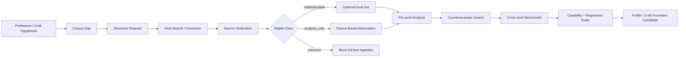

# Corpus Intelligence

Quillframe treats corpus work as a governed evidence pipeline, not a text dump.



## Purpose

Corpus supports three evidence scopes:

- **project craft** — evidence useful only for one novel/profile;
- **user taste** — evidence used to test and strengthen a user's revisable preference hypotheses;
- **general craft** — cross-work mechanisms that may become framework-level guidance only after counterexample/profile checks and evals.

Corpus is never Canon.

## Autonomous loop

Quillframe may autonomously:

1. detect a preference/craft evidence gap;
2. create a typed discovery request;
3. ask the current host to search Web/GitHub/MCP/library/user files;
4. verify source identity and provenance;
5. classify rights;
6. analyze only the range needed for the declared question;
7. search counterexamples and contrast works;
8. synthesize cross-work mechanism benchmarks;
9. generate personalized/general eval cases;
10. strengthen, narrow, contest, supersede, or reject the originating hypothesis.

`corpus_scout.py` plans research; it never pretends to have internet access when the host has no search connector.

## Generation isolation

Raw Writer should not receive bulk corpus text.

Preferred path:

```text
source
→ source-bound observation
→ per-work analysis
→ cross-work benchmark
→ profile/eval calibration
→ minimal relevant injection
→ writer
```

This reduces imitation, context waste, and accidental source leakage.

## Repository areas

```text
corpus/
├── README.en.md / README.zh-CN.md
├── CORPUS_POLICY.en.md / .zh-CN.md
├── CORPUS_INGEST_PROTOCOL.en.md / .zh-CN.md
├── corpus_scout.py
├── rights_gate.py
├── schemas/
├── benchmarks/
├── analyses/
└── catalog/
```

Actual user/project corpus data should normally live in user/project storage, not be committed into the generic framework repo unless it is a redistribution-safe generic benchmark fixture.

## Named-author imitation boundary

Quillframe may learn broad mechanisms such as pressure sequencing, dialogue embodiment, paragraph function, information timing, or scene causality. It must not turn modern authors into imitation fingerprints or generate reusable “write exactly like Author X” profiles.
