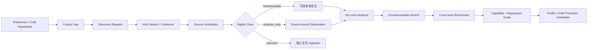

# Corpus Intelligence · 语料智能系统

Quillframe 把 Corpus 当成有治理的 evidence pipeline，而不是文本堆。



## 目的

Corpus 支持三个 evidence scope：

- **project craft**：只服务某一本小说/profile；
- **user taste**：用来检验、加强或修正用户的可推翻 preference hypothesis；
- **general craft**：只有经过 cross-work、counterexample/profile boundary 与 eval 后，才可能升级为 framework-level guidance。

Corpus 永远不是 Canon。

## 自主学习循环

Quillframe 可以自主：

1. 发现 preference/craft 的 evidence gap；
2. 生成 typed discovery request；
3. 请求当前 host 通过 Web/GitHub/MCP/library/user files 检索；
4. 验证 source identity / provenance；
5. 分类 rights；
6. 只分析研究问题真正需要的范围；
7. 主动找 counterexample 和 contrast work；
8. 综合 cross-work mechanism benchmark；
9. 自动生成 personalized/general eval case；
10. 对原始 hypothesis 做 strengthen / narrow / contest / supersede / reject。

`corpus_scout.py` 负责生成研究计划；如果 host 没有 search connector，它不会假装自己能联网。

## Generation Isolation

Raw Writer 不应直接收到大块 Corpus 正文。

推荐路径：

```text
source
→ source-bound observation
→ per-work analysis
→ cross-work benchmark
→ profile/eval calibration
→ minimal relevant injection
→ writer
```

这样可以降低模仿风险、context 浪费和 source leakage。

## Repository Areas

```text
corpus/
├── README.en.md / README.zh-CN.md
├── CORPUS_POLICY.en.md / .zh-CN.md
├── CORPUS_INGEST_PROTOCOL.en.md / .zh-CN.md
├── corpus_scout.py
├── rights_gate.py
├── schemas/
├── benchmarks/
├── analyses/
└── catalog/
```

真正的 user/project corpus data 通常应该留在用户或项目自己的 storage 中；只有明确可以再分发、并且适合作为 generic fixture/benchmark 的材料才进入 framework repo。

## Named-author Imitation Boundary

Quillframe 可以学习 pressure sequencing、dialogue embodiment、paragraph function、information timing、scene causality 等通用机制；不能把现代作者变成 imitation fingerprint，也不能生产可复用的“完全照 Author X 写”的 profile。
