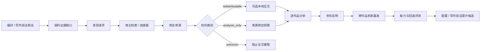

# 语料智能系统

Quillframe 把语料库当成受治理的证据流水线，而不是文本堆。

处理本地小说库时，Quillframe 明确分开三种产物：完整原文件由用户本地保管；匿名公开语料库只能保存封闭模式允许的派生证据；私有 `user_taste` 存储只保存可撤销的偏好假设。三者都不是正典。



## 目的

语料证据支持三个作用范围：

- **项目写作技法**：只服务某一本小说或配置；
- **`user_taste`**：用来检验、加强或修正用户可推翻的偏好假设；
- **`general_craft`**：只有经过跨作品证据、反例、适用边界和评测以后，才可能成为通用框架指导。

语料库永远不是正典。

## 旧版固定窗口公开配置

最初的第一版统计公开配置刻意收紧范围：

- 精确选择 120 部不同的逻辑作品，并由用户确认一份不可变清单；
- 每部作品只绑定一个版本；
- 每部作品临时读取开篇、中段、收束三个片段；
- 每个片段最多 4,000 个 Unicode 字符；
- 私有 SQLite 账本和公开制品都不保存小说正文；
- 用户确认清单时必须明确选择一个研究配置：`general` 或独立的 `adult_explicit` 分区。

提案以前，本地确定性摄取层会从私有标题、文件名、作者字段、长度和版本标记建立资格分区；它不会为此读取正文。高置信的同题连载、校订或完本快照只能贡献一个名额，无法识别身份、少于 100,000 字符或分类不确定的项目进入隔离队列。`general` 排除带强成人元数据信号的项目，`adult_explicit` 只接收这类明确项目。分类与隔离计数只用于本地审查，不进入公开制品。

没有命中成人或边界信号的元数据只能暂列为 `general` 候选，不证明正文一定属于普通内容区。用户仍然必须查看本地标题清单、明确选择并确认研究配置；机械元数据分区不是对作品内容的语义结论。一次研究及其聚合结果始终属于同一个已选配置，`general` 与 `adult_explicit` 证据不得混合。三个窗口只是证据样本，不代表已经完整刻画整部作品。来源版本发生改变、缺失、被替换或不再满足资格时，依赖它的研究证据必须失效，不能静默换成另一版。

固定的开篇／中段／收束协议继续服务原有统计制品。它不是行文文风学习协议，不能用“120 部”或“360 个窗口”宣称已经深度学会文风。

## 感知场景的行文文风学习

`quillframe_corpus_style_learning_v1` 复用同一套受治理的 V5 来源身份，但改变证据选择和解释方式。它不创建 V6，也不会顺带确认或执行 V5。精确 120 部作品构成可寻址可用池。人工确认绑定所声明的权利与范围、profile、完整成员和 proposal fingerprint；成员勾选不是逐本文学复核。学习深度由覆盖、矛盾、反例、留出复现、语义饱和、盲测因果比较和泄漏抵抗共同衡量，而不是靠跑完整个池。

在 AI-native 契约中，AI 负责判断十种场景功能（`opening`、`dialogue`、`action`、`interiority`、`exposition`、`environment`、`body_appearance`、`relationship`、`transition`、`ending`）和十个独立行文轴，发现缺口，请求下一份最小充分证据，并判断跨作品收敛。Python 运行器只负责来源身份／版本绑定、最小有界片段物化、清洁、预算和回执；模式与泄漏关卡继续作为确定性发布控制，而不是文学判断。语言不一致会缩窄语言专属结论；不完整／连载材料支持局部场景／行文结论，但不支持未经证实的整部作品结论；重启／拼接要求边界感知窗口或更窄结论；实际选中的污染窗口会整体拒绝并补位。全池暴露和 CPU／内存基准只是诊断，不是质量门。登记契约与合成运行器测试现已证明：可动态激活模型请求的作品／场景功能证据，如实保留未使用的池成员，并且无需耗尽来源池即可提前收敛。这项工程证明不等于真实 V5 已运行、已经学会文风、盲测或独立泄漏复核已通过，也不等于已经发布。

得到的 `StyleContract` 是带条件的机制记录，不是作者指纹。无来源技法卡只保留行文轴、操作、预期效果、适用／避免条件、失败边界、内容区和有界置信表示；私有证据引用绝不进入 Writer 投影。身体、服饰、解剖与外貌描写——包括单独出现的“巨乳”——都是普通 `body_appearance` 证据，本身不能建立露骨内容区。真实的露骨性行为仍按上下文独立治理。

生产行为必须明确选择才生效。冻结候选包只允许进入 Writer 阶段，每个场景可选择零到四张相关卡；当前请求与项目权威始终更高。盲读者、独立评审、正典／状态消费者和公开评测 payload 都看不到所选指导或实验处理身份。三臂评测在同一留出任务上比较无指导基线、当前技法 v3 与语料候选，使用密封标签、重复交换顺序、leave-one-work-out 隔离和独立的语义泄漏复核。

## 本地原文与公开派生结果

扫描过程只读访问来源目录。私有账本可以保存本地位置、版本指纹、随机作品标识、选择状态和派生证据链。语义分析需要片段时，运行时重新打开精确绑定的文件、复核指纹，只在调用期间物化受限范围；持久状态只保留范围标识、指纹、评审准则和无原文结果。

旧版统计公开发布是另一个默认拒绝的独立步骤：

```text
确认 120 部作品清单
→ 完成 360 次受限片段观察
→ 形成逐作品无原文综合结果
→ 形成跨作品聚合与适用边界
→ 通过封闭模式与泄漏检查
→ 再次确认精确预览令牌和清单指纹
→ 写入仓库发布目录
```

公开模式不允许书名、创作者、路径、文件名、原文、引文、近似复述、可以还原来源的摘要、人物、设定或任意新增字段。随机标识和数值、受控枚举形式的派生结果可以降低暴露风险，但不能替代针对具体来源的权利审查。

语义研究运行器会对 360 个窗口执行 `corpus.range_observe`，随后执行 `learning.work_synthesize` 与 `learning.benchmark_synthesize`。这些无原文结果仍然只是候选，不是发布内容，也不是已激活规则；它们还要通过派生输出泄漏检查。私有用户偏好候选进入长期授权门，通用写作技法候选等待人工提升。公开发布仍然只允许受控八轴特征和统计模式中的字段。

文风学习使用另一条无来源图谱路径。只有来自精确 StyleStudyRunner 完成回执的候选才能生成可审查预览，但预览不授予任何权限。回执可以报告它对应的单次运行是否使用动态激活或提前停止；任何预览都不能证明真实 V5 已运行、已经学会文风、盲测或独立泄漏复核已通过，也不能授予发布权限。真实发布还要求彼此独立、与同一精确制品绑定的来源／权利、语义泄漏、盲测、提升与人工批准回执，以及可回滚的登记表迁移。调用方提供的布尔值或自行哈希的 JSON 不是可信证据。这些门槛没有为同一候选全部成立以前，[`general/style_registry.json`](general/style_registry.json) 继续为空，也不存在公开文风图谱。

生产候选加载只接受完成回执指纹。宿主只能把这一项交给 `TrustedStylePublicationCandidateLoader`；`StyleStudyRunner` 由回执反查对应研究与最新完成候选，重新核对不可变完成回执、清单、协议、采样配置、候选制品指纹，并稳定复读实际来源文件的 SHA-256。加载器随后规范化完整私有身份策略，只接受构造时由宿主注入的 resolver 所返回、已经持久化的独立来源链复核回执，最后生成受信发布器要求的精确封闭 `quillframe_persisted_style_candidate_v1`。操作调用方不能提交候选包或来源链哈希；加载器不持有签名秘密，不授予权限，也不执行发布。

## 自主学习循环

Quillframe 可以自主：

1. 发现偏好或写作技法的证据缺口；
2. 生成类型化的发现请求；
3. 请求当前宿主通过 Web、GitHub、MCP、本地资料库或用户文件检索；
4. 核实来源身份与来源链；
5. 划分权利类别；
6. 只分析研究问题真正需要的范围；
7. 主动寻找反例和对照作品；
8. 综合跨作品机制基准；
9. 生成个性化或通用评测用例；
10. 加强、缩窄、质疑、取代或拒绝原始假设。

`corpus_scout.py` 负责生成研究计划；如果宿主没有检索连接器，它不会假装自己能联网。

## 写作阶段隔离

内部写作阶段不应直接收到大块语料正文。

推荐路径：

```text
source
→ 来源绑定观察
→ 逐作品分析
→ 跨作品机制基准
→ 配置与评测校准
→ 最小相关指导
→ 写作阶段
```

这样可以降低模仿风险、上下文浪费和来源泄漏。

私有 `user_taste` 也不能绕过这条路径。证据门、语义复核、独立评测和矛盾复核全部通过以后，可撤销的长期授权才可能自动激活偏好。每次创作运行仍会根据当前请求选择零条或多条相关偏好，而且当前请求优先。写作阶段只看到无原文机制与适用边界；盲读者和独立评审看不到语料或偏好指导。

## 仓库目录

```text
corpus/
├── README.en.md / README.zh-CN.md
├── CORPUS_POLICY.en.md / .zh-CN.md
├── CORPUS_INGEST_PROTOCOL.en.md / .zh-CN.md
├── library.py
├── style_sampling.py
├── style_contract.py
├── style_study_runner.py
├── style_publication_adapter.py
├── style_publication.py
├── corpus_scout.py
├── rights_gate.py
├── general/                    # 旧版发布及独立设门的文风图谱登记表
├── benchmarks/
├── analyses/
└── catalog/
```

真正的用户 / 项目来源文件和私有偏好状态都留在用户或宿主存储中。只有通过验证、匿名且不含原文的公开发布，才可以进入 `corpus/general/`；当前空登记表会如实说明尚无研究发布。

仓库权利人拥有的公开派生制品继承仓库[许可证](../LICENSE)。仓库虽然公开且源码可见，但并未采用开放数据许可；许可证限制再分发和商业使用。仅仅做过抽象或坚持非商业目的，并不会自动证明派生结果可以合法公开；确定性权利门和泄漏检查验证的是仓库政策，不是法律意见。

## 特定作者模仿边界

Quillframe 可以学习压力推进、对话行动化、段落功能、信息时机、场景因果等通用机制；不能把现代作者变成可复用的模仿指纹，也不能生产“完全照某位作者写”的长期配置。
