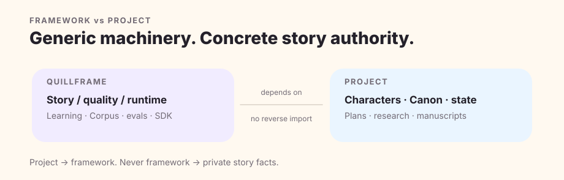

# Quillframe Documentation

Quillframe documentation starts with a mental model, then descends into contracts. The implementation, schemas, tests, and current manifest outrank explanatory prose when they disagree.

## Start here

Begin with [Why Quillframe](why-quillframe.en.md) and [Architecture](architecture.en.md), then [Production Pipeline](production-pipeline.en.md) and [Quality Assurance](quality-assurance.en.md). Those pages explain the product boundary and why a long project cannot collapse plan, draft, evidence, runtime state, and Canon into one undifferentiated memory.

## Core concepts

[Architecture Atlas](architecture-atlas.en.md) maps generic mechanisms to their implementation owners. [Canon State](../core/CANON_STATE.en.md) is the normative authority contract. [Candidate Lineage](CANDIDATE_LINEAGE_V1.en.md) explains how candidate ancestry and exact review binding remain non-authoritative provenance.

## Model and Agent Runtime

[Model Runtime](model-runtime.en.md) explains the ordinary `API Endpoint + Access Token` connection surface, model/protocol discovery, capability evidence, secret handling, and inference transport. [Agent Runtime](agent-runtime.en.md) explains the optional AgentJob/Result loop, Rust host adapters, tool permissions, checkpoints, and receipts exposed through Host Bridge v11.

Provider/vendor identity is diagnostic metadata at most. Hosts run generic agent execution; Quillframe governs runtime contracts, Context, novel authority, and Project state.

## Writing

[Production Pipeline](production-pipeline.en.md), [Surface Fundamentals](../surface/FUNDAMENTALS.en.md), and [Reader Engagement](../surface/READER_ENGAGEMENT.en.md) cover generation, diagnosis, repair ownership, and reader-facing quality.

## Quality

[Quality Assurance](quality-assurance.en.md) explains release truth and pre-independent qualification. [Quality Evolution](quality-evolution.en.md) covers incumbent/challenger comparison, objective preservation, regression protection, and explicit completion. [Eval Reference](../evals/README.en.md) describes deterministic and semantic evaluation boundaries.

## Canon & Settlement

[Canon State](../core/CANON_STATE.en.md) defines authority classes. Settlement is a separate authorized transaction: explicit acceptance, exact before/after intent, current-state compare-and-swap, required projections, and post-condition validation.

## Context & memory

[Context & Memory](context-and-memory.en.md) explains sparse Context Manifests, protected authority, derived memory, and why persistence never means automatic prompt injection.

## Learning

[Adaptive Learning](adaptive-learning.en.md) covers automatic feedback intake and governed promotion. [Corpus Intelligence](../corpus/README.en.md) and [Corpus Policy](../corpus/CORPUS_POLICY.en.md) keep evidence, rights, and Canon separate.

## Semantic execution

[Semantic Worker Protocol](../harness/semantic_workers/SEMANTIC_WORKER_PROTOCOL.en.md) defines typed semantic work. [Semantic Execution Runtime](../harness/semantic_workers/SEMANTIC_EXECUTION_RUNTIME.en.md) defines dispatch, provenance, result validation, and independent-execution boundaries.

## Session & control plane

[Runtime & Integrations](integrations.en.md), [Session Runtime](../harness/session_runtime/SESSION_RUNTIME.en.md), [Runtime Routing](../harness/session_runtime/RUNTIME_ROUTING.en.md), and [Control Plane](../harness/control_plane/CONTROL_PLANE.en.md) define resource/session/run/checkpoint identity and durable external work.

## Corpus & research

Corpus is evidence, not Canon. Research truth is not automatic character knowledge. Use the [Corpus overview](../corpus/README.en.md), [ingest protocol](../corpus/CORPUS_INGEST_PROTOCOL.en.md), [anonymous public-corpus release boundary](../corpus/general/README.en.md), and Project-side research/knowledge boundaries together. The durable [prose-style research record](../specs/031-corpus-style-learning/research.en.md) preserves the primary-source review and adopt/adapt/reject decisions; its paired [specification](../specs/031-corpus-style-learning/spec.en.md) defines scene-aware learning, Writer isolation and evidence gates.

## Project integration

[Native Project Contract](project-contract.en.md) and [Framework Bundle](../release/FRAMEWORK_BUNDLE.en.md) define how a novel stays independently reproducible without importing its private facts into the generic framework.

## Studio

[Studio overview](../studio/README.en.md) describes the current SolidJS authoring shell and typed Host Bridge. Studio consumes Core contracts; UI state and browser persistence do not become a second authority system.

## Development

The [Changelog](../CHANGELOG.en.md), [Roadmap](../ROADMAP.md), and [Agent Framework Adoption](../knowledge/AGENT_FRAMEWORK_ADOPTION.en.md) record current evolution and implementation influences. Historical specs remain historical records even when product architecture and public branding change.

## Reference

Operational authority lives in [SKILL](../SKILL.en.md), [Harness Agent](../harness/HARNESS_AGENT.en.md), schemas, implementation modules, and tests. Documentation authoring follows the [Documentation Standard](DOCUMENTATION_STANDARD.en.md) and [Documentation QA](DOCUMENTATION_QA.en.md).

**Quillframe** is the current product identity and `quillframe` is the current technical namespace. Historical records may retain earlier terminology where changing it would damage provenance; active product guidance uses the current identity.
