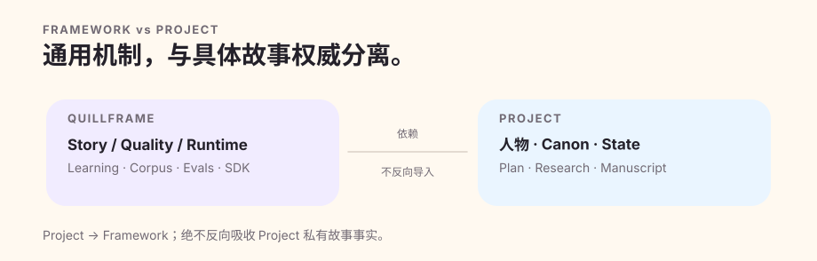

# Quillframe 文档中心

Quillframe 文档先建立心智模型，再进入契约与参考资料。只要解释性文档与当前实现、模式定义、测试或当前清单冲突，以后者为准。

## 从这里开始

先读[总体架构](architecture.zh-CN.md)，再读[生产流水线](production-pipeline.zh-CN.md)与[质量保障](quality-assurance.zh-CN.md)。这三篇解释为什么长篇项目不能把计划、草稿、证据和正典混成一团“记忆”。

## 核心概念

[架构图谱](architecture-atlas.zh-CN.md)把通用机制映射到实际实现；[正典状态](../core/CANON_STATE.zh-CN.md)是事实权威的规范契约；[候选稿谱系](CANDIDATE_LINEAGE_V1.zh-CN.md)解释候选稿的派生关系和精确评审绑定为什么仍然只属于来源证明，而不是故事权威。

## 写作

[生产流水线](production-pipeline.zh-CN.md)、[表层写作基础](../surface/FUNDAMENTALS.zh-CN.md)和[读者投入度](../surface/READER_ENGAGEMENT.zh-CN.md)覆盖正文生成、问题诊断、修订责任归属和面向读者的质量。

## 质量

[质量保障](quality-assurance.zh-CN.md)解释发布真相与独立评审前资格检查；[质量演进](quality-evolution.zh-CN.md)解释基准稿与挑战稿、目标保持、回退保护和停止条件；[评测参考](../evals/README.zh-CN.md)区分确定性评测和语义评测。

## 正典与状态落定

[正典状态](../core/CANON_STATE.zh-CN.md)定义事实权威层级。状态落定是一项独立授权事务：必须有明确接受、精确的前后状态意图、当前状态比较交换、必要派生更新以及事后条件验证。

## 上下文与记忆

[上下文与记忆](context-and-memory.zh-CN.md)说明稀疏上下文清单、受保护的权威事实、派生记忆，以及为什么“已经持久保存”从来不等于“应该自动塞进提示词”。

## 学习

[自适应学习](adaptive-learning.zh-CN.md)覆盖自动反馈接入与受治理的长期提升；[语料库智能](../corpus/README.zh-CN.md)和[语料库策略](../corpus/CORPUS_POLICY.zh-CN.md)把证据、使用权和正典分开。

## 语义执行

[语义工作者协议](../harness/semantic_workers/SEMANTIC_WORKER_PROTOCOL.zh-CN.md)定义带类型的语义任务；[语义执行运行时](../harness/semantic_workers/SEMANTIC_EXECUTION_RUNTIME.zh-CN.md)定义任务派发、来源证明、结果校验与独立执行边界。

## 会话与控制平面

[运行时与集成](integrations.zh-CN.md)、[会话运行时](../harness/session_runtime/SESSION_RUNTIME.zh-CN.md)、[运行时路由](../harness/session_runtime/RUNTIME_ROUTING.zh-CN.md)和[控制平面](../harness/control_plane/CONTROL_PLANE.zh-CN.md)共同定义资源、会话、单次运行和检查点的身份，以及可持久恢复的外部工作。

## 语料库与研究

语料库是证据，不是正典；研究结论也不会自动变成人物知识。应同时遵守[语料库概览](../corpus/README.zh-CN.md)、[摄取协议](../corpus/CORPUS_INGEST_PROTOCOL.zh-CN.md)与项目自己的知识边界。

## 项目集成

[项目开发工具](project-sdk.zh-CN.md)、[项目适配器](project-adapters.zh-CN.md)、[项目适配协议](../harness/PROJECT_ADAPTER_PROTOCOL.zh-CN.md)与[框架构建包](../release/FRAMEWORK_BUNDLE.zh-CN.md)确保小说项目可以独立复现，又不会把私有故事事实反向写进通用框架。

## 开发

[8.0 开发变更清单](8-0-development-inventory.zh-CN.md)、[代理框架采纳记录](../knowledge/AGENT_FRAMEWORK_ADOPTION.zh-CN.md)与[变更日志](../CHANGELOG.zh-CN.md)记录当前演进；历史规格即使经历公开品牌变化，也仍保持当时的真实原貌。

## 参考

操作层面的权威规范见[框架操作契约](../SKILL.zh-CN.md)、[编排执行契约](../harness/HARNESS_AGENT.zh-CN.md)、模式定义、实现模块与测试。文档编写遵守[文档规范](DOCUMENTATION_STANDARD.zh-CN.md)和[文档质量检查](DOCUMENTATION_QA.zh-CN.md)。

稳定路径 `why-quillframe.zh-CN.md` 为兼容保留；当前内容解释[为什么是 Quillframe](why-quillframe.zh-CN.md)，以及为什么技术命名空间不随公开品牌一起改名。
