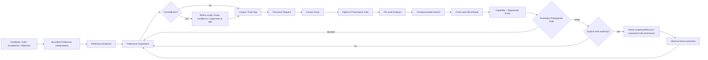

# Adaptive Learning Architecture

## Goal

NovelForge learns from user evidence and corpus evidence without turning transient model guesses into permanent style rules.

The learning system is intentionally separate from runtime/session state and Project authority:

```text
runtime.db  = where work is
learning.db = what has been learned, with evidence and rollback
project DB  = what is Canon for one novel
```

`learning/author_model.py` is a projection/capture layer over the existing Learning Store. It is **not** a second preference database and it does not gain authority by being called an Author Model.

## Learning graph



The important split is:

```text
semantic interpretation
!= evidence
!= hypothesis
!= promotion prerequisite
!= write authority
!= active behavior
```

No one stage silently acquires the authority of the next.

## Evidence hierarchy

From strongest to weakest:

1. explicit user rule;
2. direct user edit;
3. explicit acceptance/rejection with reason;
4. repeated consistent correction;
5. accepted project convention;
6. multi-work corpus mechanism;
7. external framework/craft evidence;
8. model inference.

Model inference alone never creates a durable user preference.

## Preference hypotheses

A hypothesis is more expressive than a style slider. It contains:

- dimension;
- statement;
- underlying mechanism;
- scope (`one_off | project | user_taste | general_craft`);
- confidence;
- positive and negative evidence;
- contradictions;
- applicability boundaries;
- version/state.

Example:

```yaml
dimension: paragraph_rhythm
statement: prefers fast pacing without non-functional fragmentation
mechanism: pace should come from state change, pressure, choice, or information movement—not isolated sentence cuts
scope: user_taste
confidence: 0.82
applicability:
  genres: [commercial_fiction]
  exceptions: [deliberate_shock_fragment, poetic_project_profile]
```

A shallow system might learn “short paragraphs are bad,” while the actual preference is “paragraph breaks should carry narrative function.”

## Author Model: projection, not a new authority plane

The Author Model connects review feedback to future production while preserving the existing Learning Store and promotion contracts.

A typical production-side capture is:

```text
raw review feedback
→ learning.preference_interpret when semantic interpretation is needed
→ scoped evidence in Learning Store
→ revisable hypothesis
→ contradiction / supersession handling
→ optional activation according to scope-specific authority
→ active-preference projection for future production
```

### Priority order

Production resolves current creative intent in this order:

```text
explicit current user instruction
>
explicit active project preference
>
confirmed durable user preference when applicable
>
inferred / candidate hypothesis
```

An inferred hypothesis never overrides the current explicit request.

The active projection intentionally excludes:

- candidate hypotheses;
- one-off history as a durable default;
- General Craft candidates that have not passed their promotion path.

### Project preference

A project-scoped hypothesis can become active only when the caller separately holds the explicit project-preference write authorization required by the Project/runtime authority model.

The Author Model does not create that authorization.

### Durable user taste: two independent requirements

A `user_taste` hypothesis cannot become active merely because a caller supplies `durable_user_taste_write_authorized=true`.

Activation requires **both**:

1. a current promotion-candidate evidence packet that the existing `learning/promotion_gate.py` evaluates as `ready_for_activation`, including its evidence/eval/contradiction requirements; and
2. explicit durable-user-taste write authorization from the surrounding authority mechanism.

The Author Model re-runs the existing promotion prerequisite, verifies the candidate is actually `user_taste`, and binds the promotion mechanism to the interpreted mechanism before activation.

A promotion-gate result remains a prerequisite result. It does not grant write authority by itself.

### General Craft

General Craft never auto-promotes through the Author Model production-feedback path. It remains subject to the more expensive Framework self-improvement / promotion process.

## Autonomous dimension discovery

The framework may propose new dimensions when existing dimensions cannot explain repeated evidence.

A new dimension is only a **candidate** until it has:

- traceable feedback evidence;
- at least one contrast/counterexample question;
- enough distinct evidence to justify the abstraction;
- an eval that separates the mechanism from a superficial proxy.

Prefer splitting an over-broad hypothesis over creating a brittle universal rule.

## Corpus gap detection

A hypothesis can create a corpus gap when confidence is limited by missing contrast evidence.

Example:

> User rejects sentence-per-paragraph pseudo-speed, but also wants very high pacing.

Useful corpus gap:

> Find successful high-tempo commercial passages that preserve coherent paragraph units; compare how pressure, state change, dialogue, action, and information movement produce pace without fragment dependence.

Bad corpus gap:

> Find novels with long paragraphs because the user likes long paragraphs.

The first asks for mechanism evidence; the second merely confirms a surface preference.

## Personalized corpus discovery

The Corpus Scout receives typed discovery requests containing:

- hypothesis/gap ID;
- research question;
- desired contrast;
- genre/platform/language tags;
- style dimensions;
- rights/source constraints;
- target range/question;
- diversity requirements;
- exclusion rules.

The host runtime may satisfy discovery through Web search, GitHub, publisher/platform search, library metadata, user-provided lawful files, or an MCP search connector.

Discovery is not ingestion. Every candidate still passes source verification and rights classification.

## Promotion rules

### Project preference

May activate when explicitly stated by the user, consistent with Project authority, and accompanied by the required project-preference write authorization.

### User taste

Requires explicit/repeated evidence, contradiction review, the existing deterministic promotion prerequisite, and separate durable-user-taste write authority. Neither the model nor the promotion gate can self-authorize the durable write.

### General craft

Requires:

1. mechanism independent of one user/project;
2. cross-work or otherwise strong evidence;
3. counterexample/profile boundary;
4. capability + regression evals;
5. no conflict with higher-priority profiles;
6. version and rollback reference;
7. Framework promotion authority outside the production Author Model path.

## Strengthening

“Strengthening a preference” means increasing confidence or narrowing applicability based on new independent evidence—not repeating the same model output or waiting longer.

The system may autonomously:

- queue missing corpus evidence;
- search additional contrast works when a lawful capability exists;
- generate new eval cases;
- re-run evals after evidence changes;
- mark a hypothesis contested or superseded;
- recommend stronger profile weights;
- produce a promotion-ready prerequisite result.

It may **not** silently convert weak inference into durable truth or equate “promotion-ready” with “write authorized.”

## Decay, contradiction, supersession, and rollback

Preferences are not immortal.

A hypothesis can become:

- `contested` when new evidence conflicts;
- `superseded` when a more precise hypothesis explains the evidence better;
- `deprecated` when the user explicitly changes preference or evals show harm.

Author Model capture records contradiction evidence and can supersede the specifically referenced older hypothesis while preserving provenance. The durable store keeps the history needed to roll behavior back or reinterpret old evidence.

## Positive and negative learning

User edits and accepted artifacts may provide positive mechanism evidence.

Rejected model output may provide negative regression evidence only. It is never a positive style exemplar merely because it existed.

A production failure such as HF-30 can become evidence for a bounded mechanism hypothesis; one failure does not automatically become a universal General Craft rule.

## Privacy boundary

User-taste evidence belongs to the user scope, not source control by default. The generic repository stores schemas and learning mechanisms; personal preference data belongs in local/host-managed durable storage.

Do not infer unrelated demographic/profile data from fiction preferences.

## Exact implementation boundaries

- `learning/learning_store.py` — durable evidence, hypotheses, candidates, and promotion history.
- `learning/promotion_gate.py` — deterministic evidence-completeness prerequisite; no behavior/Canon write authority.
- `learning/author_model.py` — bounded feedback capture, contradiction/supersession, scope-aware activation binding, and active-preference projection.
- `harness/semantic_workers/contracts/production-loop.json` — `learning.preference_interpret` semantic contract.
- `harness/SELF_IMPROVEMENT_PROTOCOL.en.md` — General Craft / Framework self-improvement authority and promotion process.
