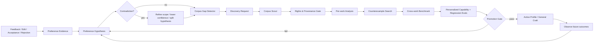

# Adaptive Learning Architecture

## Goal

NovelForge learns from user evidence and corpus evidence without turning transient model guesses into permanent style rules.

The learning system is intentionally separate from runtime/session state:

```text
runtime.db  = where work is
learning.db = what has been learned, with evidence and rollback
project DB  = what is Canon for one novel
```

## Learning graph



## Evidence hierarchy

From strongest to weakest:

1. explicit user rule;
2. direct user edit;
3. explicit acceptance/rejection with reason;
4. repeated consistent correction;
5. accepted project convention;
6. multi-work corpus mechanism;
7. external framework/craft evidence;
8. model inference.

Model inference alone never creates a durable user preference.

## Preference hypotheses

A hypothesis is more expressive than a style slider. It contains:

- dimension;
- statement;
- underlying mechanism;
- scope (`one_off | project | user_taste | general_craft`);
- confidence;
- positive and negative evidence;
- contradictions;
- applicability boundaries;
- version/state.

Example:

```yaml
dimension: paragraph_rhythm
statement: prefers fast pacing without non-functional fragmentation
mechanism: pace should come from state change, pressure, choice, or information movement—not isolated sentence cuts
scope: user_taste
confidence: 0.82
applicability:
  genres: [commercial_fiction]
  exceptions: [deliberate shock_fragment, poetic_project_profile]
```

This matters because a shallow system might learn “short paragraphs are bad,” while the actual preference could be “paragraph breaks should carry narrative function.”

## Autonomous dimension discovery

The framework may propose new dimensions when existing dimensions cannot explain repeated evidence.

A new dimension is only a **candidate** until it has:

- traceable feedback evidence;
- at least one contrast/counterexample question;
- enough distinct evidence to justify the new abstraction;
- an eval that can separate the mechanism from a superficial proxy.

The system should prefer splitting a broad hypothesis over creating a brittle universal rule.

## Corpus gap detection

A hypothesis can create a corpus gap when confidence is limited by missing contrast evidence.

Example:

> User rejects sentence-per-paragraph pseudo-speed, but also wants very high pacing.

Useful corpus gap:

> Find successful high-tempo commercial passages that preserve coherent paragraph units; compare how pressure, state change, dialogue, action, and information movement produce pace without fragment dependence.

Bad corpus gap:

> Find novels with long paragraphs because the user likes long paragraphs.

The first asks for mechanism evidence; the second merely confirms a surface preference.

## Personalized corpus discovery

The Corpus Scout receives typed discovery requests containing:

- hypothesis/gap ID;
- research question;
- desired contrast;
- genre/platform/language tags;
- style dimensions;
- rights/source constraints;
- target range/question;
- diversity requirements;
- exclusion rules.

The host runtime may satisfy discovery through Web search, GitHub, publisher/platform search, library metadata, user-provided lawful files, or an MCP search connector.

Discovery is not ingestion. Every candidate still passes source verification and rights classification.

## Promotion rules

### Project preference
May activate when explicitly stated by the user and consistent with project authority.

### User taste
Requires explicit/repeated evidence and contradiction review.

### General craft
Requires:

1. mechanism independent of one user/project;
2. cross-work or otherwise strong evidence;
3. counterexample/profile boundary;
4. capability + regression evals;
5. no conflict with higher-priority profiles;
6. version and rollback reference.

## Strengthening

“Strengthening a preference” means increasing confidence or narrowing applicability based on new independent evidence—not repeating the same model output or waiting longer.

The system may autonomously:

- queue missing corpus evidence;
- search additional contrast works;
- generate new eval cases;
- re-run evals after evidence changes;
- move a hypothesis from candidate → active;
- mark a hypothesis contested or superseded;
- recommend stronger profile weights.

It may not silently convert weak inference into durable truth.

## Decay and contradiction

Preferences are not immortal.

A hypothesis can become:

- `contested` when new evidence conflicts;
- `superseded` when a more precise hypothesis explains the evidence better;
- `deprecated` when the user explicitly changes preference or evals show harm.

The store preserves provenance so behavior can be rolled back or reinterpreted.

## Positive and negative learning

User edits and accepted artifacts may provide positive mechanism evidence.

Rejected model output may provide negative regression evidence only. It is never a positive style exemplar merely because it existed.

## Privacy boundary

User-taste evidence belongs to the user scope, not source control by default. The generic repository stores schemas and learning mechanisms; personal preference data belongs in local/host-managed durable storage.

Do not infer unrelated demographic/profile data from fiction preferences.
