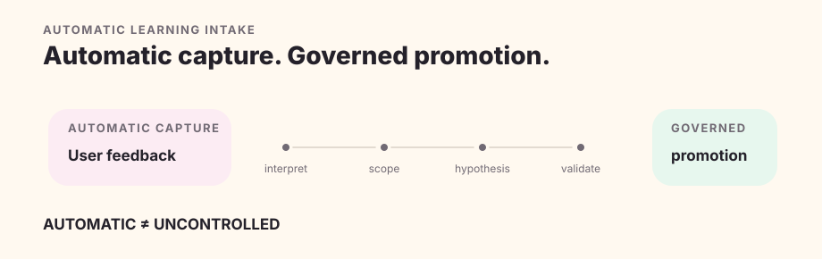

# Adaptive Learning

Quillframe can learn from feedback and rights-bounded corpus research without turning either into silent global behavior. Automatic intake creates evidence; a revocable standing policy can authorize a qualified private preference to activate; General Craft still requires a separate manual framework promotion.

## Automatic capture

A durable feedback observation can be consumed by the Rust learning service independently of current-run author steering. The typed `learning.feedback.execute` model stage decides `capture | skip` and the narrowest supported scope; an independent `learning.preference.review` call checks reuse and overgeneralization before explicit activation.

There is no keyword or regex shortcut for deciding whether feedback is meaningful.

Retrying the same durable event does not create new evidence. A genuinely new user turn can provide independent evidence that strengthens, contests, supersedes, or splits an existing hypothesis.

## Four scopes

`one_off` serves the current request/run. `project` is limited to one fiction Project. `user_taste` is a durable cross-project preference hypothesis. `general_craft` is a candidate for generic framework behavior.

Evidence always takes the narrowest scope it actually supports.

## Governed promotion

Automatic intake defaults all protected write permissions to false. It does not edit Project Profile, promote General Craft, modify framework source, or write Canon.

Durable activation requires evidence, exact candidate binding, semantic review, an independent evaluation and a passed contradiction review. A model result alone cannot activate itself.

## Revocable standing user-taste policy

The host-owned `quillframe_user_taste_auto_activation_policy_v1` policy is disabled by default. A user may enable it for an explicit subset of `corpus`, `feedback`, and `user_edit` sources. Enabling records an authorization reference and policy version; updating or disabling the policy is versioned, and individual preferences can be paused or withdrawn.

When the policy is enabled, a candidate activates only after all user-taste gates pass. An unresolved contradiction, an unbound review, a failed independent evaluation, a stale version, or an unauthorized source blocks activation. The standing policy grants no Framework or Canon write authority.

At the beginning of each production run, Quillframe freezes the eligible active preference inventory. A semantic selector chooses zero or more preferences that are relevant to the exact request and scene. The current request has priority over user taste, and user taste has priority over an older Project preference when they conflict. “Active” therefore means eligible for selection, not mandatory prompt injection.

The context-composition model sees only eligible abstract mechanisms, applicability boundaries, hypothesis identifiers and versions. It sees no corpus prose, titles, creators, paths, quotations, close paraphrases or evidence payloads. Only explicitly selected entries enter the one direct Surface Writer pack; Blind Reader and independent reviewers do not receive the preference projection.

Content-zone preferences remain partitioned. In particular, `adult_explicit` preferences apply only when the current task explicitly enters that content zone; they are not mixed into the ordinary profile.

## General Craft stays manual

General Craft has the highest bar: multiple cross-work references, counterexamples, a profile boundary, capability and regression evaluation, provenance, version/rollback evidence, green deterministic CI and explicit engineering authority. Even a promotable result remains a candidate until a human-authorized `SYSTEM-IMPROVE` change updates the framework.

Corpus prose-style learning follows that manual path. The exact 120-work V5 membership is an addressable source pool: human confirmation binds declared rights and scope, profile, complete membership and proposal fingerprint, but is not a per-work literary review. Full-pool exposure and CPU/memory benchmarks are diagnostics rather than confirmation or quality gates.

The AI-native contract gives AI responsibility for scene/style classification, evidence gaps, the next minimum-sufficient sample and cross-work convergence. Rust Core is only deterministic scaffolding: it binds identity/version, materializes bounded evidence, enforces source and leakage boundaries, journals semantic calls, and verifies receipts. It never infers literary similarity or convergence. The current Corpus runner can request exact remaining units, stop at model-declared saturation, and publish only source-free mechanisms; this is engineering evidence, not proof that Quillframe has learned a style. Live blind evaluation and author judgment remain separate gates.

An exact candidate pack changes production only through explicit opt-in. A semantic selector may choose zero to four relevant cards for Writer stages; the current user request and frozen project authority take precedence. Blind Reader and independent reviewers receive neither the cards nor treatment labels. Baseline, current craft v5 and corpus candidate are evaluated as three anonymous arms with order swaps, leave-one-work-out isolation and a separate semantic-leakage review. No aggregate score or model verdict can promote the pack by itself.

Body and appearance language remains an ordinary style dimension. An isolated anatomy or figure-description term such as `巨乳` is not an adult-content signal; only actual contextual evidence of explicit content enters the separately governed content zone.

## Rejected output

A rejected artifact can become negative regression evidence by reference/fingerprint and meaning. It is not a positive prose exemplar and must not leak back into pre-draft writer context.

## Research and Corpus

Learning may create a Corpus gap and search for rights-safe contrast evidence. The anonymous public corpus and the private user-taste store are separate projections of the same bounded analysis: public output contains only closed-schema, source-free derivatives; private preferences remain host-owned and are not committed by default.

Discovery is not ingestion; ingestion is not preference; analysis is not promotion; Corpus is not Canon. Abstracting a source does not by itself establish a legal right to publish the result, so the release path still requires declared rights, provenance and a leakage review.
