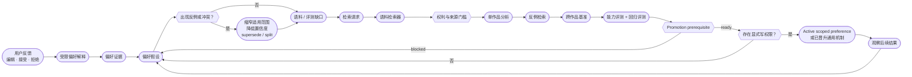

<div align="center">
  
  <p><strong>自适应学习 · 用证据学习，而不是把模型猜测变成永久规则</strong></p>
  <p><kbd>用户证据</kbd>&nbsp;&nbsp;<kbd>偏好假设</kbd>&nbsp;&nbsp;<kbd>AUTHOR MODEL</kbd>&nbsp;&nbsp;<kbd>语料缺口</kbd>&nbsp;&nbsp;<kbd>评测</kbd>&nbsp;&nbsp;<kbd>回滚</kbd></p>
</div>


# 自适应学习架构

> 🌸 **NovelForge 可以持续学习，但任何持久行为变化都必须有证据、有边界、可评测、可回滚。模型自己猜出来的“用户偏好”永远不够。**

学习状态与运行状态、项目状态严格分离：

```text
runtime.db  = 工作进行到哪里
learning.db = 学到了什么、证据是什么、如何回滚
project DB  = 某一本小说哪些内容属于已接受正典
```

`learning/author_model.py` 只是建立在既有 Learning Store 之上的 feedback capture / active projection 层。它**不是第二套偏好数据库**，也不会因为名字叫 Author Model 就获得新的 authority。

---

## 01 · 学习闭环 ✨



这里最重要的不是“多存一些记忆”，而是严格保持：

```text
semantic interpretation
!= evidence
!= hypothesis
!= promotion prerequisite
!= write authority
!= active behavior
```

任何一步都不会静默获得下一步的 authority。

---

## 02 · 证据等级 📚

由强到弱：

1. 用户明确提出的规则；
2. 用户直接修改后的文本；
3. 用户带理由的明确接受或拒绝；
4. 多次一致的修正行为；
5. 已接受的项目约定；
6. 多作品语料中反复出现的机制证据；
7. 外部框架或写作研究证据；
8. 模型推断。

只有第 8 层时，**不得建立持久用户偏好**。

---

## 03 · 偏好假设 🧠

偏好假设比静态“风格滑块”更有表达力。至少记录：

- 偏好维度；
- 假设陈述；
- 底层机制；
- 作用域：`one_off | project | user_taste | general_craft`；
- 置信度；
- 正向 / 负向证据；
- 冲突证据；
- 适用边界；
- 版本与状态。

示例：

```yaml
dimension: paragraph_rhythm
statement: 喜欢快节奏，但不喜欢没有叙事功能的碎段
mechanism: 节奏应来自状态变化、压力、选择或信息移动，而不是单纯把句子切碎
scope: user_taste
confidence: 0.82
applicability:
  genres: [commercial_fiction]
  exceptions: [deliberate_shock_fragment, poetic_project_profile]
```

浅层系统很容易把这个偏好错误概括成“用户讨厌短段落”；真正可复用的机制其实是：**段落切分必须承担叙事功能。**

### 自动发现新的偏好维度

当既有维度无法解释重复出现的用户证据时，框架可以提出新的候选维度。但它至少需要：

- 可追溯的用户反馈证据；
- 至少一个反例或对照问题；
- 足够独立的重复证据，而不是一次偶发现象；
- 一个能区分真实机制与表面代理指标的评测。

系统应优先拆分过宽假设，而不是制造脆弱万能规则。

---

## 04 · Author Model 是 projection，不是新 authority plane 🎛️

Author Model 负责把 review feedback 与未来 production 连接起来，同时继续复用既有 Learning Store 与 promotion contract。

典型 production-side capture：

```text
raw review feedback
→ 必要时 learning.preference_interpret
→ Learning Store 中的 scoped evidence
→ revisable hypothesis
→ contradiction / supersession
→ 按 scope-specific authority 可选激活
→ 只把 active + applicable preference 投影进后续 production
```

### 生产优先级

当前创作意图的覆盖顺序是：

```text
当前用户显式指令
>
当前项目已激活的显式偏好
>
在适用范围内已确认的 durable user preference
>
inferred / candidate hypothesis
```

因此模型推断出来的 hypothesis 永远不能覆盖当前明确用户指令。

Active projection 会明确排除：

- candidate hypothesis；
- one-off 历史，不把它当 durable default；
- 尚未经过自身晋升路径的 General Craft candidate。

### Project preference

Project scope hypothesis 只有在 surrounding runtime / Project authority 另行授予明确 `project_preference_write` 权限时，才能变 active。

Author Model 自己不创造这项授权。

### Durable user taste：必须同时通过两道门

`user_taste` hypothesis 不能因为调用方自己传了 `durable_user_taste_write_authorized=true` 就激活。

必须**同时**满足：

1. 一份当前 promotion-candidate evidence packet，被既有 `learning/promotion_gate.py` 重新计算为 `ready_for_activation`，包括它要求的 evidence、eval 与 contradiction 条件；
2. surrounding authority mechanism 明确授予 durable-user-taste write authorization。

Author Model 会重新调用既有 promotion gate，并验证 candidate scope 确实是 `user_taste`，同时把 promotion mechanism 与当前 interpreted mechanism 绑定，防止拿不相干的 PASS receipt 冒充 prerequisite。

Promotion gate 的结果只是 prerequisite result，本身仍然**不授予写权限**。

### General Craft

General Craft 永远不能通过 Author Model 的 production-feedback path 自动晋升。它必须继续走更昂贵的 Framework self-improvement / promotion process。

---

## 05 · 语料缺口检测 🔎

当某个偏好假设缺少足够对照证据时，可以生成“语料缺口”。

例如：用户反感“一句一段”的伪速度感，但又要求很高的商业网文节奏。

**好的研究问题：**

> 寻找高节奏商业小说中仍保持完整段落单元的成功片段，比较压力、状态变化、对话、动作和信息移动如何制造速度，而不是依赖碎段。

**差的研究问题：**

> 用户喜欢长段落，所以找一些长段落小说。

前者研究机制，后者只是寻找确认偏见。

---

## 06 · 个性化语料检索 🪄

Corpus Scout 接收类型化 discovery request，包括：

- hypothesis / gap ID；
- research question；
- desired contrast；
- genre / platform / language tags；
- style dimensions；
- rights / source constraints；
- target range / question；
- diversity requirements；
- exclusion rules。

宿主运行时可以通过 Web、GitHub、出版社 / 平台搜索、图书馆元数据、用户合法文件、MCP connector 等方式完成查找。

> **边界 ✦ Discovery ≠ Ingestion。** 每个候选来源仍然必须经过来源核验和权利分类。

---

## 07 · Promotion 规则 🔒

### 项目偏好

用户明确提出、与 Project authority 一致，并且具备对应 project-preference write authorization 时，可以在该项目内激活。

### 用户口味

需要明确 / 重复证据、冲突审查、既有 deterministic promotion prerequisite，以及独立的 durable-user-taste write authority。模型与 promotion gate 都不能给自己授权写入 durable behavior。

### 通用写作机制

必须同时满足：

1. 机制不依赖单一用户或单一项目；
2. 有跨作品或同等级别的强证据；
3. 有反例或适用边界分析；
4. 有 capability eval 与 regression eval；
5. 不与更高优先级 profile 冲突；
6. 有版本记录和回滚依据；
7. 由 Author Model production path 之外的 Framework promotion authority 负责真正晋升。

---

## 08 · “加强学习”真正意味着什么 ⚙️

加强一个偏好，不是让同一个模型重复同意自己，也不是“时间久了自动加权”；它意味着出现了新的独立证据，从而提高置信度或缩窄适用边界。

系统可以自主：

- 排队等待缺失的语料证据；
- 在存在合法 capability 时搜索更多对照作品；
- 生成新的 eval case；
- 证据变化后重新运行评测；
- 标记 hypothesis contested / superseded；
- 建议更强或更弱的 profile weight；
- 产出 promotion-ready prerequisite result。

它不能把弱推断静默升级成持久真理，也不能把“promotion-ready”当成“write-authorized”。

---

## 09 · 衰减、冲突、Supersession 与回滚 ↩️

偏好不是永久不变的。Hypothesis 可以进入：

- `contested`：新证据与旧结论冲突；
- `superseded`：更精确的新假设能更好解释证据；
- `deprecated`：用户明确改变口味，或 eval 证明该偏好产生明显副作用。

Author Model capture 会记录 contradiction evidence，并可以 supersede 被明确引用的旧 hypothesis，同时保留 provenance。Durable store 保存足够历史，使行为能够回滚，也能在新证据出现后重新解释旧 evidence。

---

## 10 · 正向与负向学习 ✦

用户直接编辑、以及已接受 artifact，可以提供正向机制证据。

被用户拒绝的模型输出只能提供**负面 regression evidence**。它不能因为“曾经生成过”就反过来成为正向 style exemplar。

像 HF-30 这样的真实 production failure 可以成为一个 bounded mechanism hypothesis 的证据；一次失败不会自动变成通用 General Craft rule。

---

## 11 · 隐私边界 🔐

User-taste evidence 属于用户作用域，默认不应提交到通用源码仓库。Framework repo 只保存 schema 与 learning mechanism；个人偏好数据应留在 local / host-managed durable storage。

不得根据小说口味推断与当前任务无关的人口属性或个人画像。

---

## 12 · 精确实现边界

- `learning/learning_store.py` —— durable evidence、hypothesis、candidate 与 promotion history。
- `learning/promotion_gate.py` —— deterministic evidence-completeness prerequisite；不授予 behavior / Canon write authority。
- `learning/author_model.py` —— bounded feedback capture、contradiction / supersession、scope-aware activation binding、active-preference projection。
- `harness/semantic_workers/contracts/production-loop.json` —— `learning.preference_interpret` semantic contract。
- `harness/SELF_IMPROVEMENT_PROTOCOL.zh-CN.md` —— General Craft / Framework self-improvement authority 与 promotion process。

<div align="center">
  
  <br />
  <sub>证据可以积累，假设必须可推翻；ready 不等于有权写。🌸</sub>
</div>