<div align="center">
  
  <p><strong>自适应学习 · 用证据学习，而不是把模型猜测变成永久规则</strong></p>
  <p><kbd>用户证据</kbd>&nbsp;&nbsp;<kbd>偏好假设</kbd>&nbsp;&nbsp;<kbd>语料缺口</kbd>&nbsp;&nbsp;<kbd>评测</kbd>&nbsp;&nbsp;<kbd>回滚</kbd></p>
</div>


# 自适应学习架构

> 🌸 **NovelForge 可以持续学习，但任何持久行为变化都必须有证据、有边界、可评测、可回滚。模型自己猜出来的“用户偏好”永远不够。**

学习状态与运行状态、项目状态严格分离：

```text
runtime.db  = 工作进行到哪里
learning.db = 学到了什么、证据是什么、如何回滚
project DB  = 某一本小说哪些内容属于已接受正典
```

---

## 01 · 学习闭环 ✨

```mermaid
%%{init: {"theme":"base","themeVariables":{"background":"#FFFDFC","primaryTextColor":"#241D2B","lineColor":"#756A7D","fontFamily":"ui-sans-serif, system-ui, sans-serif"},"flowchart":{"curve":"basis","nodeSpacing":28,"rankSpacing":34}}}%%
flowchart LR
    F([用户反馈<br/>编辑 · 接受 · 拒绝]) --> E([偏好证据]) --> H([偏好假设]) --> C{{出现反例或冲突？}}
    C -- 是 --> R([缩窄适用范围<br/>降低置信度<br/>拆分假设])
    C -- 否 --> G([语料缺口检测])
    R --> G
    G --> D([检索请求]) --> S([语料检索器]) --> Q{{权利与来源门槛}} --> A([单作品分析]) --> X([反例检索]) --> B([跨作品基准]) --> V([个性化能力评测<br/>+ 回归评测]) --> P{{升级门槛}}
    P -- 通过 --> AP([当前偏好配置<br/>或通用写作机制])
    P -- 未通过 --> H
    AP --> M([观察后续结果]) --> H

    classDef editorial fill:#F9DDE9,stroke:#D6679A,color:#241D2B,stroke-width:1.75px;
    classDef evidence fill:#F9EDCF,stroke:#BE892F,color:#241D2B,stroke-width:1.75px;
    classDef runtime fill:#E7E1F8,stroke:#796BC4,color:#241D2B,stroke-width:1.75px;
    classDef validated fill:#DCF1E7,stroke:#4D9B7D,color:#241D2B,stroke-width:2px;
    classDef neutral fill:#FFFDFC,stroke:#62556D,color:#241D2B,stroke-width:1.75px;

    class F editorial;
    class E,H,G,D,A,X,B,V evidence;
    class C,Q,P runtime;
    class R,M neutral;
    class S runtime;
    class AP validated;
```



这套闭环的重点不是“积累更多记忆”，而是让每个偏好结论都能回答三个问题：**证据从哪里来？什么情况下不适用？如果后来证明错了，怎么撤回？**

---

## 02 · 证据等级 📚

由强到弱：

1. 用户明确提出的规则；
2. 用户直接修改后的文本；
3. 用户带理由的明确接受或拒绝；
4. 多次一致的修正行为；
5. 已接受的项目约定；
6. 多作品语料中反复出现的机制证据；
7. 外部框架或写作研究证据；
8. 模型推断。

只有第 8 层时，**不得建立持久用户偏好**。

---

## 03 · 偏好假设 🧠

偏好假设比静态“风格滑块”更有表达力。至少记录：

- 偏好维度；
- 假设陈述；
- 底层机制；
- 作用域：`one_off | project | user_taste | general_craft`；
- 置信度；
- 正向 / 负向证据；
- 冲突证据；
- 适用边界；
- 版本与状态。

示例：

```yaml
dimension: paragraph_rhythm
statement: 喜欢快节奏，但不喜欢没有叙事功能的碎段
mechanism: 节奏应来自状态变化、压力、选择或信息移动，而不是单纯把句子切碎
scope: user_taste
confidence: 0.82
applicability:
  genres: [commercial_fiction]
  exceptions: [deliberate_shock_fragment, poetic_project_profile]
```

浅层系统很容易把这个偏好错误地概括成“用户讨厌短段落”；真正可复用的机制其实是：**段落切分必须承担叙事功能。**

### 自动发现新的偏好维度

当既有维度无法解释重复出现的用户证据时，框架可以提出新的候选维度。但它至少需要：

- 可追溯的用户反馈证据；
- 至少一个反例或对照问题；
- 足够独立的重复证据，而不是一次偶发现象；
- 一个能够区分真实机制与表面代理指标的评测。

系统应优先拆分过宽的假设，而不是制造脆弱的“万能规则”。

---

## 04 · 语料缺口检测 🔎

当某个偏好假设缺少足够对照证据时，可以生成“语料缺口”。

例如：用户反感“一句一段”的伪速度感，但又要求很高的商业网文节奏。

**好的研究问题：**

> 寻找高节奏商业小说中仍保持完整段落单元的成功片段，比较压力、状态变化、对话、动作和信息移动如何制造速度，而不是依赖碎段。

**差的研究问题：**

> 用户喜欢长段落，所以找一些长段落小说。

前者研究机制，后者只是寻找确认偏见。

---

## 05 · 个性化语料检索 🪄

语料检索器（Corpus Scout）接收类型化检索请求，包含：

- 假设 / 缺口 ID；
- 研究问题；
- 需要的对照类型；
- 类型、平台、语言标签；
- 风格维度；
- 权利与来源限制；
- 目标范围与问题边界；
- 多样性要求；
- 排除规则。

宿主运行时可以通过 Web、GitHub、出版社 / 平台搜索、图书馆元数据、用户合法文件、MCP 检索连接器等方式完成查找。

> **边界 ✦ 检索 ≠ 入库。** 每个候选来源仍必须通过来源核验和权利分类。

---

## 06 · 升级规则 🔒

### 项目偏好

用户明确提出、且不与项目权威冲突时，可以在该项目内激活。

### 用户口味

需要明确或重复证据，并完成冲突审查。

### 通用写作机制

必须同时满足：

1. 机制不依赖单一用户或单一项目；
2. 有跨作品或同等级别的强证据；
3. 有反例或适用边界分析；
4. 有能力评测与回归评测；
5. 不与更高优先级配置冲突；
6. 有版本记录和回滚依据。

---

## 07 · “加强学习”真正意味着什么 ⚙️

加强一个偏好，不是让同一个模型重复同意自己，也不是“时间久了自动加权”；它意味着**出现了新的独立证据**，从而让置信度上升，或让适用范围变得更精确。

系统可以自主：

- 排队等待缺失的语料证据；
- 搜索更多对照作品；
- 生成新的评测案例；
- 证据变化后重新运行相关评测；
- 把候选假设升级为当前有效假设；
- 标记为“有争议”或“已被替代”；
- 建议更强或更弱的配置权重。

它不能把弱推断静默升级成持久真理。

---

## 08 · 衰减、冲突与回滚 ↩️

偏好不是永久不变的。假设可以进入：

- `contested`：新证据与旧结论冲突；
- `superseded`：更精确的新假设能够更好解释证据；
- `deprecated`：用户明确改变口味，或评测证明该偏好产生明显副作用。

所有来源记录都应保留，因此行为能够回滚，也能够在新证据出现后重新解释。

---

## 09 · 正向与负向学习 ✦

用户直接编辑、以及已接受稿件，可以提供正向机制证据。

被用户拒绝的模型输出只能提供**负面回归证据**。它不能因为“曾经生成过”就反过来成为正向风格范例。

---

## 10 · 隐私边界 🔐

用户口味证据属于用户作用域，默认不应提交到通用源码仓库。框架仓库只保存 Schema 与学习机制；个人偏好数据应留在本地或宿主管理的持久存储中。

不得根据小说口味推断与当前任务无关的人口属性或个人画像。

<div align="center">
  
  <br />
  <sub>证据可以积累，假设必须可推翻。🌸</sub>
</div>
