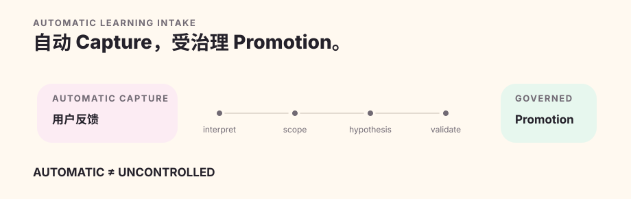

# 自适应学习

Quillframe 的学习机制会在收到有意义的用户反馈时自动启动接入流程，但**自动接入从来不等于自动升级长期规则**。

## 自动捕获反馈

持久事件 `feedback.observed` 可以由学习接入流程独立于当前运行中的作者引导机制来消费。`learning/feedback_intake.py` 会把反馈交给 `learning.preference_interpret`；由模型判断 `capture | skip`、证据真正支持的最窄作用范围、涉及机制、矛盾情况以及与既有假设的关系。

系统不会用关键词或正则表达式，冒充“这是不是有意义反馈”的语义判断。

同一个持久事件重试不算新证据；真正不同的新用户回合，才可能成为新的独立证据，用来加强、质疑、取代或拆分既有假设。

## 四种作用范围

`one_off` 只服务当前请求或运行；`project` 只属于一个项目；`user_taste` 表示跨项目、可持久保存的用户偏好假设；`general_craft` 才是通用框架行为的候选。

证据永远只使用它真正支持的最窄作用范围。

## 受治理的长期提升

自动接入默认把所有受保护写入权限设为关闭。它不会自动修改项目配置、激活持久用户偏好、把通用写作技法提升为框架规则、修改框架源码或写入正典。

持久激活需要足够证据、矛盾复核、相关评测证据、来源链，以及目标作用范围要求的正式权限。通用写作技法的门槛最高：需要跨作品证据、反例与适用边界、能力和回退评测、版本与回滚机制、绿色的确定性持续集成结果，以及明确的软件工程授权。

## 被拒绝的产物

被拒制品可以按引用和内容指纹，加上明确的负面含义，成为回退证据；但它不是正向文风样例，也不能泄漏回起草前的写作上下文。

## 研究资料与语料库

学习机制可以发现语料库缺口，并寻找权利安全的对照证据。发现资料不等于允许摄取；摄取不等于形成偏好；分析不等于长期提升；语料库也不等于正典。
