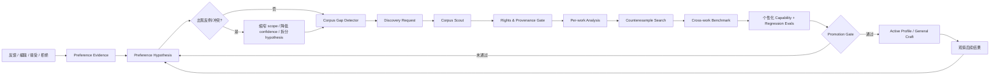

# 自适应学习架构

## 目标

NovelForge 从用户证据与 Corpus 证据中持续学习，但不会把临时模型猜测偷偷变成永久风格规则。

Learning state 与 runtime/session state 必须分开：

```text
runtime.db  = 工作做到哪里
learning.db = 学到了什么，以及证据与 rollback
project DB  = 某一本小说哪些内容是 Canon
```

## Learning Graph



## 证据等级

由强到弱：

1. 用户明确规则；
2. 用户直接编辑；
3. 用户带理由的明确接受/拒绝；
4. 多次一致修正；
5. Accepted project convention；
6. 多作品 Corpus mechanism；
7. 外部 framework / craft evidence；
8. 模型推断。

只有第 8 层模型推断时，不得建立 durable user preference。

## Preference Hypothesis

Hypothesis 比静态 style slider 更有表达力，至少记录：

- dimension；
- statement；
- underlying mechanism；
- scope（`one_off | project | user_taste | general_craft`）；
- confidence；
- positive / negative evidence；
- contradictions；
- applicability boundary；
- version/state。

示例：

```yaml
dimension: paragraph_rhythm
statement: 喜欢快节奏，但不喜欢无功能碎段
mechanism: 节奏应该来自状态改变、压力、选择或信息移动，而不是单纯把句子切碎
scope: user_taste
confidence: 0.82
applicability:
  genres: [commercial_fiction]
  exceptions: [deliberate_shock_fragment, poetic_project_profile]
```

这很重要。浅层系统可能会学成“短段落不好”，真正的偏好却可能是“段落切分必须承担叙事功能”。

## 自主发现新的偏好维度

当既有 dimensions 无法解释重复出现的用户证据时，framework 可以提出新的 dimension。

新 dimension 只能先成为 **candidate**，至少需要：

- 可追溯 feedback evidence；
- 至少一个 contrast/counterexample 问题；
- 足够独立的证据支持这个抽象，而不是一次偶发现象；
- 一个能区分真实 mechanism 与 superficial proxy 的 eval。

系统应优先拆分过宽 hypothesis，而不是制造脆弱的 universal rule。

## Corpus Gap Detection

当某个 hypothesis 因缺少对照证据而置信度有限时，可以生成 Corpus Gap。

例如：

> 用户反感 sentence-per-paragraph 的伪速度感，但又要求很高的商业网文节奏。

好的 Corpus Gap：

> 寻找高节奏商业小说中仍保持完整段落单元的成功片段，对比 pressure、state change、dialogue、action、information movement 如何制造速度，而不是依赖碎段。

坏的 Corpus Gap：

> 用户喜欢长段落，所以找一些长段落小说。

前者研究 mechanism，后者只是寻找确认偏见。

## 个性化 Corpus Discovery

Corpus Scout 接收 typed discovery request，包含：

- hypothesis/gap ID；
- research question；
- desired contrast；
- genre/platform/language tags；
- style dimensions；
- rights/source constraints；
- target range/question；
- diversity requirements；
- exclusion rules。

Host runtime 可以通过 Web、GitHub、出版社/平台搜索、图书馆 metadata、用户合法文件、MCP search connector 等方式完成检索。

**Discovery ≠ Ingestion。** 每个候选仍必须通过 source verification 与 rights classification。

## Promotion Rules

### Project Preference
用户明确提出，并且不冲突 project authority 时可以激活。

### User Taste
需要明确/重复证据，并经过 contradiction review。

### General Craft
必须同时满足：

1. mechanism 不依赖单一用户/项目；
2. cross-work 或其他足够强的证据；
3. counterexample / profile boundary；
4. capability + regression eval；
5. 不冲突更高优先级 profile；
6. version + rollback reference。

## “加强学习”是什么意思

加强某个偏好，不是重复同一个模型判断，也不是时间久了自动加权；而是因为出现了新的独立证据，使 confidence 上升或 applicability 更精准。

系统可以自主：

- 排队缺失 Corpus evidence；
- 搜索更多对照作品；
- 自动生成新的 eval case；
- 证据变化后重新跑 eval；
- 把 hypothesis 从 candidate → active；
- 标记 contested / superseded；
- 推荐更强的 profile weight。

它不能把 weak inference 静默升级成 durable truth。

## Decay / Contradiction

偏好不是永久不变的。

Hypothesis 可以变成：

- `contested`：新证据与旧结论冲突；
- `superseded`：更精确的新 hypothesis 能更好解释证据；
- `deprecated`：用户明确改变口味，或 eval 证明该偏好造成明显副作用。

所有 provenance 都要保留，因此行为能够 rollback 或重新解释。

## 正向与负向学习

用户编辑和 Accepted artifact 可以提供 positive mechanism evidence。

被用户拒绝的模型输出只能提供 negative regression evidence。它不能因为“已经生成过”就成为正向 style exemplar。

## Privacy Boundary

User-taste evidence 属于用户 scope，默认不应该 commit 到通用 source repo。Framework repo 只保存 schema 与 learning mechanism；个人偏好数据应存放在 local/host-managed durable storage。

不得根据小说口味推断与任务无关的人口属性或个人画像。
