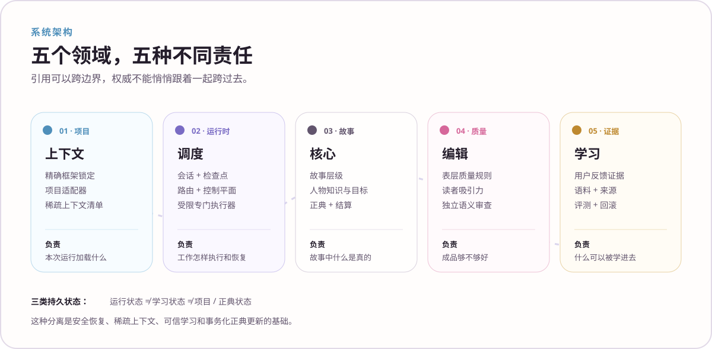

<div align="center">
  
  <p><strong>架构图谱 · 按子系统逐层拆解</strong></p>
  <p><kbd>故事</kbd>&nbsp;&nbsp;<kbd>运行时</kbd>&nbsp;&nbsp;<kbd>质量</kbd>&nbsp;&nbsp;<kbd>学习</kbd>&nbsp;&nbsp;<kbd>项目工程</kbd></p>
</div>


# 架构图谱

> 🌸 **总架构图告诉你各领域如何连接；这份图谱进一步说明每个子系统究竟负责什么、明确拒绝负责什么，以及精确契约在哪里。**



---

## 01 · 项目边界与上下文代理

**目的：** 把一个具体小说项目绑定到一个精确 NovelForge 版本，并为每次调用构造任务级上下文，而不是把整库资料塞进模型。

**负责：** 项目清单、精确锁定、适配器映射、权威路径解析、稀疏上下文清单、相关内容指纹。

**不负责：** 具体故事事实本身、独立审查结论、用户偏好、运行时聊天历史。

```text
项目清单 + 锁文件
→ 项目适配器
→ 权威 / 配置 / 状态解析
→ 任务级上下文清单
→ 管理器 / 专门执行器调用
```

**关键边界：** 存储里“存在”不等于进入 prompt。未来计划、无关正典、回归 gold、管理器整段聊天历史都不会默认注入。

参考：[项目 SDK](project-sdk.zh-CN.md) · [项目适配器](project-adapters.zh-CN.md) · [项目适配器协议](../harness/PROJECT_ADAPTER_PROTOCOL.zh-CN.md)

---

## 02 · 故事系统

**目的：** 把小说建模成有层级、有因果、有开放依赖的故事系统，而不是连续文本流。

**负责：** `BOOK → VOLUME → ARC → UNIT → CHAPTER → SCENE` 层级、结构目标、因果推进、开放线索、故事依赖和故事层失败归属。

**不负责：** 人物私有知识、最终表层文风、运行时会话、自动正典结算。

```text
已接受前置状态
+ 当前计划
+ 本场景问题
→ 故事预检
→ 场景模拟
→ 改变状态的事件轨迹
```

参考：[故事系统](../core/STORY_SYSTEM.zh-CN.md)

---

## 03 · 人物与关系系统

**目的：** 保持重要人物在行为和知识上真正独立，避免管理器或大纲通过所有角色的嘴说话。

**负责：** 人物目标、知识边界、声线归属、位置 / 是否在场、利益、关系状态、义务、任务、情绪余波，以及人物真正拥有的选择。

**不负责：** 管理器知道的一切，也不把“大纲里写了某角色会这样反应”自动当成人物真实行为。

```text
人物状态 + 关系状态 + 场景压力
→ 人物模拟
→ 合理行动 / 拒绝 / 失误 / 反应
→ 场景状态变化提案
```

参考：[人物系统](../core/CHARACTER_SYSTEM.zh-CN.md)

---

## 04 · 正典状态与结算

**目的：** 防止计划、审阅稿、记忆、语料证据和模型猜测悄悄变成故事事实。

**负责：** `locked > accepted > active_plan > review > proposal` 等权威生命周期、接受证据、before/after 结算、依赖影响、post-condition 和 trace。

**不负责：** 自动接受。Review Draft 即使通过 QA，也不会自动变成正典。

```text
用户明确接受
→ 冻结 accepted artifact
→ state delta
→ exact before-state 验证
→ dependency impact
→ 授权写入
→ derived view 重建
→ post-condition + trace
```

参考：[正典状态](../core/CANON_STATE.zh-CN.md)

---

## 05 · 调度管理器

**目的：** 按任务模式协调生产过程，但不把“多 Agent”本身当成目标。

**负责：** 唯一 primary task mode、能力解析、稀疏上下文、检查点、受限专门执行器、门槛顺序、外部等待 / 恢复、结果验证和真实用户可见状态。

**不负责：** 在 mandatory independence 场景里自己充当独立语义审阅者，也不拥有项目专属故事事实。

```text
用户请求
→ 解析 task mode
→ 能力 + 权威预检
→ 上下文冻结
→ 生产 / 审计 / 研究 / 学习图
→ 必要门槛
→ 真实用户可见状态
```

参考：[调度管理器](../harness/HARNESS_AGENT.zh-CN.md) · [编排协议](../harness/ORCHESTRATION_PROTOCOL.zh-CN.md)

---

## 06 · 会话运行时

**目的：** 让长时间工作可以跨用户等待、工具调用、提供商切换、进程重启和外部 worker 继续恢复。

**负责：** session / run / checkpoint / event 身份、workflow cursor、pending wait、handoff / result binding、恢复验证和 consume-once。

**不负责：** 正典。提供商原生 conversation/thread ID 只是元数据。

```text
项目 / 资源
→ 会话
→ 一次运行
→ 检查点
→ 事件 / 交接
→ 结果
→ 验证 / 单次消费
→ 恢复
```

参考：[会话运行时](../harness/session_runtime/SESSION_RUNTIME.zh-CN.md) · [运行时路由](../harness/session_runtime/RUNTIME_ROUTING.zh-CN.md)

---

## 07 · 运行时能力代理

**目的：** 只把工作路由到当前宿主里真实存在、权限合格的能力。

**负责：** 能力发现与规范化、权限约束、模型执行可用性、用量约束和合格 transport 选择。

**不负责：** 权威。某个 connector 或 runtime 技术上能写文件，不代表它有权修改 Canon。

运行方式可以包括当前聊天、独立 peer chat、本地 Codex / Claude、提供商 API、MCP、GitHub job、本地模型和人工审阅。

参考：[运行时能力](../harness/session_runtime/RUNTIME_CAPABILITIES.zh-CN.md)

---

## 08 · 持久控制平面

**目的：** 管理外部 / 并行运行状态，同时禁止异步基础设施成为隐形故事真相来源。

**负责：** event、handoff、lease、result receipt、生命周期、幂等性、单次消费和运行来源记录。

**不负责：** 语义有效性或正典权限。

```text
管理器分发
→ handoff / lease
→ 外部工作
→ 类型化 result receipt
→ 指纹 / 来源验证
→ 单次消费
```

参考：[控制平面](../harness/control_plane/CONTROL_PLANE.zh-CN.md)

---

## 09 · 语义执行器运行时

**目的：** 在真正需要独立判断时，提供管理器无法合法自我替代的独立语义能力。

**负责：** 独立 session / invocation、有限审阅包、artifact fingerprint 绑定、类型化 verdict、reviewer freshness 和结果验证。

**不负责：** 自动修复或权威升级。Reviewer 负责指出哪里失败；真正的修复必须回到 owning mechanism。

```text
冻结候选稿
→ 有界盲审包
→ 独立调用 / 会话
→ 指纹绑定类型化结果
→ 管理器验证
→ owning repair layer
```

参考：[语义执行器协议](../harness/semantic_workers/SEMANTIC_WORKER_PROTOCOL.zh-CN.md) · [语义执行运行时](../harness/semantic_workers/SEMANTIC_EXECUTION_RUNTIME.zh-CN.md)

---

## 10 · 表层质量规则

**目的：** 在文本表层执行通用 anti-AI 失败机制，但不把“表面干净”误当成“读者体验好”。

**负责：** 已知的结构破损 / AI-ish 表层机制，以及局部修复与整场景重生之间的尺度选择。

**不负责：** 故事结构、人物动机或读者压力。

参考：[表层质量规则](../surface/FUNDAMENTALS.zh-CN.md)

---

## 11 · 读者吸引力

**目的：** 判断文本是否真的产生叙事压力、阶段性回报、因果运动、反差和前推力。

**负责：** 面向读者的质量维度，以及 SAFE-BUT-FLAT 检测。

**不负责：** 单纯语法正确性或确定性生命周期规则。

```text
表层安全候选稿
→ 压力 / 回报 / 因果 / 反差审查
→ PASS
或
→ 上游场景模拟 + 读者压力修复
```

参考：[读者吸引力](../surface/READER_ENGAGEMENT.zh-CN.md)

---

## 12 · 自适应学习

**目的：** 从用户证据学习，但不把模型猜测变成永久偏好规则。

**负责：** evidence、preference hypothesis、置信度 / 冲突、适用边界、语料缺口、promotion candidate、版本和 rollback。

**不负责：** 自动修改项目 Canon，也不允许通用写作机制无证据自动升级。

```text
用户反馈证据
→ 偏好假设
→ 冲突 / 作用域分析
→ 语料缺口
→ 证据 / eval
→ candidate
→ 激活或回滚
```

参考：[自适应学习](adaptive-learning.zh-CN.md) · [自我改进协议](../harness/SELF_IMPROVEMENT_PROTOCOL.zh-CN.md)

---

## 13 · 语料智能

**目的：** 合法获取外部证据并提炼 mechanism-level observation，同时严格区分外部文本、项目事实和作者模仿模板。

**负责：** discovery request、来源 / provenance、权利分类、ingest 边界、机制观察、反例和跨作品 benchmark。

**不负责：** Canon、人物知识，也不会因为“找到一篇资料”就自动变成用户持久口味。

```text
语料缺口
→ 检索
→ 来源验证 + rights
→ 有界 ingest / observation
→ 机制分析
→ benchmark / eval evidence
```

参考：[语料智能](../corpus/README.zh-CN.md) · [语料政策](../corpus/CORPUS_POLICY.zh-CN.md)

---

## 14 · 评测体系

**目的：** 把确定性发布不变量与盲审文学语义判断分开。

**负责：** regression / capability / infrastructure case、deterministic / rubric / hybrid judge、blind queue、结果评分和 release-blocking logic。

**不负责：** 当 reviewer 根本没运行时伪造 semantic PASS。

参考：[质量保障与 QA](quality-assurance.zh-CN.md) · [评测参考](../evals/README.zh-CN.md)

---

## 15 · Project SDK 与发布包

**目的：** 让 Framework 和每一本下游小说都成为可复现的软件工程产物。

**负责：** manifest、exact lock、validate、build bundle、compatibility、migration、release fingerprint 和 deterministic build output。

**不负责：** 创建第二份故事真相。Build bundle 和 derived view 都只是可重新生成的产物。

参考：[项目 SDK](project-sdk.zh-CN.md) · [框架发布包](../release/FRAMEWORK_BUNDLE.zh-CN.md)

---

## 16 · 整体依赖规则 ✦

完整系统始终遵守：

```text
小说项目 → pinned NovelForge Framework
NovelForge Framework -X→ 项目专属故事事实
```

以及：

```text
能力 ≠ 权威
记忆 ≠ 正典
审阅 ≠ 接受
语料 ≠ 故事事实
学习假设 ≠ 持久规则
```

<div align="center">
  
  <br />
  <sub>每个子系统只做很窄的一件事。很多安全性，正是来自拒绝让这些边界混在一起。✦</sub>
</div>
