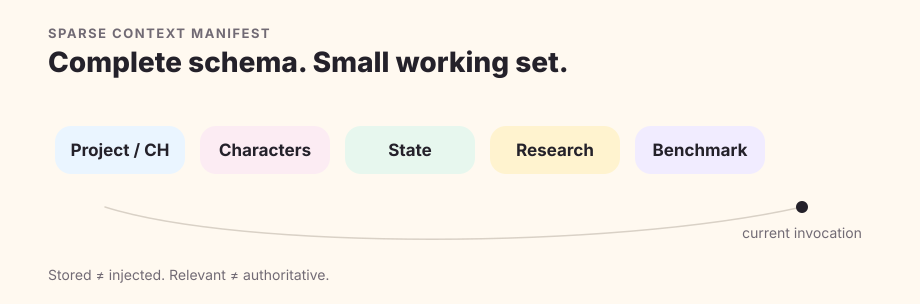
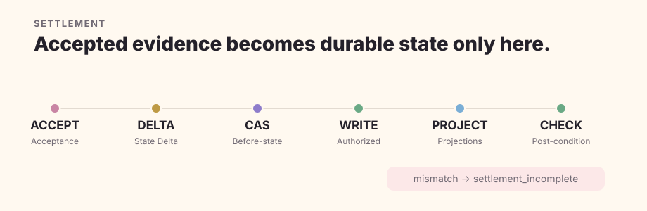

# Architecture

Quillframe is a novel-contract kernel alongside a generic host. The host runs sessions, model/tool loops, sandboxes, and subagents; Quillframe resolves the Project, bounds Context, governs Story/Character/Canon contracts, verifies exact artifacts, and keeps Settlement as the only path from accepted evidence to durable story-state mutation.

## Project authority is outside the generic framework

The generic framework owns Story/Character/Canon mechanisms, quality mechanisms, session/runtime contracts, semantic execution, learning infrastructure, Corpus governance, evaluation, and the native Project Contract. A consuming Project owns its concrete characters, plot, relationships, research, plans, manuscripts, accepted Canon, and current state.

Dependency direction is one-way: Project to framework. Project content never becomes generic framework truth merely because it was used in a run.

## Semantic intelligence and deterministic execution

Semantic contracts package bounded context, rubric, permissions, output shape, subject identity, and a semantic fingerprint. Models own interpretation. The deterministic runtime validates exact contract identity, provenance, fingerprint binding, permissions, typed results, and consume-once behavior.

Mechanical metadata can describe execution facts; it cannot stand in for semantic literary judgment. A manager's self-review can provide non-independent evidence; it cannot satisfy an independent gate.

## Authority ladder

`locked > accepted > active_plan > review > proposal` is a lifecycle distinction, not a suggestion that every item can freely promote itself upward. Plan is future intent. Review is a candidate. Acceptance is explicit evidence. Settlement is a separate authorized transaction.

Corpus is not Canon. Research is not automatic Character Knowledge. Session state is not story state. Learning state is not editorial authority.

## Sparse context

Persistent storage is larger than a model invocation. The manager selects a sparse Context Manifest for the current semantic question, then deterministic assembly verifies exact refs, authority classes, stage isolation, provenance, fingerprints, and hard budget.

## Sessions and external work

Quillframe keeps `project/resource`, `session/thread`, `run/invocation`, and `checkpoint` separate. A checkpoint records execution position and exact artifacts; it never upgrades a Plan or Review to Canon. Resume revalidates live authority, artifact fingerprints, pending approval, capabilities, and consume-once state.

## Settlement

Settlement requires explicit acceptance or Canon intent, exact before-to-after state operations, dependency impact, a checkpoint/write intent, current before-state validation, an authorized write, required derived projections, and post-condition checks. Any before-state mismatch or required projection failure yields `settlement_incomplete` rather than a guessed partial success.

See [Architecture Atlas](architecture-atlas.en.md) for implementation owners.
