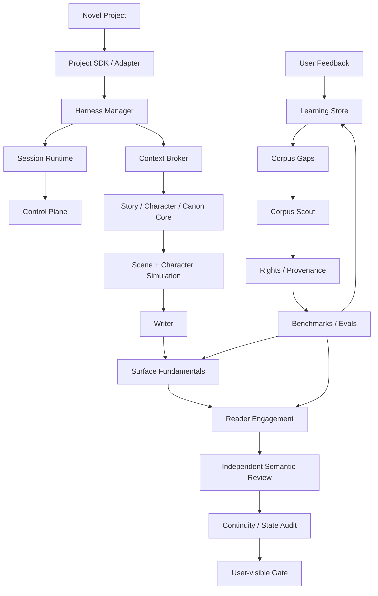
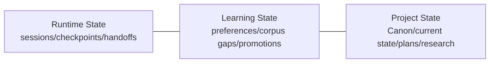

# NovelForge Architecture

## System view



## Architectural domains

### 1. Generic Fiction Core
Owns reusable object models and rules for story hierarchy, character/relationship behavior, information boundaries, Canon lifecycle, dependencies, settlement, and continuity.

### 2. Quality Runtime
Surface Fundamentals reject recurring AI prose failures. Reader Engagement supplies a positive quality model. Genre/platform/project/user profiles tune thresholds without silently deleting fundamental mechanisms.

### 3. Harness Runtime
One manager coordinates task modes, sparse context, checkpoints, bounded specialists, independent semantic review, failure routing, and user-visible gates.

### 4. Durable Runtime State
Session Runtime tracks execution identity. Control Plane persists sessions/events/handoffs/leases/consume-once receipts. This domain never becomes Canon.

### 5. Adaptive Learning
Learning Store tracks evidence, preference hypotheses, contradictions, corpus gaps, promotion candidates, and rollback metadata. Personal learning data is separate from generic source and project Canon.

### 6. Corpus Intelligence
Corpus subsystem discovers evidence gaps, creates provider-neutral search plans, enforces rights/provenance boundaries, distills mechanism-level observations, finds counterexamples, and builds benchmarks/evals.

### 7. Project Engineering
Project SDK turns each novel into a complete engineering project with manifest, framework lockfile, authority/state, plans, manuscripts, tests/evals, research, migrations, build bundles, and reproducible validation.

## Three persistent state domains



They can reference each other through explicit IDs/evidence, but authority never flows implicitly between them.

## Dependency direction

```text
Novel Project → NovelForge Framework
NovelForge Framework -X→ consumer-specific project facts
```

The framework owns schemas/mechanisms. The project owns instances/facts.

## Context philosophy

Complete schema, sparse injection.

A model invocation gets only the relevant slice of project state + framework rules. Presence in storage does not imply inclusion in context.

## Deterministic vs semantic split

Prefer deterministic code for:
- identity and lifecycle;
- schemas and validation;
- fingerprints;
- permissions;
- idempotency and leases;
- arithmetic / dependency integrity;
- build/release invariants.

Use semantic workers for:
- prose quality judgment;
- reader engagement judgment;
- nuanced character/scene evaluation;
- corpus mechanism interpretation;
- preference/craft distillation where rules are not reducible to code.

## Release philosophy

A framework release is valid only when machine contracts, documentation pairing, project-agnostic boundaries, deterministic self-tests, and integration contracts pass. Model quality baselines remain explicit semantic results rather than being faked by CI.
