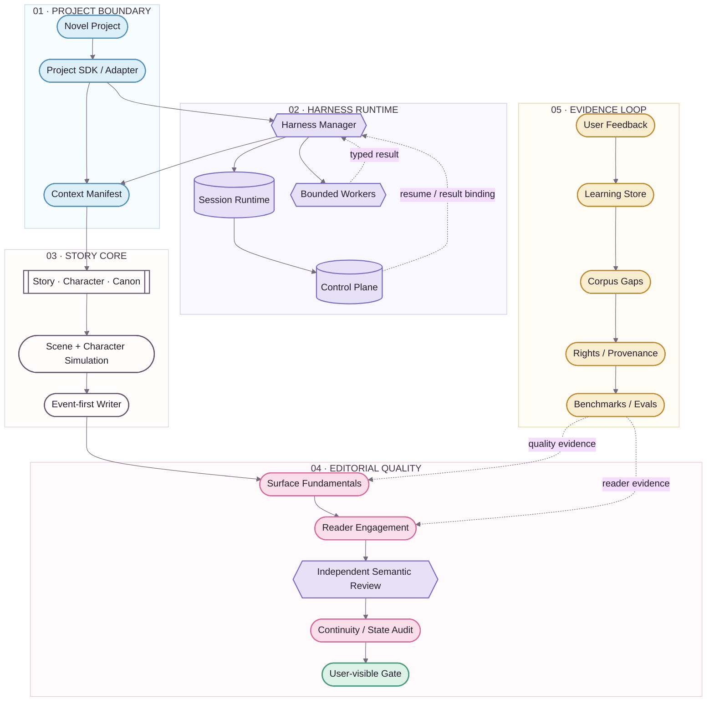
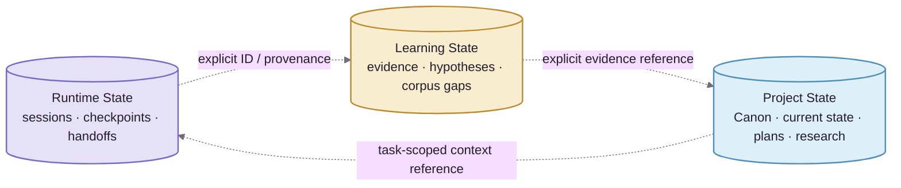
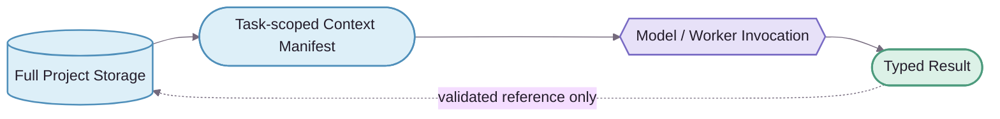

<div align="center">
  
  <p><strong>Architecture</strong></p>
  <p><kbd>AUTHORITY</kbd>&nbsp;&nbsp;<kbd>RUNTIME</kbd>&nbsp;&nbsp;<kbd>QUALITY</kbd>&nbsp;&nbsp;<kbd>EVIDENCE</kbd></p>
</div>


# NovelForge Architecture

> ✦ **Core idea: separate fiction production into explicit authority, runtime, quality, and evidence domains, then connect those domains through typed boundaries.**
>
> This page follows the [Story Loom documentation system](../assets/DESIGN_SYSTEM.en.md). Mermaid remains the maintainable source diagram; future branded static visuals are presentation layers only.

---

## 01 · Reading Key 🌸

| Lane | Token | Owns | Never implies |
|---|---|---|---|
| **Project / Context** | `project` · sky | consuming project, adapters, context selection | generic framework truth |
| **Harness Runtime** | `runtime` · lavender | sessions, checkpoints, handoffs, workers, control plane | Canon |
| **Story Core** | `neutral` · ink | story, character, Canon mechanics, simulation, drafting | automatic acceptance into Canon |
| **Editorial Quality** | `editorial` · sakura | Surface Fundamentals, Reader Engagement, semantic review | Canon write authority |
| **Evidence / Learning** | `evidence` · amber | feedback, corpus, hypotheses, benchmarks, evals | automatic promotion into durable behavior |
| **Validated Output** | `validated` · mint | results that satisfied the active gate | implicit Canon settlement |

**Shape grammar:** stadium = boundary or I/O; hexagon = manager, decision, or semantic gate; database = durable state; subroutine = reusable core mechanism.

---

## 02 · System View ✨



**Solid edges** carry primary execution or dependency. **Dashed edges** carry feedback, evidence, resume, or typed results. A data path crossing a domain boundary never grants authority by itself.

---

## 03 · Architecture Domains 📚

| Domain | Owns | Boundary |
|---|---|---|
| **Generic Fiction Core** | story hierarchy, character and relationship behavior, information boundaries, Canon lifecycle, dependencies, settlement, continuity | generic mechanisms only; never consuming-project story facts |
| **Quality Runtime** | Surface Fundamentals, Reader Engagement, quality-failure routing | profiles may tune weights and thresholds; they may not silently remove fundamental mechanisms |
| **Harness Runtime** | task modes, sparse context, checkpoints, specialists, semantic routing, user-visible gates | manager coordination ≠ independent judgment |
| **Durable Runtime State** | sessions, events, handoffs, leases, result receipts | persistence never upgrades into Canon |
| **Adaptive Learning** | evidence, preference hypotheses, contradictions, promotion candidates, rollback | model inference alone cannot become durable behavior |
| **Corpus Intelligence** | discovery gaps, rights and provenance, mechanism observations, counterexamples, benchmarks | corpus ≠ Canon; modern copyrighted text is not mirrored by default |
| **Project Engineering** | manifests, lockfiles, adapters, authority/state, plans, tests, migrations, builds | project facts must not leak back into the generic framework |


## 04 · Three Persistent State Domains 🧠



> **Boundary ✦** These domains may reference one another through explicit IDs, evidence, and provenance, but **authority never flows implicitly**. A session remembering something does not make it accepted story truth; a corpus fact does not automatically become character knowledge.

---

## 05 · Dependency Direction 🔒

```text
Novel Project → NovelForge Framework
NovelForge Framework -X→ project-specific facts
```

The Framework owns **schemas and mechanisms**. The Project owns **instances and facts**. A project may pin an exact NovelForge commit; NovelForge may not import that project's Canon back into generic source.

---

## 06 · Context Philosophy 🧩

**Complete schema, sparse injection. Storage is not the prompt.**



The Context Broker selects only the project-state slice and framework rules relevant to the active task. Presence in storage does not imply prompt inclusion, and specialists do not inherit the manager's entire conversation by default.

---

## 07 · Deterministic vs. Semantic Responsibility ⚙️

| Prefer deterministic code for | Use semantic workers for |
|---|---|
| identity and lifecycle | prose-quality judgment |
| schema validation | reader-engagement judgment |
| fingerprints and result binding | nuanced character and scene evaluation |
| permission and authority preconditions | corpus-mechanism interpretation |
| idempotency, leases, consume-once logic | preference and craft distillation |
| arithmetic and dependency integrity | judgment that should not collapse into brittle rules |
| build and release invariants | independent-review verdicts |

**Rule:** if an invariant can be expressed precisely and deterministically, do not spend model judgment on it. If a literary judgment cannot be reduced to deterministic rules, do not pretend a Python check can validate it.

---

## 08 · Branded Static Diagram Contract 🎨

Future AI- or designer-rendered diagrams follow this relationship:

```text
Mermaid source → semantic reference → branded SVG / WebP → README presentation
```

A rendered diagram may not introduce semantics absent from the source. Architecture changes update Mermaid first, then regenerate the presentation asset. Every static asset requires alt text and provenance.

---

## 09 · Release Philosophy 🚢

A framework release is valid only when all of the following hold:

- machine contracts and schemas are coherent;
- English and Simplified Chinese documentation remain paired;
- the project-agnostic boundary stays clean;
- deterministic self-tests and integration contracts pass;
- semantic baselines remain real typed results rather than CI-faked PASS states;
- visual documentation improves comprehension without becoming a second authority.

<div align="center">
  
  <br />
  <sub>keep the complexity in the system, the authority explicit, and the architecture calm ✦</sub>
</div>
