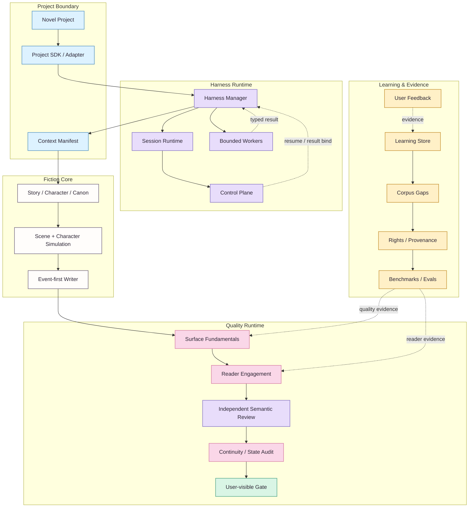
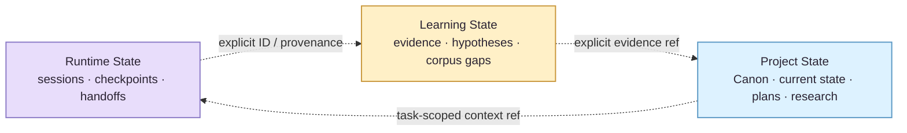
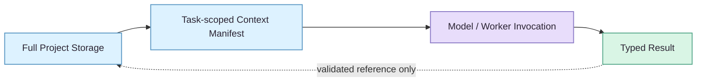

# NovelForge Architecture

> ✦ **Core idea: split fiction production into explicit authority, runtime, quality, and evidence domains, then connect them through typed boundaries.**
>
> Visual styling follows the [NovelForge Documentation Design System](../assets/DESIGN_SYSTEM.en.md). Color groups information; it never carries semantics by itself.

## 🎨 Reading key

| Lane | Accent | Owns | Never means |
|---|---|---|---|
| **Project / Context** | Sky | consumer project, adapter, context selection | Framework generic truth |
| **Harness Runtime** | Lavender | sessions, checkpoints, handoffs, workers, control plane | Canon |
| **Story / Production** | Neutral ink | Story, Character, Canon mechanisms, simulation, draft | Accepted fact unless the project actually accepts it |
| **Quality** | Sakura | Surface, Reader Engagement, semantic review | Canon authority |
| **Learning / Evidence** | Amber | feedback, corpus, hypotheses, benchmarks, evals | automatic promotion |
| **Validated output** | Mint | result that satisfied the active gate | implicit settlement |

## 🪄 System view



**Solid lines** are primary execution/dependency paths. **Dashed lines** are feedback, evidence, resume, or typed-result flows. A dashed edge is still an explicit data path; it never implies authority silently crossing domains.

## 📚 Architectural domains

| Domain | Owns | Boundary |
|---|---|---|
| **Generic Fiction Core** | story hierarchy, Character/Relationship behavior, information boundaries, Canon lifecycle, dependencies, settlement, continuity | owns generic mechanism only, never consumer story facts |
| **Quality Runtime** | Surface Fundamentals, Reader Engagement, quality failure routing | profiles may tune weights/thresholds but cannot silently delete fundamentals |
| **Harness Runtime** | task modes, sparse context, checkpoints, bounded specialists, semantic routing, user-visible gates | manager coordination ≠ independent judgment |
| **Durable Runtime State** | sessions, events, handoffs, leases, result receipts | persistence never upgrades into Canon |
| **Adaptive Learning** | evidence, preference hypotheses, contradictions, promotion candidates, rollback | model inference alone cannot durably promote behavior |
| **Corpus Intelligence** | discovery gaps, rights/provenance, mechanism observations, counterexamples, benchmarks | corpus ≠ Canon; modern copyrighted text is not mirrored by default |
| **Project Engineering** | manifests, lockfiles, adapters, authority/state, plans, tests, migrations, builds | project facts must not leak back into Generic Framework source |

## 🧠 Three persistent state domains



> **Boundary 🌸** The three domains may reference each other through explicit IDs, evidence, and provenance, but **authority never flows implicitly**. A session remembering something does not make it accepted story truth; a corpus fact does not automatically become character knowledge.

## 🔒 Dependency direction

```text
Novel Project → NovelForge Framework
NovelForge Framework -X→ consumer-specific project facts
```

The Framework owns **schema / mechanism**. The Project owns **instance / fact**. A Project may pin an exact Framework commit; the Framework may not import that novel's Canon back into Generic source.

## 🧩 Context philosophy

**Complete schema, sparse injection.** Storage is not the prompt.



The Context Broker selects only the project-state slice and Framework rules relevant to the active task. Presence in storage does not imply prompt inclusion, and workers do not inherit the manager's whole conversation by default.

## ⚙️ Deterministic vs semantic split

| Prefer deterministic code for | Use semantic workers for |
|---|---|
| identity / lifecycle | prose quality judgment |
| schema validation | reader engagement judgment |
| fingerprint / result binding | nuanced character / scene evaluation |
| permission / authority preconditions | corpus mechanism interpretation |
| idempotency / leases / consume-once | preference / craft distillation |
| arithmetic / dependency integrity | judgment that cannot reasonably collapse into rules |
| build / release invariants | independent-review verdicts |

**Rule:** if an invariant can be expressed precisely and deterministically, do not spend model judgment on it. If a literary judgment cannot be reduced to deterministic rules, do not pretend a Python check can validate it.

## 🚢 Release philosophy

A Framework release is valid only when all of the following hold:

- machine contracts and schemas are coherent;
- bilingual human docs are paired;
- the project-agnostic boundary remains clean;
- deterministic self-tests and integration contracts pass;
- semantic baselines remain real typed results rather than CI-faked PASS states;
- visual documentation improves understanding without becoming a second authority.

<p align="center"><sub>architecture should feel calm even when the system behind it is complicated ✦</sub></p>
