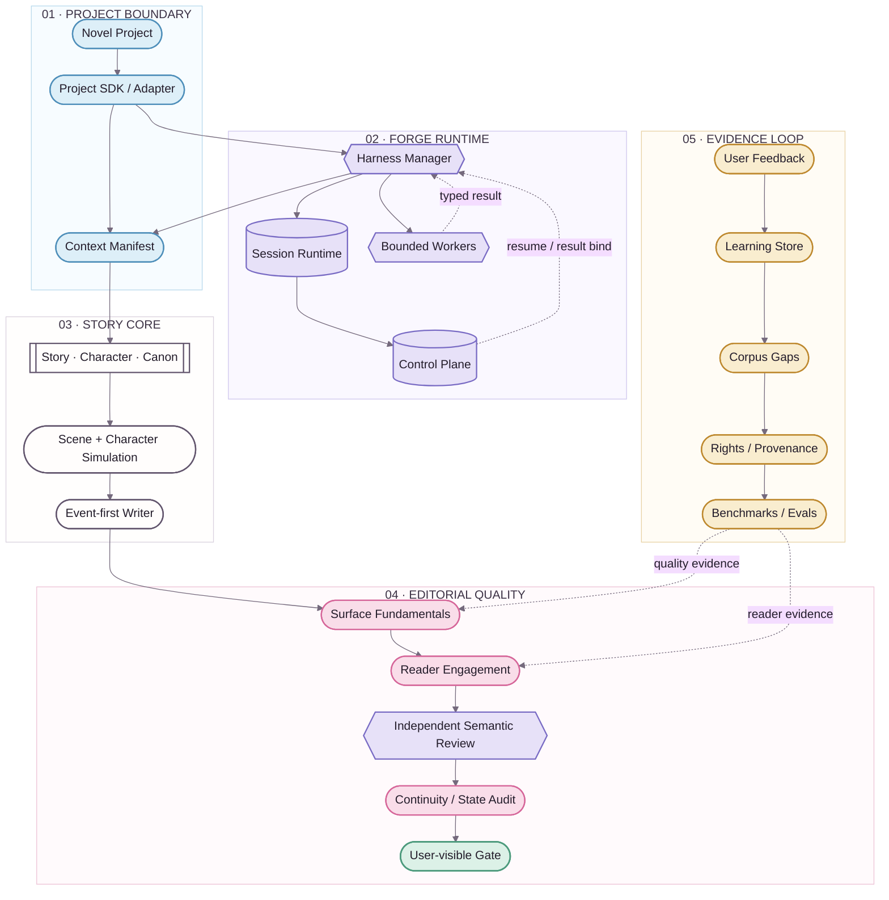
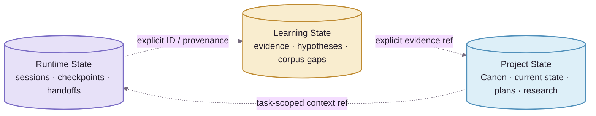
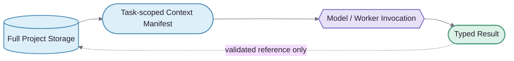

<div align="center">
  
  <p><strong>Architecture · 架构总览</strong></p>
  <p><kbd>AUTHORITY</kbd>&nbsp;&nbsp;<kbd>RUNTIME</kbd>&nbsp;&nbsp;<kbd>QUALITY</kbd>&nbsp;&nbsp;<kbd>EVIDENCE</kbd></p>
</div>


# NovelForge Architecture · 架构总览

> ✦ **核心思想：把 fiction production 拆成明确的 authority、runtime、quality 与 evidence domain，再通过 typed boundary 协作。**
>
> 视觉遵循 [Story Loom Design System](../assets/DESIGN_SYSTEM.zh-CN.md)。Mermaid 是可维护的 source chart；未来 static rendered chart 只做 presentation layer。

---

## 01 · Reading Key 🌸

| Lane | Token | 负责什么 | 永远不代表什么 |
|---|---|---|---|
| **Project / Context** | `project` · sky | consumer project、adapter、context selection | Framework generic truth |
| **Harness Runtime** | `runtime` · lavender | session、checkpoint、handoff、worker、control plane | Canon |
| **Story Core** | `neutral` · ink | Story、Character、Canon mechanics、simulation、draft | 自动 Accepted |
| **Editorial Quality** | `editorial` · sakura | Surface、Reader Engagement、semantic review | Canon authority |
| **Learning / Evidence** | `evidence` · amber | feedback、corpus、hypothesis、benchmark、eval | 自动 promotion |
| **Validated Output** | `validated` · mint | gate 已满足的可见结果 | 隐式 settlement |

**Shape grammar：** stadium = boundary；hexagon = manager/gate；database = durable store；subroutine = reusable core mechanism。

---

## 02 · System View ✨



**实线** = execution / dependency；**虚线** = feedback / evidence / resume / typed result。虚线仍是显式数据流，**不代表 authority 自动跨域传播**。

---

## 03 · Architecture Domains 📚

| Domain | Owns | Boundary |
|---|---|---|
| **Generic Fiction Core** | Story hierarchy、Character/Relationship、information boundary、Canon lifecycle、dependency、settlement、continuity | generic mechanism ≠ consumer story fact |
| **Quality Runtime** | Surface Fundamentals、Reader Engagement、failure routing | Profile 可调权重，不能删除 fundamental mechanism |
| **Harness Runtime** | task mode、sparse context、checkpoint、specialist、semantic routing、user-visible gate | manager coordination ≠ independent judgment |
| **Durable Runtime State** | session/event/handoff/lease/result receipt | runtime persistence ≠ Canon |
| **Adaptive Learning** | evidence、hypothesis、contradiction、promotion candidate、rollback | model inference alone ≠ durable promotion |
| **Corpus Intelligence** | discovery、rights/provenance、mechanism observation、counterexample、benchmark | corpus ≠ Canon |
| **Project Engineering** | manifest、lockfile、adapter、state、plans、tests、migration、build | Project fact 不回流 Generic Framework |


## 04 · Three Persistent State Domains 🧠



> **Boundary ✦** 三个状态域可以通过 explicit ID / evidence / provenance 互相引用，但 **authority 绝不隐式流动**。Session 记住一件事，不等于项目接受它；Corpus 找到一条事实，也不等于角色知道它。

---

## 05 · Dependency Direction 🔒

```text
Novel Project → NovelForge Framework
NovelForge Framework -X→ consumer-specific project facts
```

Framework 拥有 **schema / mechanism**；Project 拥有 **instance / fact**。Project 可以 pin exact Framework commit；Framework 不能反向 import 某本小说的 Canon。

---

## 06 · Context Philosophy 🧩

**完整 Schema，稀疏注入。Storage 不是 prompt。**



Context Broker 只选择当前任务真正需要的 project state slice + framework rules。Storage 里“有”不等于自动进入 model context；worker 也不会继承 manager 整段聊天。

---

## 07 · Deterministic vs Semantic Split ⚙️

| Deterministic code 优先负责 | Semantic worker 负责 |
|---|---|
| identity / lifecycle | prose quality judgment |
| schema validation | reader engagement judgment |
| fingerprint / result binding | nuanced character / scene evaluation |
| permission / authority precondition | corpus mechanism interpretation |
| idempotency / lease / consume-once | preference / craft distillation |
| arithmetic / dependency integrity | 不适合压缩成规则的语义判断 |
| build / release invariant | independent review verdict |

**原则：** 能被 deterministic invariant 精确表达的，不浪费 model judgment；无法被规则替代的语义问题，也不假装 Python 能“验证文学质量”。

---

## 08 · Rendered Diagram Contract 🎨

未来 AI / designer-rendered chart 采用：

```text
Mermaid source → semantic reference → branded SVG/WebP → README presentation
```

Rendered chart 不能新增 source 中不存在的语义；architecture 变更先改 Mermaid，再 regenerate static visual；static visual 必须有 alt text + provenance。

---

## 09 · Release Philosophy 🚢

Framework release 只有在以下层面都成立时才有效：

- machine contract / schema 一致；
- 双语 human docs 配对；
- project-agnostic boundary 未泄漏；
- deterministic self-tests / integration contracts 通过；
- semantic baseline 保持真实 typed result，不由 CI 伪造 PASS；
- visual documentation 只改善理解，不变成第二 authority。

<div align="center">
  
  <br />
  <sub>calm architecture · explicit authority · one woven story thread ✦</sub>
</div>
