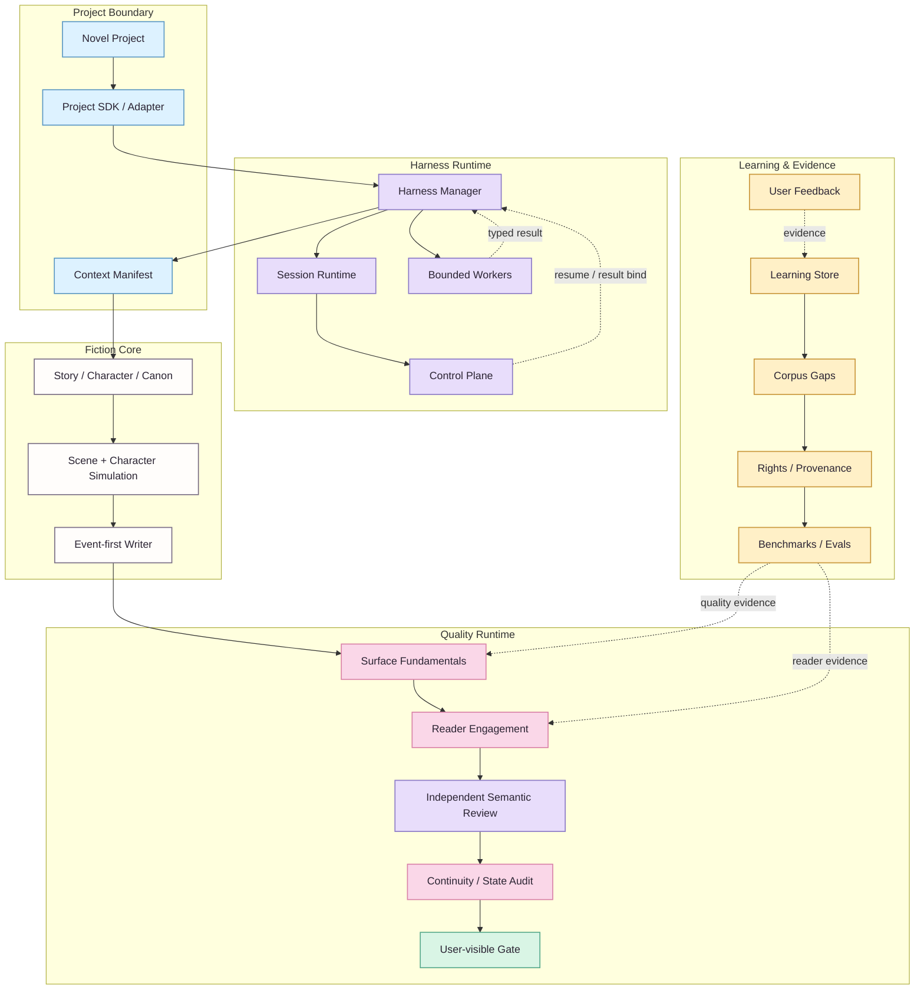
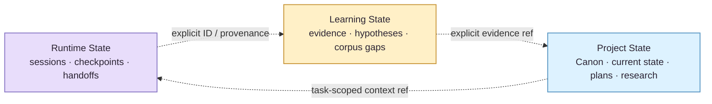
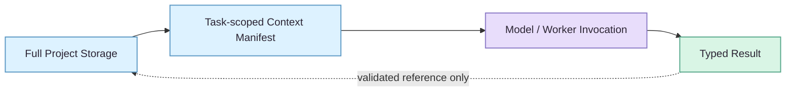

# NovelForge Architecture · 架构总览

> ✦ **核心思想：把 fiction production 拆成明确的 authority、runtime、quality 与 evidence domain，再让它们通过 typed boundary 协作。**
>
> 视觉样式遵循 [NovelForge Documentation Design System](../assets/DESIGN_SYSTEM.zh-CN.md)。颜色用于分组，不承担唯一语义。

## 🎨 Reading Key

| Lane | Accent | 负责什么 | 永远不代表什么 |
|---|---|---|---|
| **Project / Context** | Sky | consumer project、adapter、context selection | Framework generic truth |
| **Harness Runtime** | Lavender | session、checkpoint、handoff、worker、control plane | Canon |
| **Story / Production** | Neutral ink | Story、Character、Canon mechanics、simulation、draft | 已 Accepted 的事实，除非项目真的接受 |
| **Quality** | Sakura | Surface、Reader Engagement、semantic review | Canon authority |
| **Learning / Evidence** | Amber | feedback、corpus、hypothesis、benchmark、eval | 自动 promotion |
| **Validated output** | Mint | gate 已满足的可见结果 | 隐式 settlement |

## 🪄 System View



**实线**是主 execution/dependency；**虚线**是 feedback、evidence、resume 或 typed result flow。虚线仍然是显式数据流，不代表 authority 自动跨域传播。

## 📚 Architecture Domains

| Domain | Owns | Boundary |
|---|---|---|
| **Generic Fiction Core** | Story hierarchy、Character/Relationship behavior、information boundary、Canon lifecycle、dependency、settlement、continuity | 只拥有 generic mechanism，不拥有 consumer story fact |
| **Quality Runtime** | Surface Fundamentals、Reader Engagement、quality failure routing | Profile 可调权重/阈值，不能静默删除 fundamental mechanism |
| **Harness Runtime** | task mode、sparse context、checkpoint、bounded specialist、semantic routing、user-visible gate | manager coordination ≠ independent judgment |
| **Durable Runtime State** | session/event/handoff/lease/result receipt | runtime persistence 永远不升级为 Canon |
| **Adaptive Learning** | evidence、preference hypothesis、contradiction、promotion candidate、rollback | model inference alone 不能 durable promote |
| **Corpus Intelligence** | discovery gap、rights/provenance、mechanism observation、counterexample、benchmark | corpus ≠ Canon；modern copyrighted text 不默认镜像 |
| **Project Engineering** | manifest、lockfile、adapter、authority/state、plans、tests、migration、build | Project facts 不得泄漏回 Generic Framework |

## 🧠 三个持久状态域



> **Boundary 🌸** 三者可以通过 explicit ID / evidence / provenance 互相引用，但 **authority 绝不隐式流动**：session 记住一件事，不等于项目接受它；Corpus 找到一条事实，也不等于角色知道它。

## 🔒 Dependency Direction

```text
Novel Project → NovelForge Framework
NovelForge Framework -X→ consumer-specific project facts
```

Framework 拥有 **schema / mechanism**；Project 拥有 **instance / fact**。Project 可以 pin 一个 exact Framework commit，但 Framework 不能反向 import 某本小说的 Canon。

## 🧩 Context Philosophy

**完整 Schema，稀疏注入。** Storage 不是 prompt。



Context Broker 只选择当前任务真的需要的 project state slice + framework rules。Storage 里“有”不代表自动进入 model context；worker 也不会继承 manager 整段聊天。

## ⚙️ Deterministic vs Semantic Split

| Deterministic code 优先负责 | Semantic worker 负责 |
|---|---|
| identity / lifecycle | prose quality judgment |
| schema validation | reader engagement judgment |
| fingerprint / result binding | nuanced character / scene evaluation |
| permission / authority precondition | corpus mechanism interpretation |
| idempotency / lease / consume-once | preference / craft distillation |
| arithmetic / dependency integrity | 无法合理压缩成规则的语义判断 |
| build / release invariant | independent review verdict |

**原则：** 能被 deterministic invariant 精确表达的，就不要浪费 model judgment；无法被规则替代的语义问题，也不要假装一段 Python 就能“验证文学质量”。

## 🚢 Release Philosophy

一个 Framework release 只有在以下层面都成立时才有效：

- machine contract 与 schema 一致；
- 双语 human docs 配对；
- project-agnostic boundary 未泄漏；
- deterministic self-tests / integration contracts 通过；
- semantic baseline 保持真实 typed result，而不是由 CI 伪造 PASS；
- visual documentation 只改善理解，不偷偷变成第二 authority。

<p align="center"><sub>architecture should feel calm even when the system behind it is complicated ✦</sub></p>
