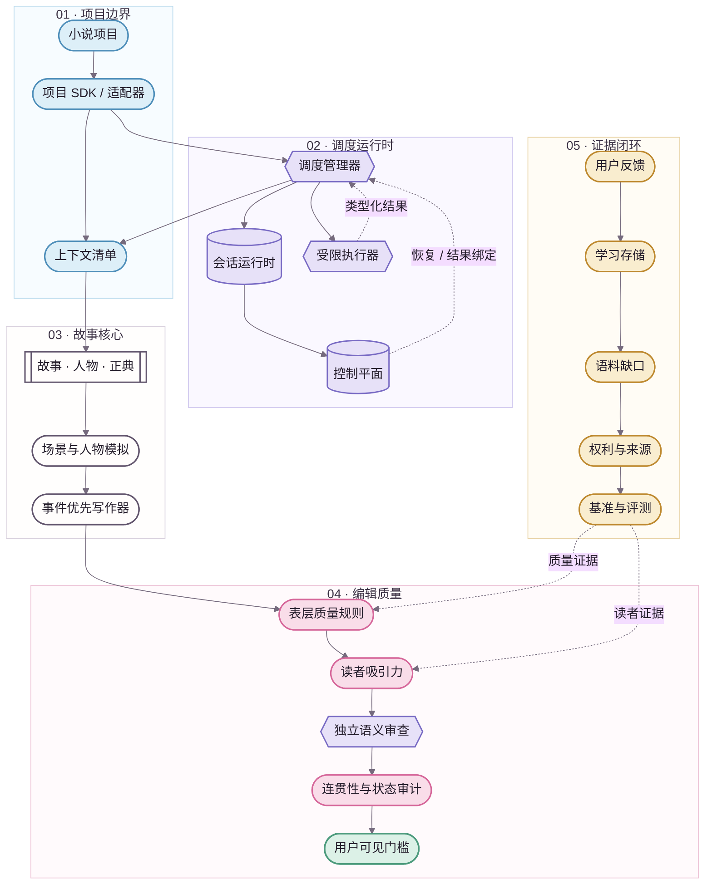
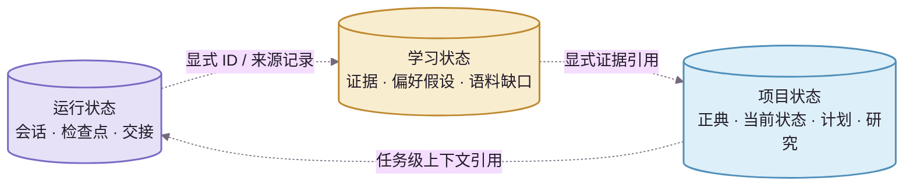

<div align="center">
  
  <p><strong>架构总览</strong></p>
  <p><kbd>权威边界</kbd>&nbsp;&nbsp;<kbd>运行时</kbd>&nbsp;&nbsp;<kbd>质量</kbd>&nbsp;&nbsp;<kbd>证据</kbd></p>
</div>


# NovelForge 架构总览

> ✦ **核心思想：把小说生产拆成权威、运行时、质量与证据四类明确领域，再通过类型化边界协作。**
>
> 本页遵循 [Story Loom 文档设计系统](../assets/DESIGN_SYSTEM.zh-CN.md)。Mermaid 是可维护的源图；未来的品牌化静态图只作为展示层，不改变架构语义。

---

## 01 · 读图说明 🌸

| 分区 | 视觉令牌 | 负责什么 | 永远不代表什么 |
|---|---|---|---|
| **项目 / 上下文** | `project` · 天空蓝 | 下游项目、项目适配器、上下文选择 | 框架层通用真理 |
| **调度运行时** | `runtime` · 薰衣草紫 | 会话、检查点、交接、执行器、控制平面 | 小说正典 |
| **故事核心** | `neutral` · 墨色 | 故事、人物、正典机制、模拟、草稿 | 自动成为已接受事实 |
| **编辑质量** | `editorial` · 樱花粉 | 表层质量、读者吸引力、语义审查 | 正典写入权限 |
| **证据 / 学习** | `evidence` · 琥珀色 | 用户反馈、语料、偏好假设、基准、评测 | 自动升级为长期规则 |
| **已验证输出** | `validated` · 薄荷绿 | 满足当前门槛的可见结果 | 自动完成正典结算 |

**形状规则：** 体育场形表示边界或输入输出；六边形表示管理器、决策点或语义门槛；数据库形表示持久状态；子程序形表示可复用核心机制。

---

## 02 · 系统总览 ✨



**实线**表示主执行路径或依赖关系；**虚线**表示反馈、证据、恢复或类型化结果。即使数据通过虚线跨域传递，**权威也不会因此自动跨域流动**。

---

## 03 · 架构领域 📚

| 领域 | 负责什么 | 边界 |
|---|---|---|
| **通用小说核心** | 故事层级、人物与关系行为、信息边界、正典生命周期、依赖、结算、连贯性 | 只拥有通用机制，不拥有任何下游小说事实 |
| **质量运行时** | 表层质量规则、读者吸引力、质量失败路由 | 项目配置可以调权重和阈值，不能静默删除通用质量机制 |
| **调度运行时** | 任务模式、稀疏上下文、检查点、专门执行器、语义路由、用户可见门槛 | 管理器负责协调，不等于具备独立审查资格 |
| **持久运行状态** | 会话、事件、交接、租约、结果回执 | 运行状态再持久，也不会升级成正典 |
| **自适应学习** | 证据、偏好假设、矛盾、升级候选、回滚 | 单纯模型推断不能直接升级为持久规则 |
| **语料智能** | 证据缺口、权利与来源、机制观察、反例、基准 | 语料 ≠ 正典；现代版权文本不默认镜像 |
| **项目工程化** | 清单、锁文件、适配器、权威与状态、计划、测试、迁移、构建 | 项目事实不得反向泄漏到通用框架 |


## 04 · 三类持久状态 🧠



> **边界 ✦** 三类状态可以通过显式 ID、证据和来源记录互相引用，但**权威永远不会隐式流动**。会话记住一件事，不等于项目接受了它；语料找到一条事实，也不等于故事中的人物知道它。

---

## 05 · 依赖方向 🔒

```text
小说项目 → NovelForge 框架
NovelForge 框架 -X→ 项目专属事实
```

框架拥有 **Schema 与机制**；项目拥有 **实例与事实**。项目可以锁定一个精确的框架提交版本，但框架不能反向导入某本小说的正典。

---

## 06 · 上下文原则 🧩

**完整 Schema，稀疏注入。存储不是提示词。**


上下文代理只选择当前任务真正需要的项目状态切片和框架规则。存储里“存在”不等于自动进入模型上下文；专门执行器也不会默认继承管理器的整段聊天历史。

---

## 07 · 确定性机制与语义判断 ⚙️

| 优先交给确定性代码 | 交给语义执行器 |
|---|---|
| 身份与生命周期 | 文本质量判断 |
| Schema 验证 | 读者吸引力判断 |
| 内容指纹与结果绑定 | 细腻的人物 / 场景评估 |
| 权限与权威前置条件 | 语料机制解释 |
| 幂等、租约、单次消费 | 偏好与写作机制提炼 |
| 算术与依赖完整性 | 不适合压缩成硬规则的语义问题 |
| 构建与发布不变量 | 独立审查结论 |

**原则：** 能被确定性不变量精确表达的问题，就不要浪费模型判断；无法被规则替代的文学语义问题，也不要假装一段 Python 就能验证。

---

## 08 · 品牌化静态图契约 🎨

未来 AI / 设计师生成的品牌图采用：

```text
Mermaid 源图 → 语义参照 → 品牌化 SVG / WebP → README 展示
```

静态图不能新增源图中不存在的语义；架构变化时先更新 Mermaid，再重新生成展示图；每张静态图都必须有替代文本与来源记录。

---

## 09 · 发布原则 🚢

一个框架版本只有在以下条件同时成立时才有效：

- 机器契约与 Schema 一致；
- 中英文人类文档成对维护；
- 项目无关边界没有泄漏；
- 确定性自检与集成契约通过；
- 语义基线保留真实的类型化结果，而不是由 CI 伪造“通过”；
- 视觉文档只改善理解，不成为第二套权威来源。

<div align="center">
  
  <br />
  <sub>复杂留在系统里，架构呈现保持冷静；所有权威边界都沿同一根故事线清晰可追。✦</sub>
</div>
