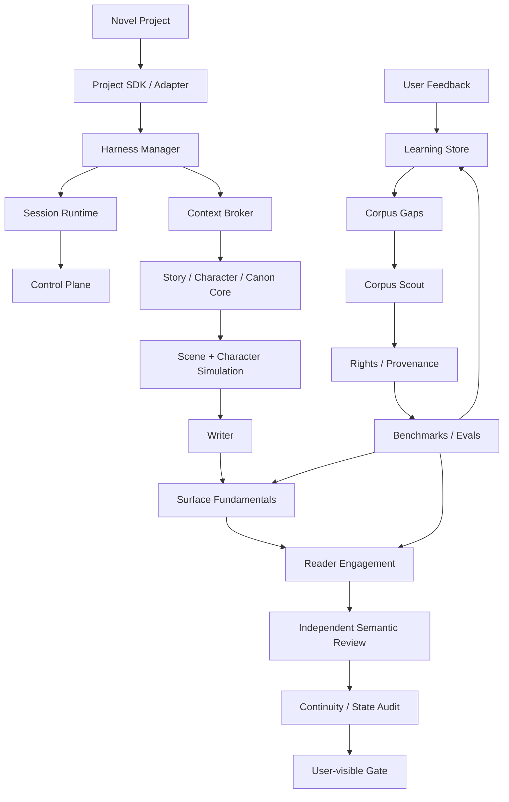
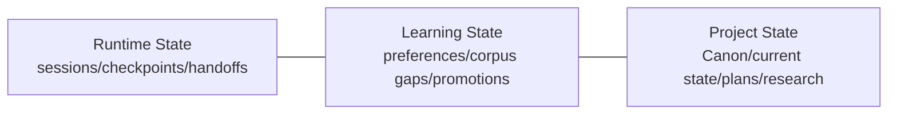

# NovelForge Architecture · 架构总览

## System View



## Architecture Domains

### 1. Generic Fiction Core
负责 Story hierarchy、Character/Relationship behavior、information boundary、Canon lifecycle、dependency、settlement 与 continuity 等可复用机制。

### 2. Quality Runtime
Surface Fundamentals 拦截稳定出现的 AI prose failure；Reader Engagement 提供正向质量模型。Genre/platform/project/user profile 只调权重和阈值，不能静默删掉 fundamental mechanism。

### 3. Harness Runtime
一个 manager 协调 task mode、sparse context、checkpoint、bounded specialist、independent semantic review、failure routing 与 user-visible gate。

### 4. Durable Runtime State
Session Runtime 记录 execution identity；Control Plane 持久化 session/event/handoff/lease/consume-once receipt。这个 domain 永远不会变成 Canon。

### 5. Adaptive Learning
Learning Store 保存 evidence、preference hypothesis、contradiction、corpus gap、promotion candidate 与 rollback metadata。Personal learning data 与 generic source、project Canon 分离。

### 6. Corpus Intelligence
Corpus subsystem 发现 evidence gap，生成 provider-neutral search plan，执行 rights/provenance 边界，提炼 mechanism-level observation，主动寻找 counterexample，并建立 benchmark/eval。

### 7. Project Engineering
Project SDK 让每一本小说成为完整工程：manifest、framework lockfile、authority/state、plans、manuscripts、tests/evals、research、migration、build bundle 与 reproducible validation。

## 三个持久状态域



三者可以通过显式 ID/evidence 互相引用，但 authority 绝不隐式流动。

## Dependency Direction

```text
Novel Project → NovelForge Framework
NovelForge Framework -X→ consumer-specific project facts
```

Framework 拥有 schema/mechanism；Project 拥有 instance/fact。

## Context Philosophy

**完整 Schema，稀疏注入。**

Model invocation 只得到当前任务需要的 project state slice + framework rules。Storage 中存在，不代表自动进入 context。

## Deterministic vs Semantic Split

优先由 deterministic code 负责：
- identity / lifecycle；
- schema validation；
- fingerprint；
- permission；
- idempotency / lease；
- arithmetic / dependency integrity；
- build/release invariant。

Semantic worker 负责：
- prose quality judgment；
- reader engagement judgment；
- nuanced character/scene evaluation；
- corpus mechanism interpretation；
- 无法简化成代码的 preference/craft distillation。

## Release Philosophy

Framework release 只有在 machine contract、双语文档、project-agnostic boundary、deterministic self-test、integration contract 全部通过后才有效。Semantic quality baseline 必须保持真实的 semantic result，CI 不得伪造。
