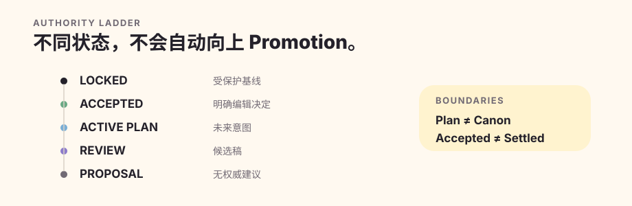
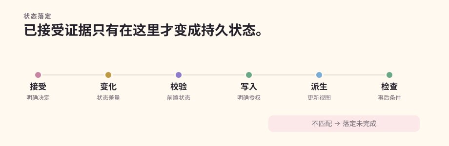

# 总体架构

理解 Quillframe 最简单的方法，是把它看成位于通用宿主旁边的小说契约内核。宿主运行 session、model/tool 循环、sandbox 与 subagent；Quillframe 解析 Project、限制 Context、管理 Story / Character / Canon 契约、校验 exact artifact，并确保“已接受证据”只有通过 Settlement 才能写入持久故事状态。

## 项目事实权威在通用框架之外

通用框架拥有故事、人物、关系与正典机制，质量机制，会话与运行时契约，语义执行，学习设施，语料库治理，评测系统和 native Project Contract。下游项目拥有具体人物、剧情、关系、研究资料、计划、正文、已接受正典和当前状态。

依赖方向只有“项目 → 框架”。某条项目内容即使参加过一次运行，也不会因此变成通用框架的内置事实。

## 语义判断与确定性执行

语义契约会打包受限上下文、评审准则、权限、输出结构、对象身份和语义任务指纹。模型负责解释意义；确定性运行时负责验证精确契约身份、来源链、指纹绑定、权限、类型化结果和一次性消费。

遥测数据可以描述可观察形式，却不能冒充语义判断；管理器自审可以形成非独立证据，却不能满足独立评审门。

## 权威层级

`locked > accepted > active_plan > review > proposal` 表达的是生命周期和权威级别的差异，并不表示任何制品可以自行向上升级。计划是未来意图；评审态是候选；接受需要明确证据；状态落定则是另一项独立授权事务。

语料库不等于正典；研究结论不等于人物自动知情；会话状态不等于故事状态；学习状态也不等于编辑权威。

## 稀疏上下文

持久存储永远大于一次模型调用实际需要的内容。管理器先针对当前语义问题选择稀疏上下文清单；确定性组装阶段再验证精确引用、权威级别、阶段隔离、来源链、内容指纹和硬预算。

## 会话与外部工作

Quillframe 分开 `project/resource`、`session/thread`、`run/invocation` 和 `checkpoint`。检查点只记录执行位置与精确制品，不会把计划或评审稿提升成正典。恢复时必须重新核对当前权威、制品指纹、待确认事项、可用能力和一次性消费状态。

## 状态落定

状态落定要求明确接受或明确正典修改意图、精确的前后状态操作、依赖影响、检查点与写入意图、实时前置状态验证、授权写入、必要派生更新和事后条件检查。前置状态不匹配或必要派生更新失败时，必须返回 `settlement_incomplete`，不能猜测式地宣布“部分成功”。

具体实现归属见[架构图谱](architecture-atlas.zh-CN.md)。
