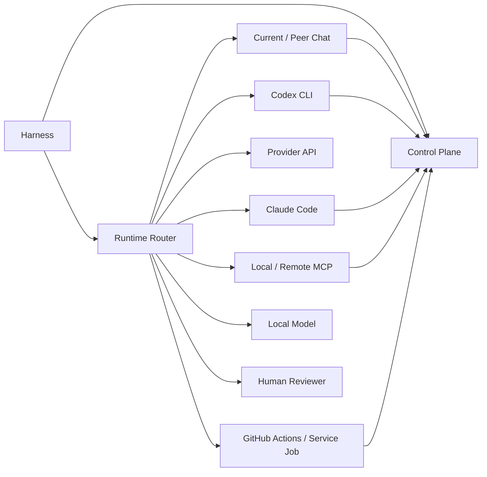

# Runtime Integrations

NovelForge is provider-neutral. A runtime is selected because it satisfies capability, independence, permission, session, automation, and cost constraints—not because the framework is bound to one vendor.

## Integration map



## Chat sessions

Current chat may be a manager runtime. It cannot count its own role-play review as independent semantic judgment.

A separate peer chat can serve as an independent reviewer when it receives a bounded blind packet and returns typed fingerprint-bound evidence. `peer_chat_relay.py` supplies nonce/fingerprint binding for relay workflows.

## Codex CLI

Local Codex can run the full Harness or bounded specialist work. Mandatory independent review requires a separate invocation/session. NovelForge does not require a second OpenAI API key when the local Codex runtime already has supported authentication.

## Claude Code

Claude Code can run full Harness or bounded worker sessions. Repository hooks under `.claude/` record deterministic lifecycle/file-change telemetry only; they do not replace independent semantic review.

## Provider APIs

Provider API adapters are optional execution transports. They must obey the same typed semantic/output contracts, context isolation, provenance, and permission boundaries.

Normal CI uses dry-run/contract tests and does not spend provider inference usage.

## MCP

Local default: stdio MCP.

Future remote services: Streamable HTTP MCP with authentication, Origin validation, session/protocol handling, and normal transport security.

The generic Control Plane exposes operational tools. High-authority Canon settlement remains a Harness/project transaction, not a raw MCP capability granted by default.

## GitHub Actions / service jobs

GitHub may act as:
- deterministic CI;
- event ingress through `repository_dispatch` or equivalent transport;
- semantic relay/service queue when an independent worker backend is available;
- peer-chat relay bridge without API model execution.

Workflow events are candidates/transport messages, not authority elevation.

### Operational workflows

- `novelforge-ci.yml` — deterministic default release gate; no live model execution.
- `novelforge-contracts.yml` — reusable deterministic contracts.
- `novelforge-event-router.yml` — typed external event ingress.
- `novelforge-chat-semantic-bridge.yml` — user-relayed independent peer-chat semantic path; no API model execution.
- `novelforge-semantic-live.yml` — optional manually dispatched provider-backed semantic eval; requires an explicitly configured API secret and may incur provider billing.
- `novelforge-weekly-maintenance.yml` — scheduled deterministic observation/queueing. It does not run an LLM or promote behavior automatically.

The weekly maintenance job may produce corpus discovery/eval queues, but actual Web/GitHub/MCP discovery still requires an authorized host connector. It must not fabricate source access.

## Webhooks

Provider-specific webhooks should normalize into the generic typed event contract before the Harness acts on them.

```text
provider webhook
→ adapter
→ typed NovelForge event
→ idempotency/provenance validation
→ Harness classification
```

Do not create multiple incompatible resume/idempotency semantics per provider.

## Human review

Human reviewer is a first-class independent runtime. Use the same artifact fingerprint, bounded instructions, return contract, provenance, and consume-once behavior.

## Fallback

Infrastructure failures can fall through to the next eligible runtime after checkpointing. A valid semantic rejection cannot be converted into infrastructure failure just to switch reviewers.

## Secrets

Credentials remain host/runtime configuration. Do not store provider tokens in project Canon, semantic jobs, corpus records, runtime SQLite committed state, or framework source.
